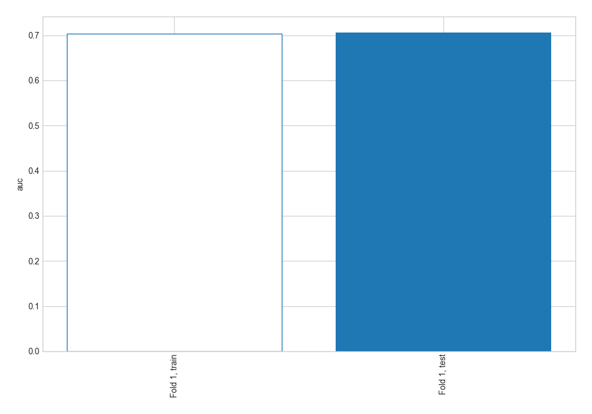
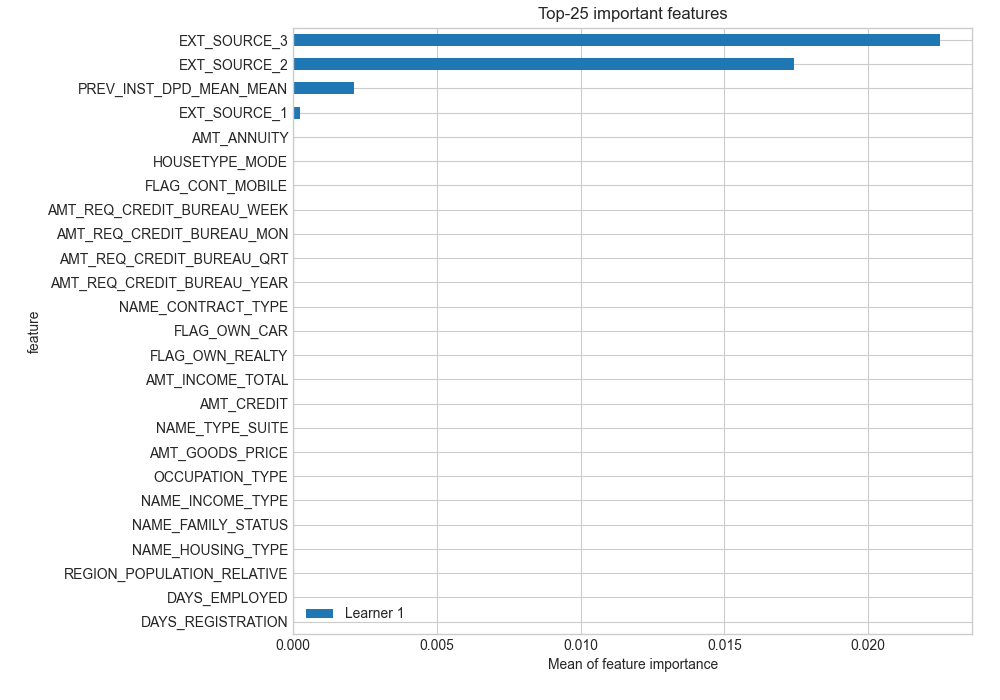
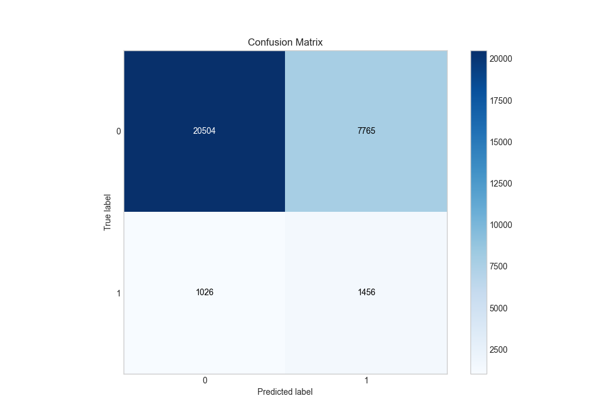
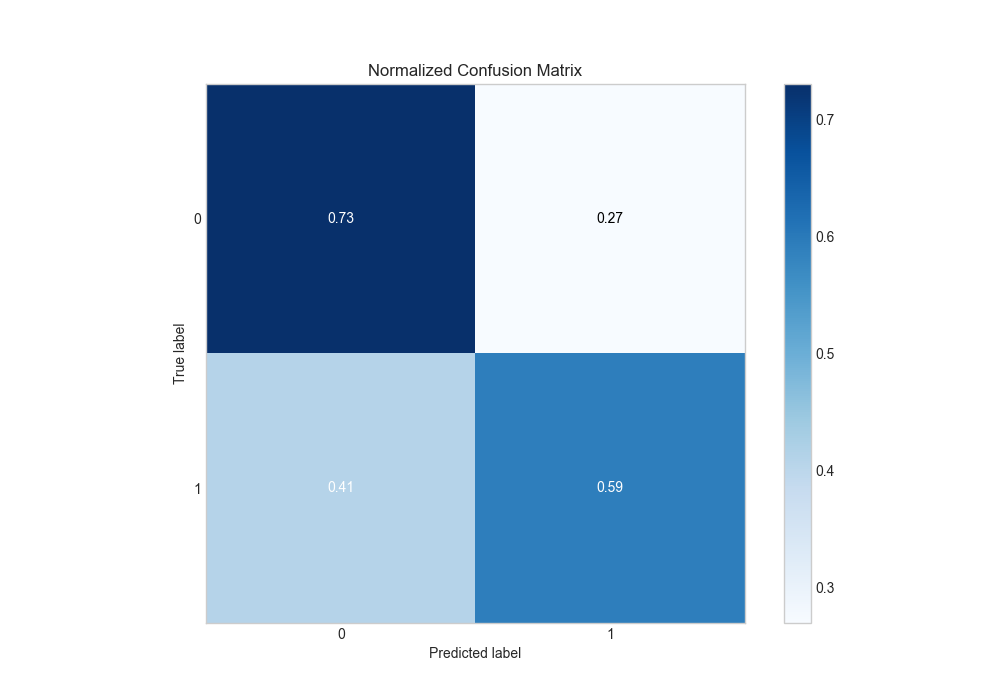
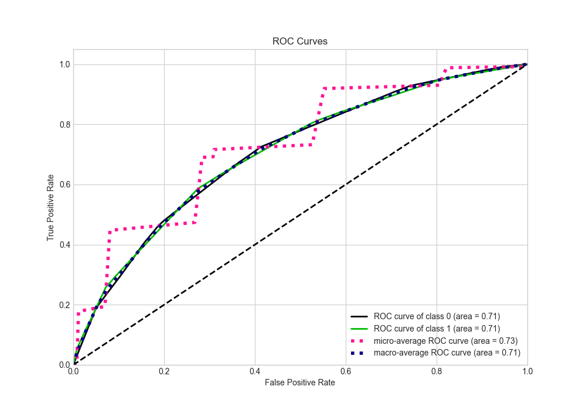
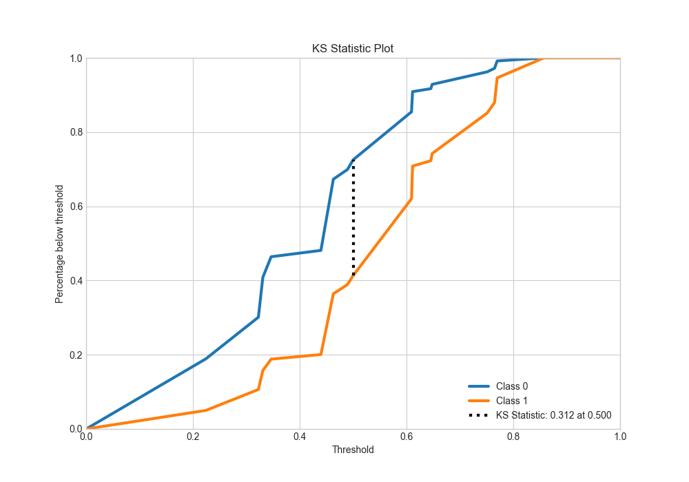
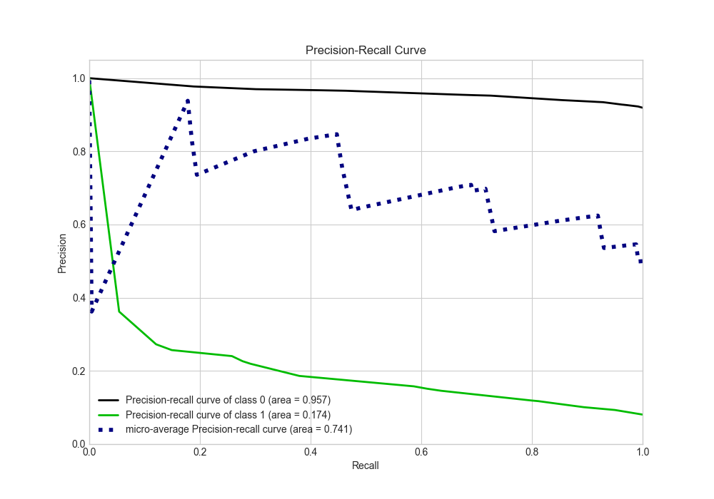
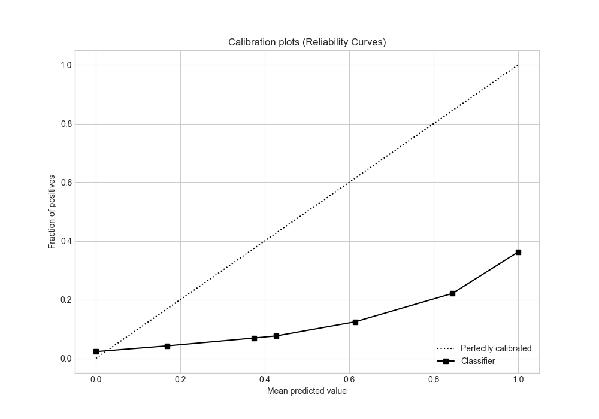
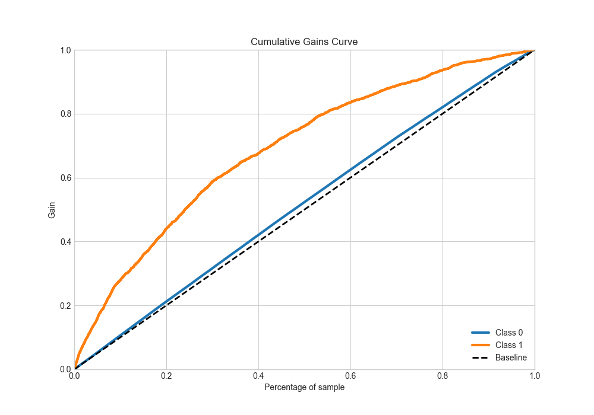
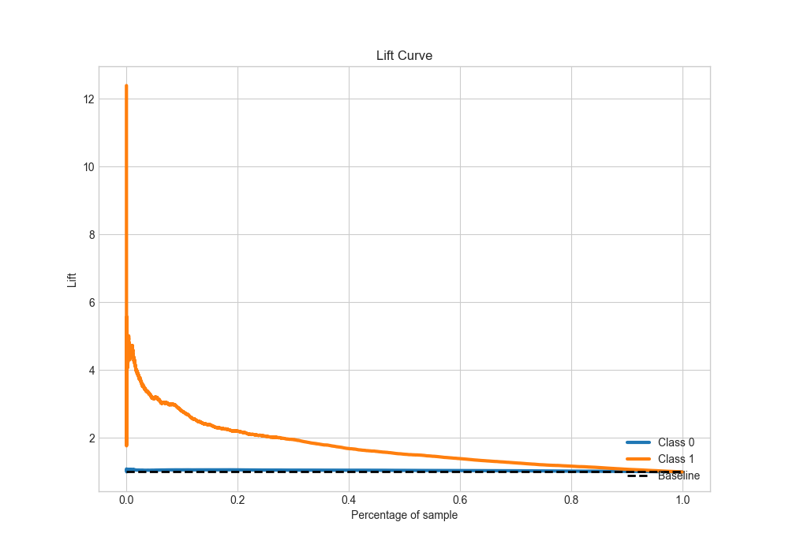

# Summary of 1_DecisionTree

[<< Go back](../README.md)

## Decision Tree
- **n_jobs**: -1
- **criterion**: entropy
- **max_depth**: 4
- **explain_level**: 2

## Validation
 - **validation_type**: split
 - **train_ratio**: 0.9
 - **shuffle**: True
 - **stratify**: True

## Optimized metric
auc

## Training time

308.2 seconds

## Metric details
|           |    score |   threshold |
|:----------|---------:|------------:|
| logloss   | 0.6231   |  nan        |
| auc       | 0.706358 |  nan        |
| f1        | 0.692257 |    0.330933 |
| accuracy  | 0.655977 |    0.500114 |
| precision | 0.866055 |    0.769805 |
| recall    | 1        |    0.201718 |
| mcc       | 0.314987 |    0.500114 |

## Metric details with threshold from accuracy metric
|           |    score |   threshold |
|:----------|---------:|------------:|
| logloss   | 0.6231   |  nan        |
| auc       | 0.706358 |  nan        |
| f1        | 0.630318 |    0.500114 |
| accuracy  | 0.655977 |    0.500114 |
| precision | 0.681045 |    0.500114 |
| recall    | 0.586624 |    0.500114 |
| mcc       | 0.314987 |    0.500114 |

## Confusion matrix (at threshold=0.500114)
|              |   Predicted as 0 |   Predicted as 1 |
|:-------------|-----------------:|-----------------:|
| Labeled as 0 |         11152.3  |          4223.45 |
| Labeled as 1 |          6354.76 |          9018.06 |

## Learning curves

## Permutation-based Importance

## Confusion Matrix

## Normalized Confusion Matrix

## ROC Curve

## Kolmogorov-Smirnov Statistic

## Precision-Recall Curve

## Calibration Curve

## Cumulative Gains Curve

## Lift Curve

[<< Go back](../README.md)
