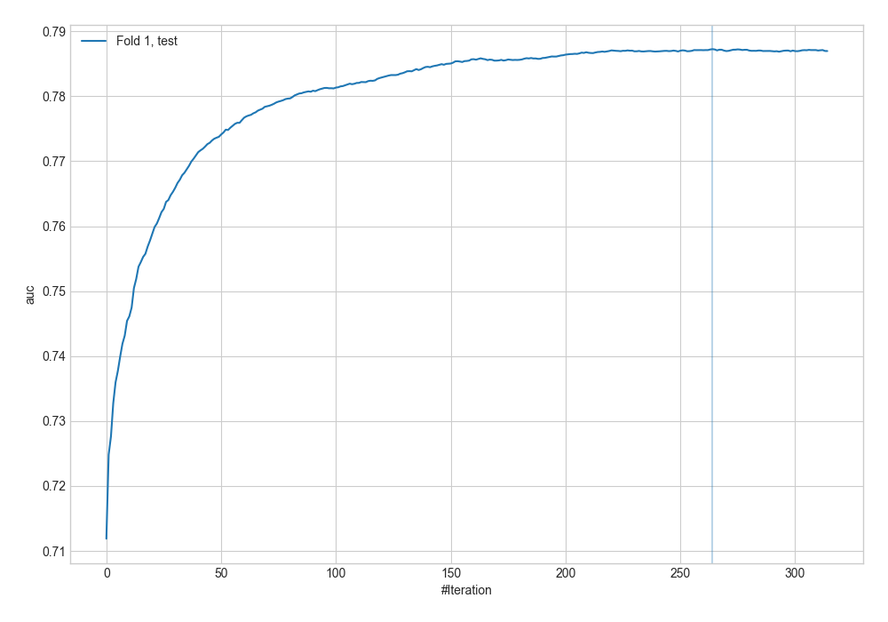
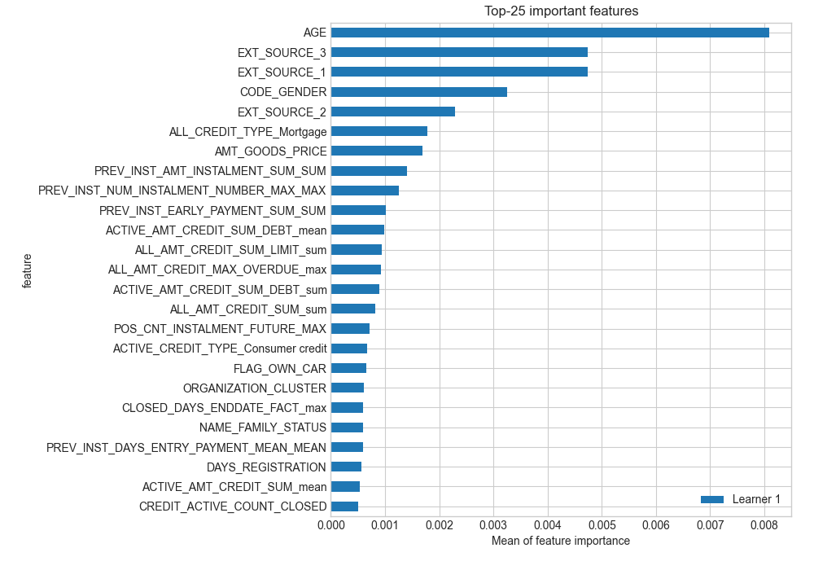
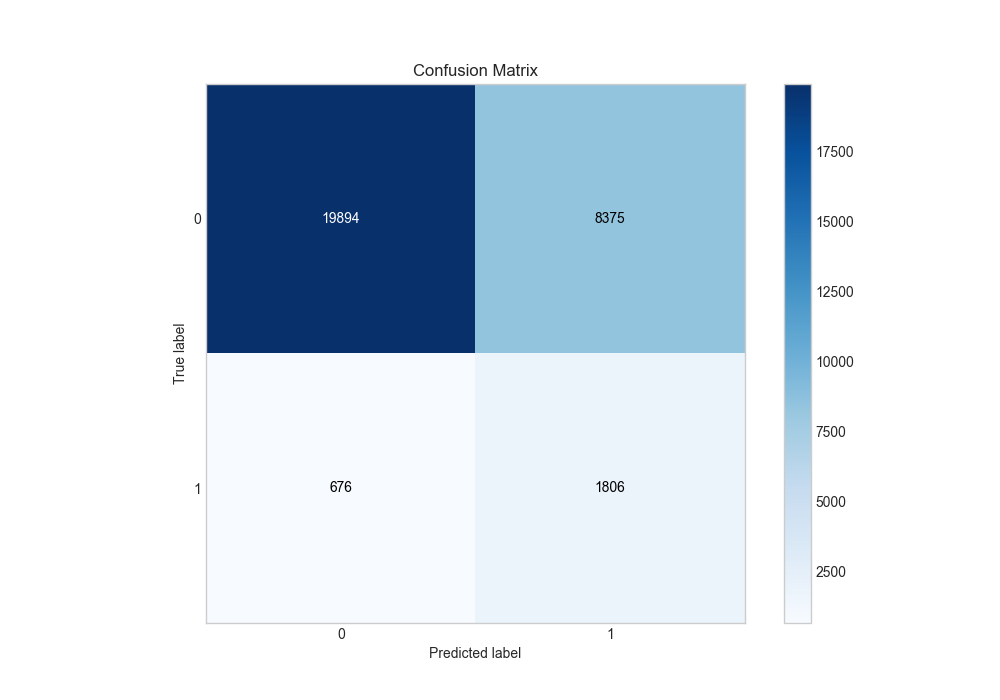
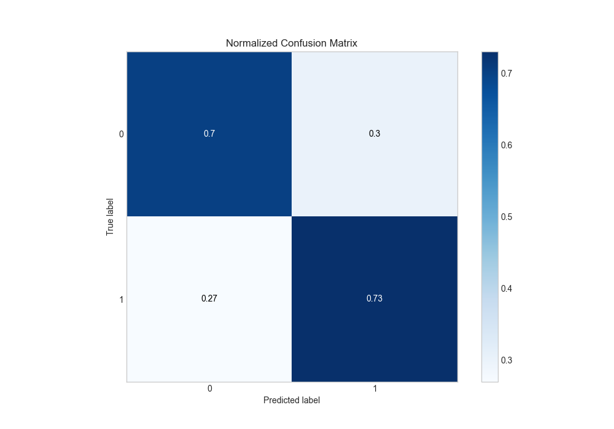
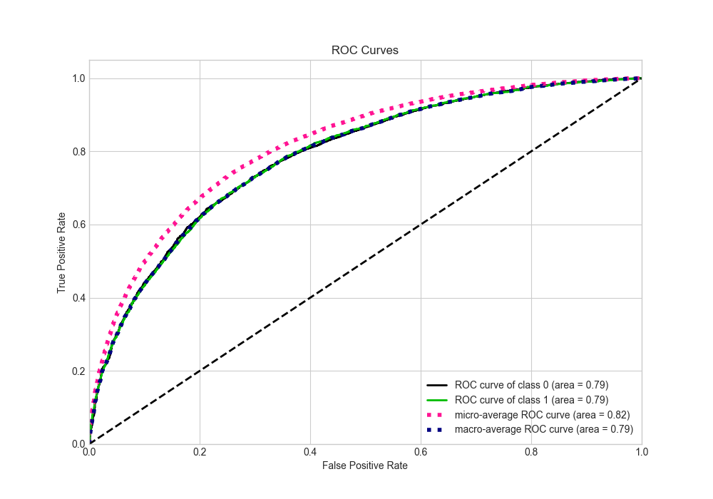
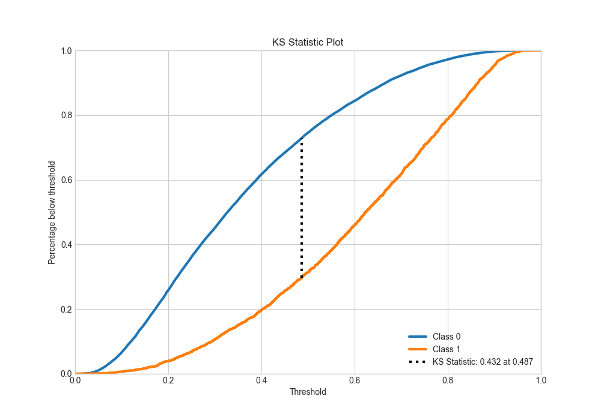
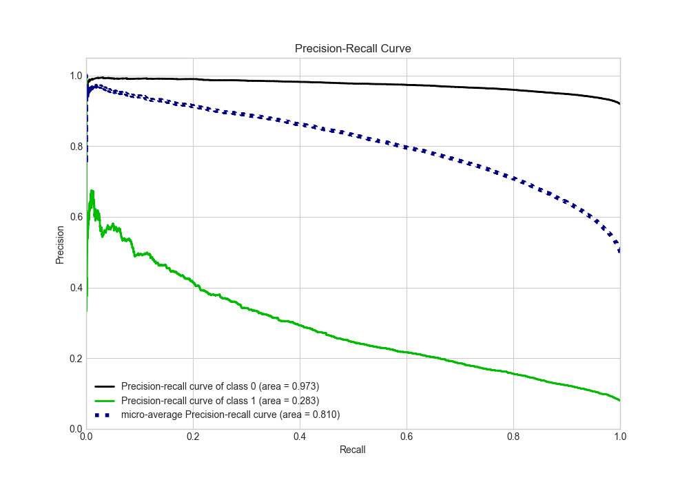
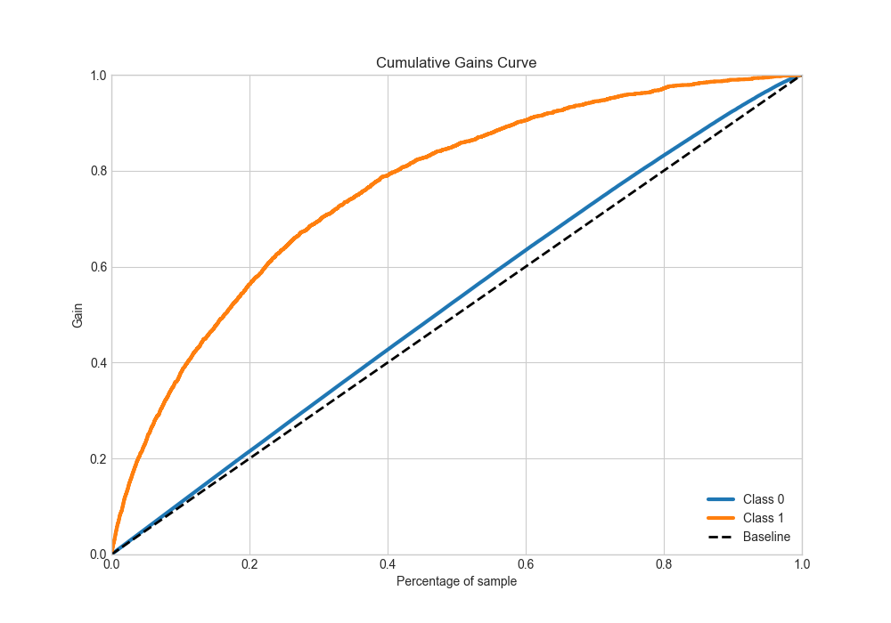
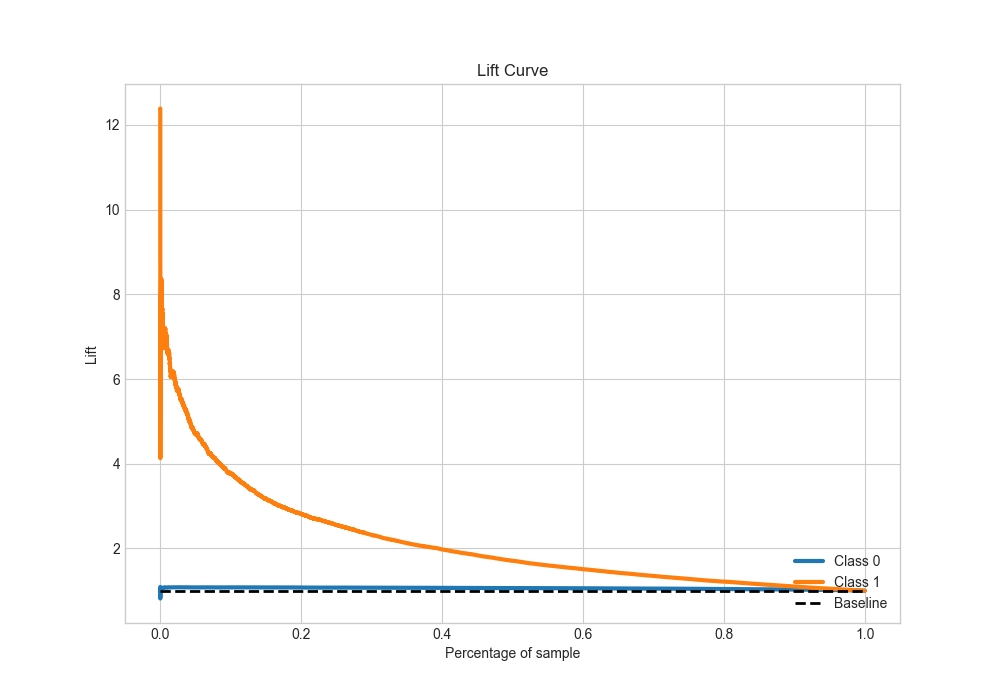

# Summary of 24_CatBoost

[<< Go back](../README.md)

## CatBoost
- **n_jobs**: -1
- **learning_rate**: 0.1
- **depth**: 7
- **rsm**: 0.8
- **loss_function**: Logloss
- **eval_metric**: AUC
- **explain_level**: 2

## Validation
 - **validation_type**: split
 - **train_ratio**: 0.9
 - **shuffle**: True
 - **stratify**: True

## Optimized metric
auc

## Training time

399.2 seconds

## Metric details
|           |    score |    threshold |
|:----------|---------:|-------------:|
| logloss   | 0.558293 | nan          |
| auc       | 0.787244 | nan          |
| f1        | 0.737332 |   0.384855   |
| accuracy  | 0.715688 |   0.466547   |
| precision | 0.92909  |   0.879634   |
| recall    | 1        |   0.00989411 |
| mcc       | 0.433721 |   0.418999   |

## Metric details with threshold from accuracy metric
|           |    score |   threshold |
|:----------|---------:|------------:|
| logloss   | 0.558293 |  nan        |
| auc       | 0.787244 |  nan        |
| f1        | 0.719026 |    0.466547 |
| accuracy  | 0.715688 |    0.466547 |
| precision | 0.710615 |    0.466547 |
| recall    | 0.727639 |    0.466547 |
| mcc       | 0.431501 |    0.466547 |

## Confusion matrix (at threshold=0.466547)
|              |   Predicted as 0 |   Predicted as 1 |
|:-------------|-----------------:|-----------------:|
| Labeled as 0 |         10820.5  |          4555.23 |
| Labeled as 1 |          4186.96 |         11185.9  |

## Learning curves

## Permutation-based Importance

## Confusion Matrix

## Normalized Confusion Matrix

## ROC Curve

## Kolmogorov-Smirnov Statistic

## Precision-Recall Curve

## Calibration Curve

## Cumulative Gains Curve

## Lift Curve

[<< Go back](../README.md)
