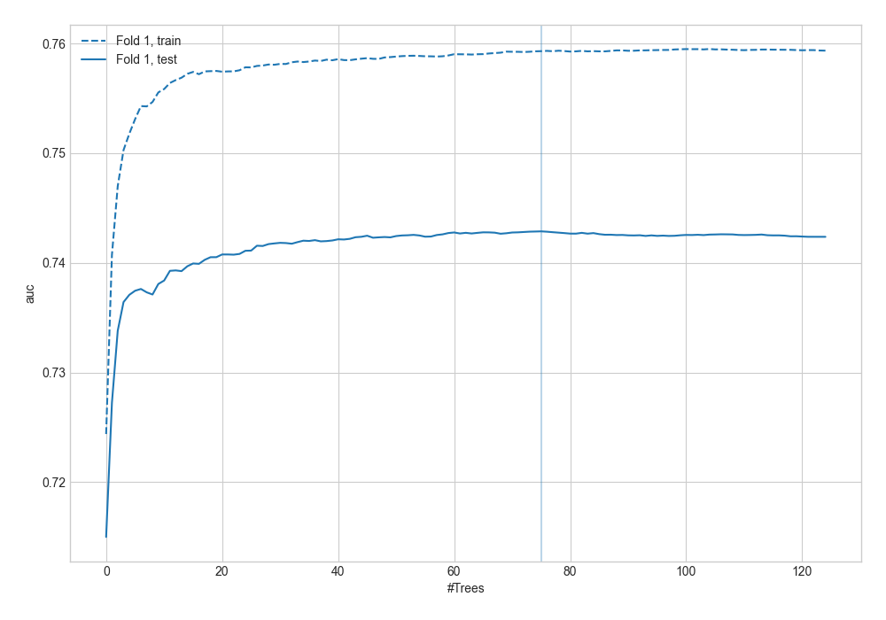
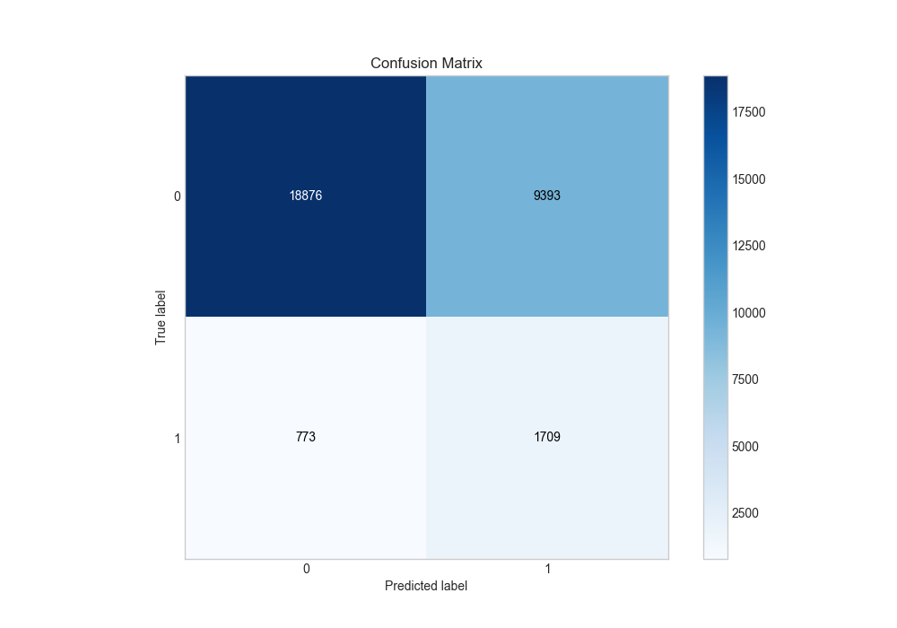
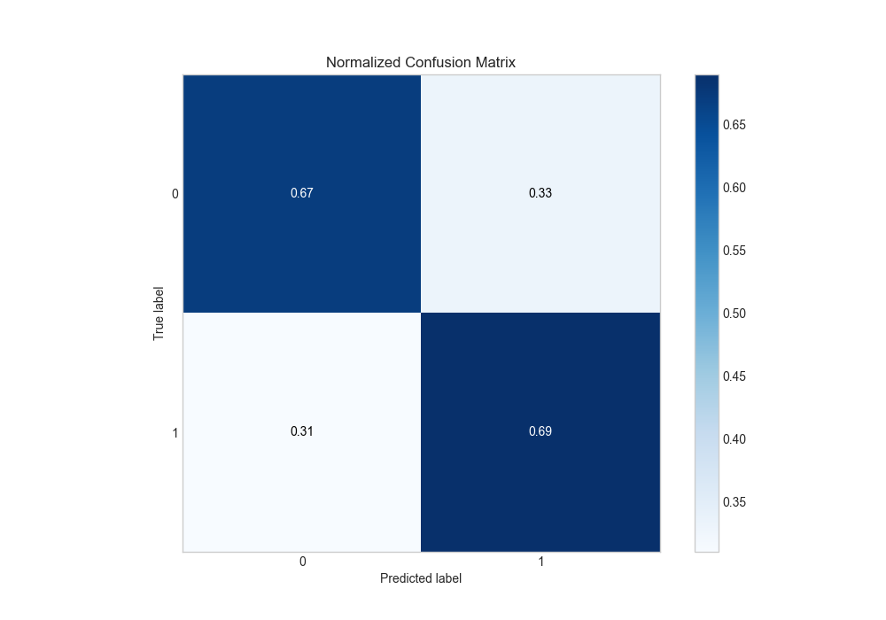
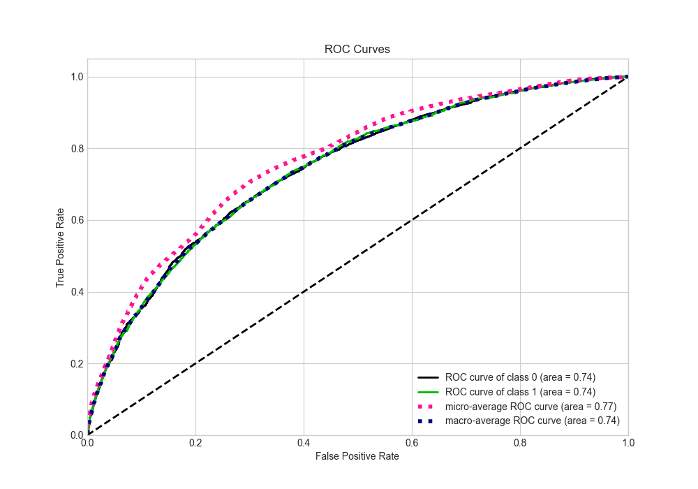
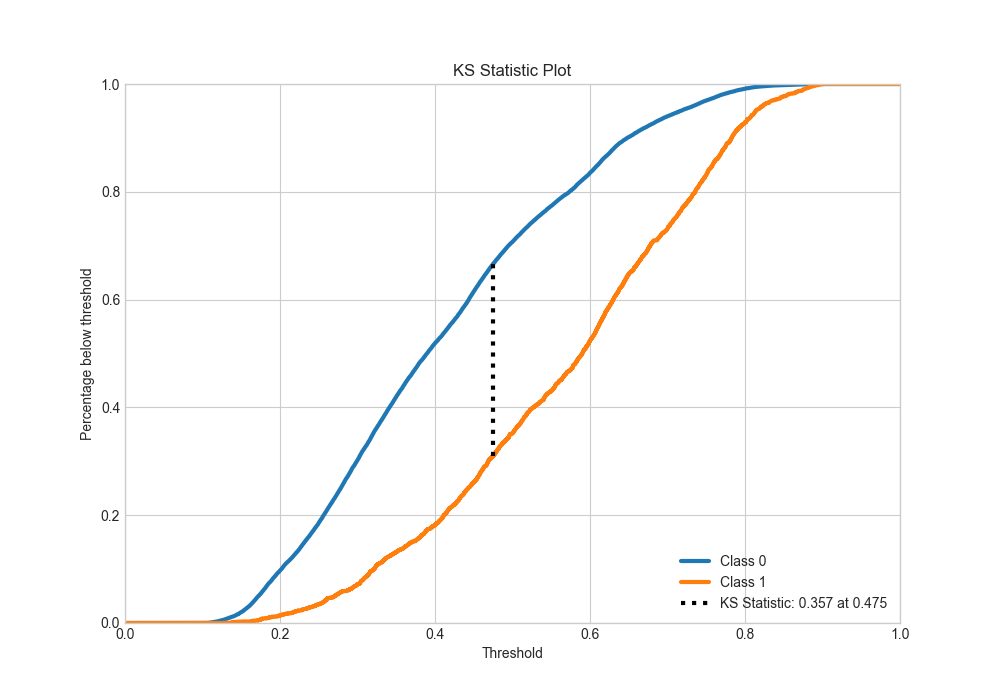
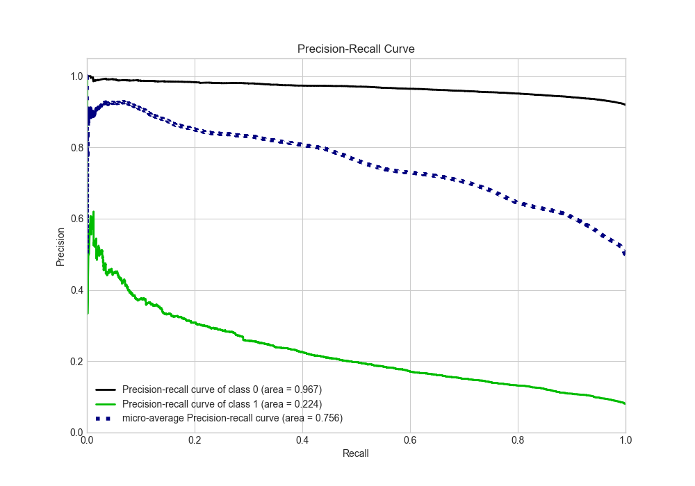
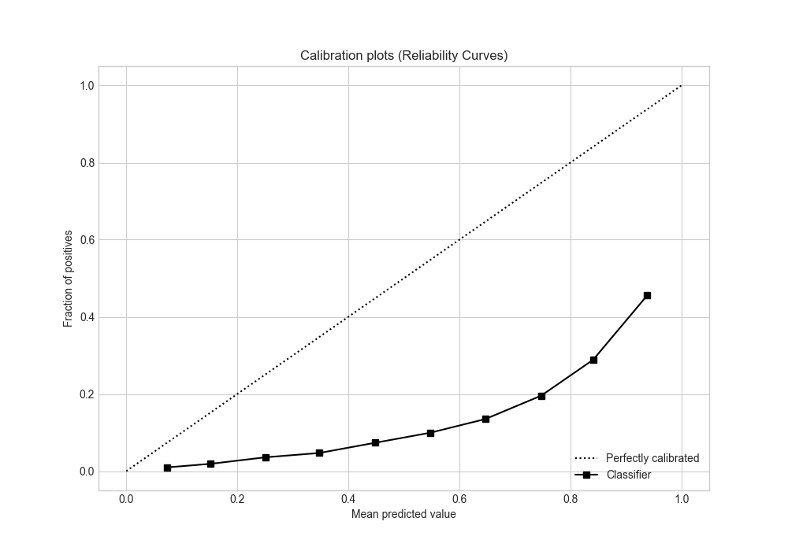
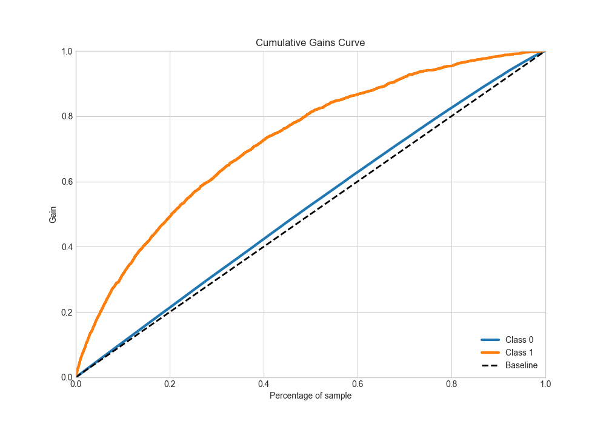
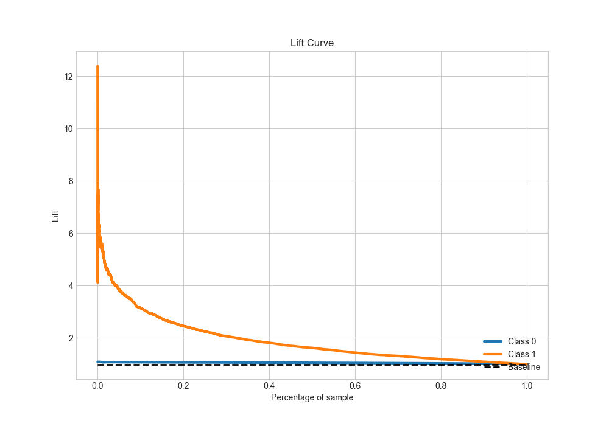

# Summary of 33_RandomForest

[<< Go back](../README.md)

## Random Forest
- **n_jobs**: -1
- **criterion**: entropy
- **max_features**: 0.8
- **min_samples_split**: 50
- **max_depth**: 7
- **eval_metric_name**: auc
- **explain_level**: 2

## Validation
 - **validation_type**: split
 - **train_ratio**: 0.9
 - **shuffle**: True
 - **stratify**: True

## Optimized metric
auc

## Training time

2689.3 seconds

## Metric details
|           |    score |   threshold |
|:----------|---------:|------------:|
| logloss   | 0.599483 | nan         |
| auc       | 0.74287  | nan         |
| f1        | 0.71348  |   0.376443  |
| accuracy  | 0.678142 |   0.475708  |
| precision | 0.896252 |   0.806767  |
| recall    | 1        |   0.0826676 |
| mcc       | 0.357598 |   0.45591   |

## Metric details with threshold from accuracy metric
|           |    score |   threshold |
|:----------|---------:|------------:|
| logloss   | 0.599483 |  nan        |
| auc       | 0.74287  |  nan        |
| f1        | 0.681439 |    0.475708 |
| accuracy  | 0.678142 |    0.475708 |
| precision | 0.674466 |    0.475708 |
| recall    | 0.688558 |    0.475708 |
| mcc       | 0.356363 |    0.475708 |

## Confusion matrix (at threshold=0.475708)
|              |   Predicted as 0 |   Predicted as 1 |
|:-------------|-----------------:|-----------------:|
| Labeled as 0 |         10266.8  |          5108.93 |
| Labeled as 1 |          4787.75 |         10585.1  |

## Learning curves

## Permutation-based Importance

## Confusion Matrix

## Normalized Confusion Matrix

## ROC Curve

## Kolmogorov-Smirnov Statistic

## Precision-Recall Curve

## Calibration Curve

## Cumulative Gains Curve

## Lift Curve

[<< Go back](../README.md)
