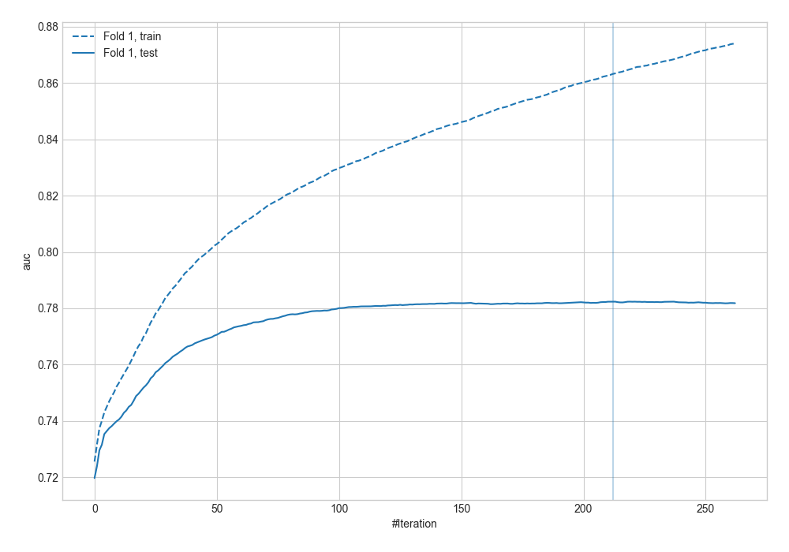
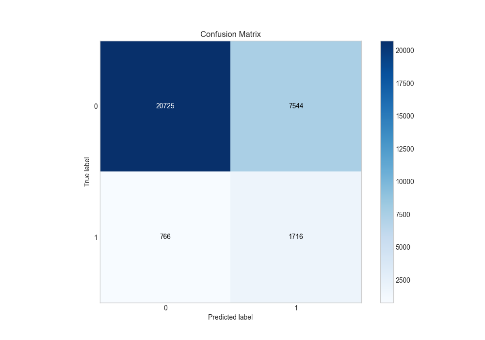
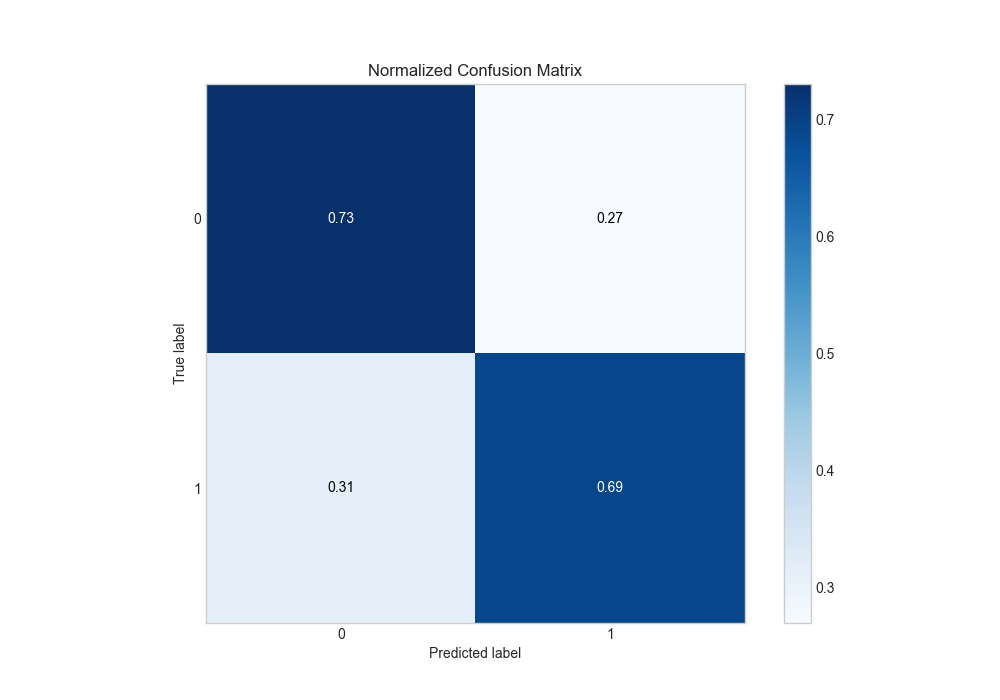
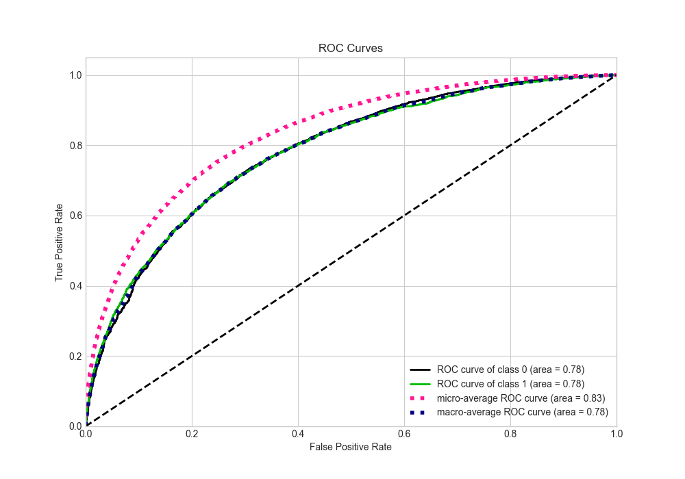
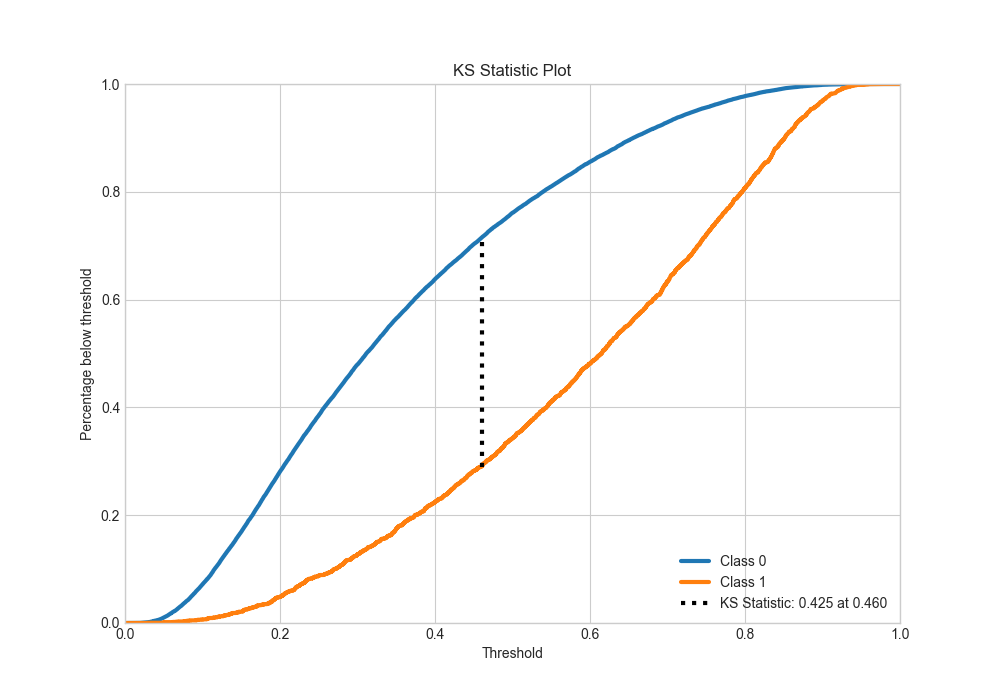
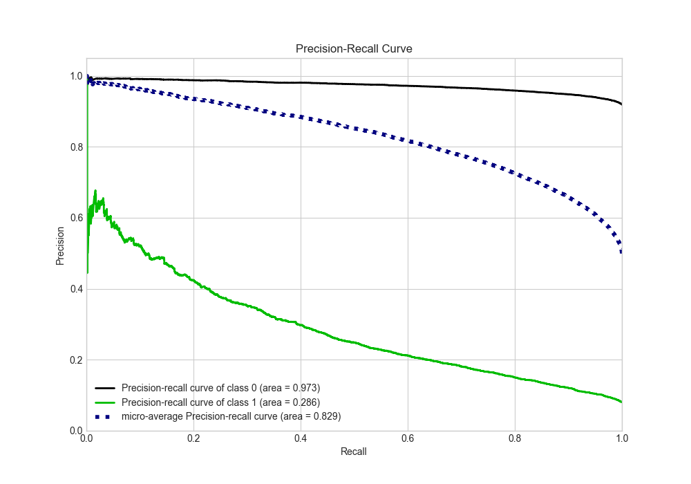
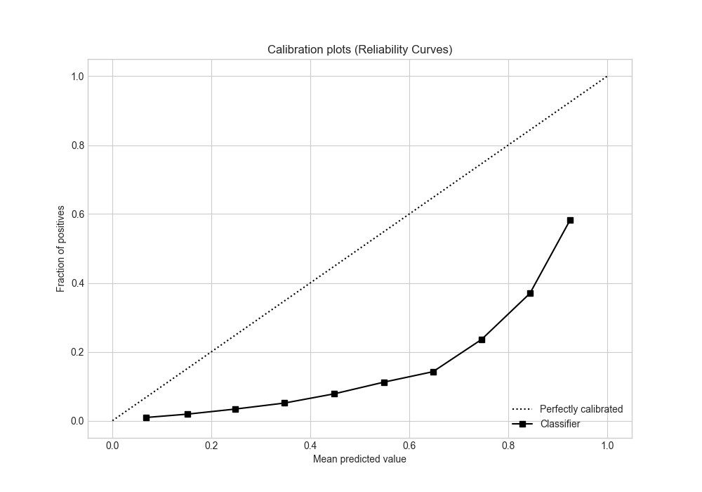
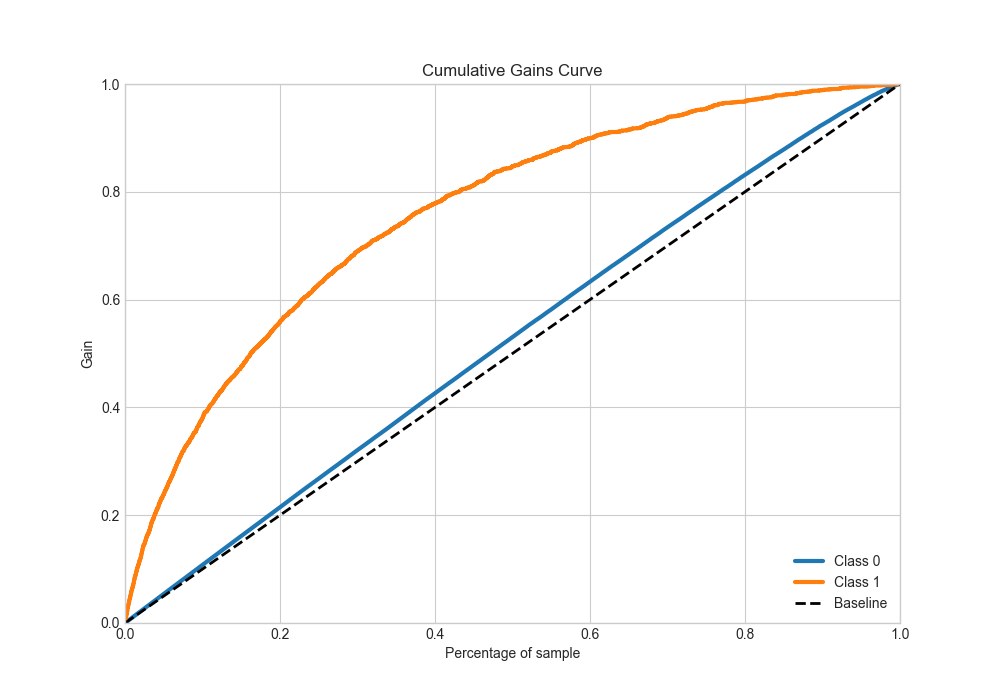
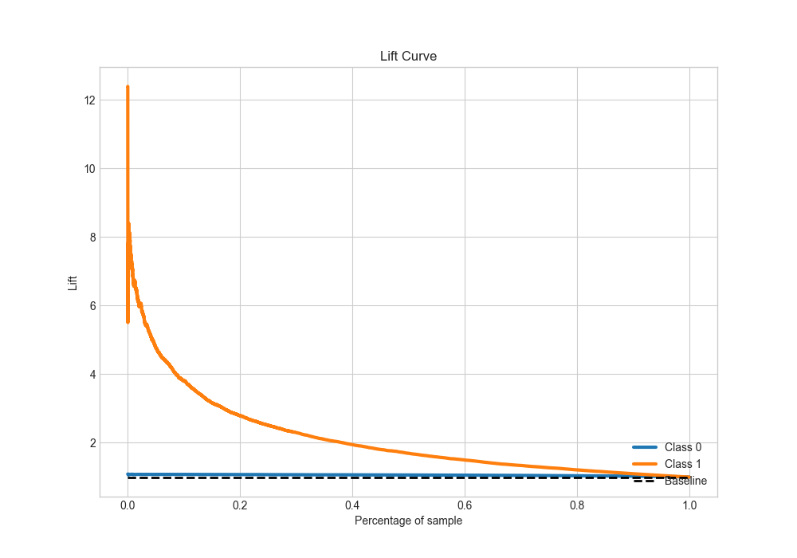

# Summary of 5_Default_Xgboost

[<< Go back](../README.md)

## Extreme Gradient Boosting (Xgboost)
- **n_jobs**: -1
- **objective**: binary:logistic
- **eta**: 0.075
- **max_depth**: 6
- **min_child_weight**: 1
- **subsample**: 1.0
- **colsample_bytree**: 1.0
- **eval_metric**: auc
- **explain_level**: 2

## Validation
 - **validation_type**: split
 - **train_ratio**: 0.9
 - **shuffle**: True
 - **stratify**: True

## Optimized metric
auc

## Training time

211.2 seconds

## Metric details
|           |    score |   threshold |
|:----------|---------:|------------:|
| logloss   | 0.564127 |  nan        |
| auc       | 0.782377 |  nan        |
| f1        | 0.732679 |    0.340883 |
| accuracy  | 0.712259 |    0.474723 |
| precision | 0.92909  |    0.864604 |
| recall    | 1        |    0.011915 |
| mcc       | 0.424884 |    0.474723 |

## Metric details with threshold from accuracy metric
|           |    score |   threshold |
|:----------|---------:|------------:|
| logloss   | 0.564127 |  nan        |
| auc       | 0.782377 |  nan        |
| f1        | 0.706103 |    0.474723 |
| accuracy  | 0.712259 |    0.474723 |
| precision | 0.721468 |    0.474723 |
| recall    | 0.691378 |    0.474723 |
| mcc       | 0.424884 |    0.474723 |

## Confusion matrix (at threshold=0.474723)
|              |   Predicted as 0 |   Predicted as 1 |
|:-------------|-----------------:|-----------------:|
| Labeled as 0 |         11272.5  |          4103.24 |
| Labeled as 1 |          4744.39 |         10628.4  |

## Learning curves

## Permutation-based Importance

## Confusion Matrix

## Normalized Confusion Matrix

## ROC Curve

## Kolmogorov-Smirnov Statistic

## Precision-Recall Curve

## Calibration Curve

## Cumulative Gains Curve

## Lift Curve

[<< Go back](../README.md)
