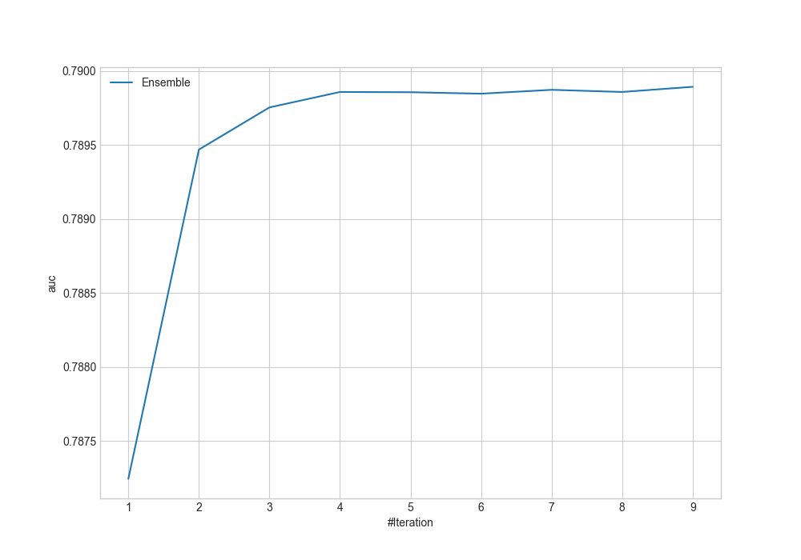
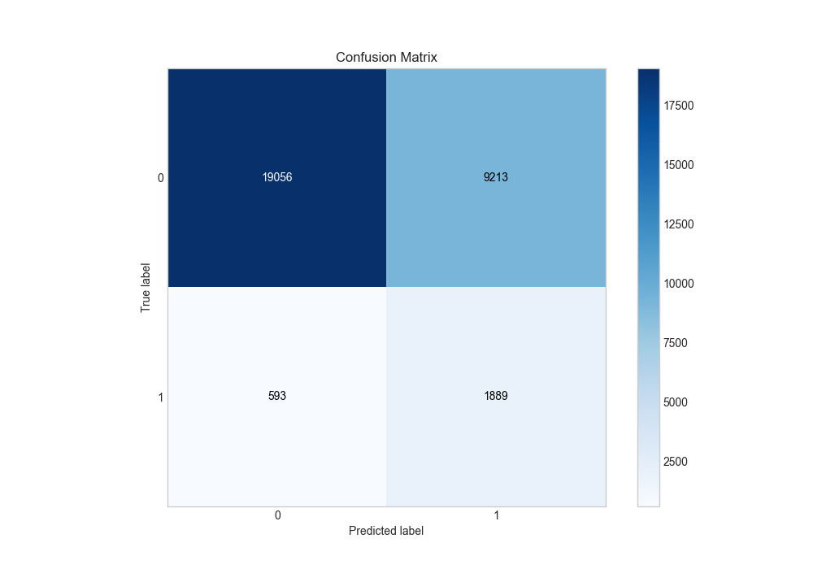
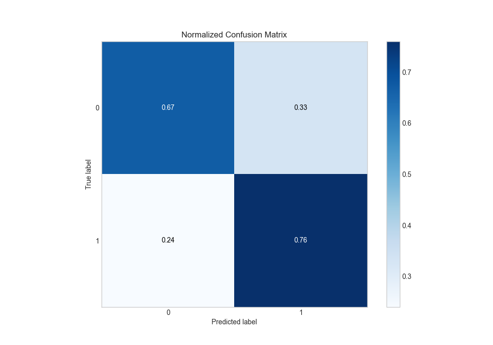
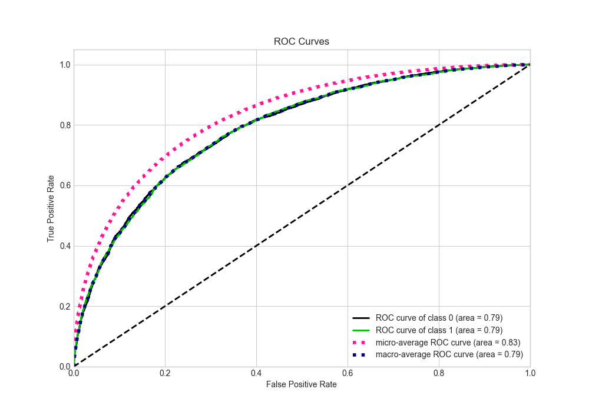
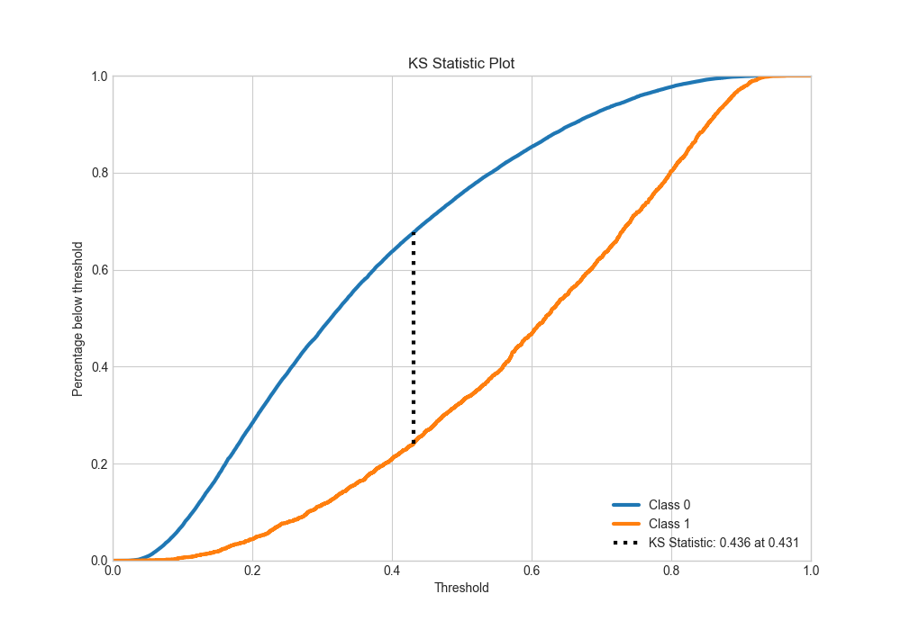
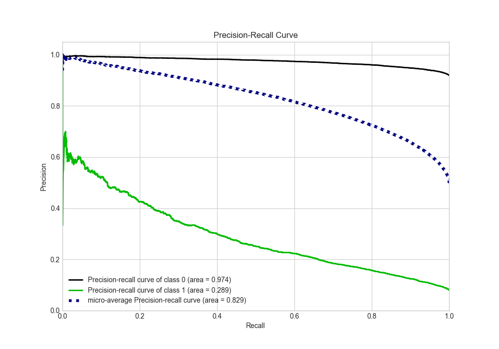
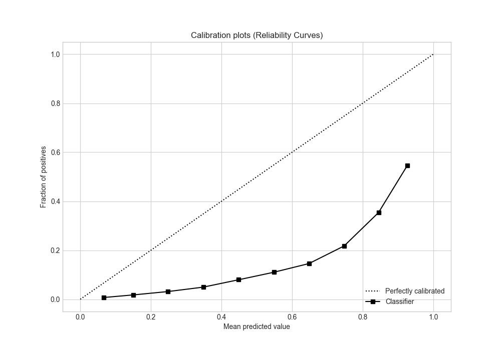
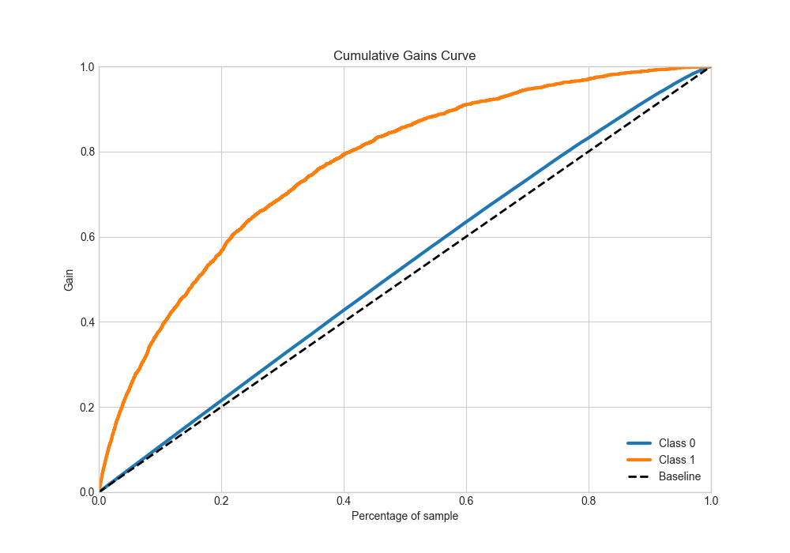
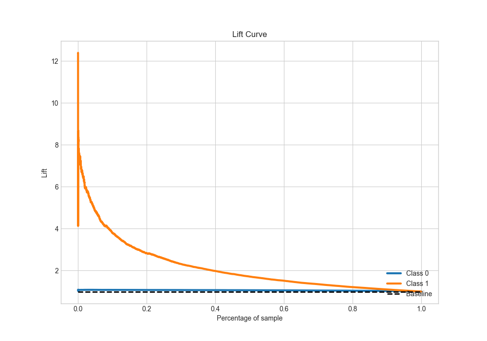

# Summary of Ensemble

[<< Go back](../README.md)

## Ensemble structure
| Model              |   Weight |
|:-------------------|---------:|
| 15_LightGBM        |        2 |
| 24_CatBoost        |        4 |
| 4_Default_LightGBM |        3 |

## Metric details
|           |    score |   threshold |
|:----------|---------:|------------:|
| logloss   | 0.556288 | nan         |
| auc       | 0.789892 | nan         |
| f1        | 0.738053 |   0.355416  |
| accuracy  | 0.717583 |   0.429163  |
| precision | 0.931286 |   0.86538   |
| recall    | 1        |   0.0169175 |
| mcc       | 0.436829 |   0.429163  |

## Metric details with threshold from accuracy metric
|           |    score |   threshold |
|:----------|---------:|------------:|
| logloss   | 0.556288 |  nan        |
| auc       | 0.789892 |  nan        |
| f1        | 0.729337 |    0.429163 |
| accuracy  | 0.717583 |    0.429163 |
| precision | 0.700136 |    0.429163 |
| recall    | 0.76108  |    0.429163 |
| mcc       | 0.436829 |    0.429163 |

## Confusion matrix (at threshold=0.429163)
|              |   Predicted as 0 |   Predicted as 1 |
|:-------------|-----------------:|-----------------:|
| Labeled as 0 |         10364.7  |          5011.02 |
| Labeled as 1 |          3672.88 |         11699.9  |

## Learning curves

## Confusion Matrix

## Normalized Confusion Matrix

## ROC Curve

## Kolmogorov-Smirnov Statistic

## Precision-Recall Curve

## Calibration Curve

## Cumulative Gains Curve

## Lift Curve

[<< Go back](../README.md)
