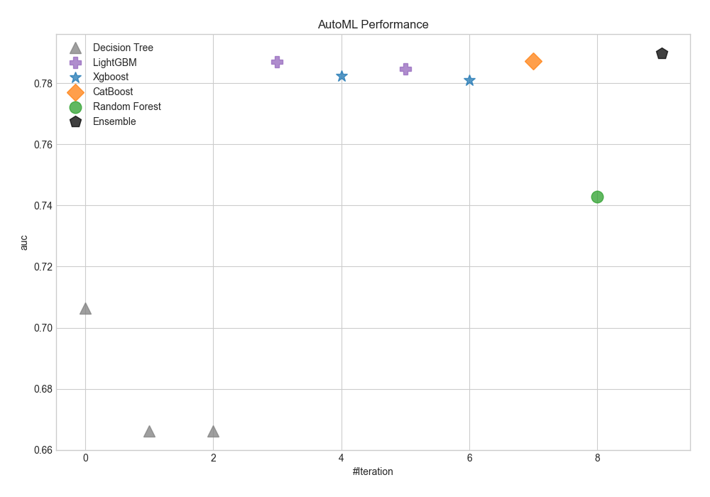
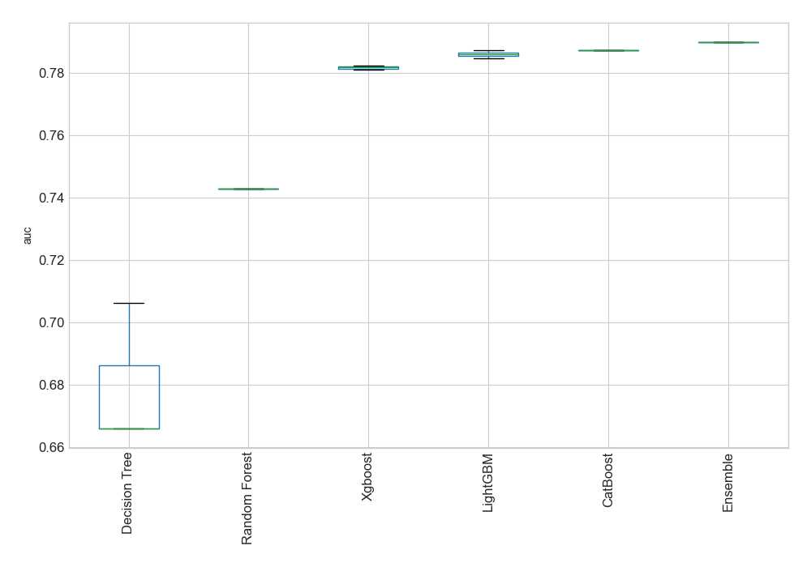
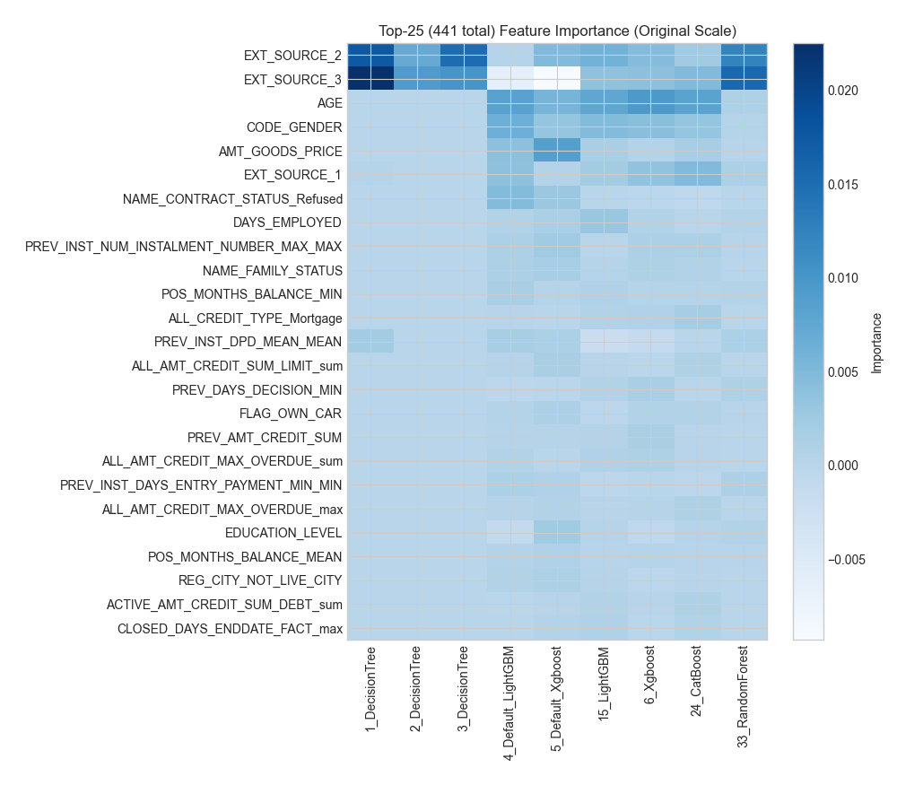
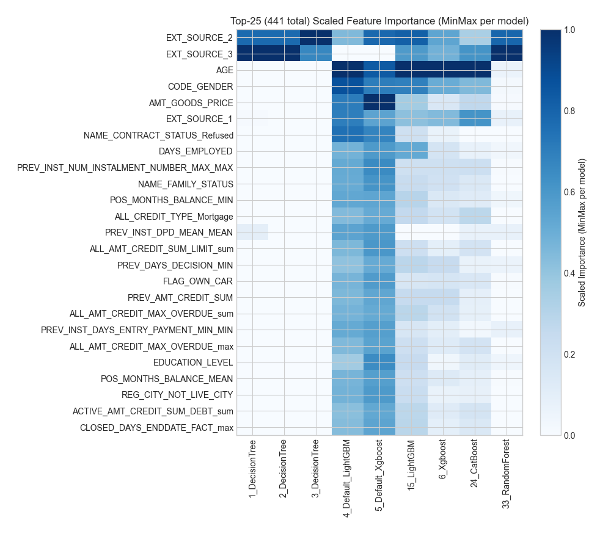
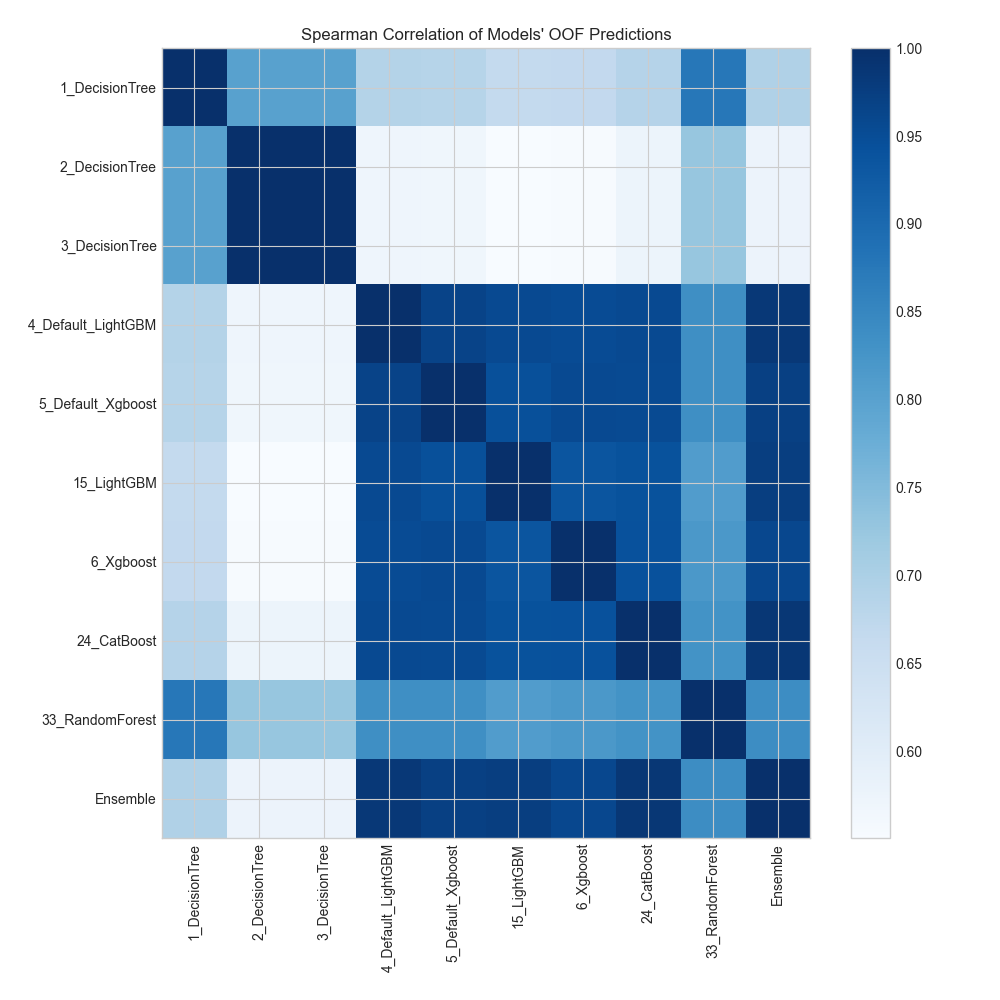

# AutoML Leaderboard

| Best model   | name                                               | model_type    | metric_type   |   metric_value |   train_time |
|:-------------|:---------------------------------------------------|:--------------|:--------------|---------------:|-------------:|
|              | [1_DecisionTree](1_DecisionTree/README.md)         | Decision Tree | auc           |       0.706358 |       310.19 |
|              | [2_DecisionTree](2_DecisionTree/README.md)         | Decision Tree | auc           |       0.666149 |       168.11 |
|              | [3_DecisionTree](3_DecisionTree/README.md)         | Decision Tree | auc           |       0.666149 |       152.88 |
|              | [4_Default_LightGBM](4_Default_LightGBM/README.md) | LightGBM      | auc           |       0.787093 |       203.32 |
|              | [5_Default_Xgboost](5_Default_Xgboost/README.md)   | Xgboost       | auc           |       0.782377 |       213.17 |
|              | [15_LightGBM](15_LightGBM/README.md)               | LightGBM      | auc           |       0.784674 |       181.32 |
|              | [6_Xgboost](6_Xgboost/README.md)                   | Xgboost       | auc           |       0.780952 |       192.63 |
|              | [24_CatBoost](24_CatBoost/README.md)               | CatBoost      | auc           |       0.787244 |       400.92 |
|              | [33_RandomForest](33_RandomForest/README.md)       | Random Forest | auc           |       0.74287  |      2690.98 |
| **the best** | [Ensemble](Ensemble/README.md)                     | Ensemble      | auc           |       0.789892 |         8.03 |

### AutoML Performance

### AutoML Performance Boxplot

### Features Importance (Original Scale)

### Scaled Features Importance (MinMax per Model)

### Spearman Correlation of Models

