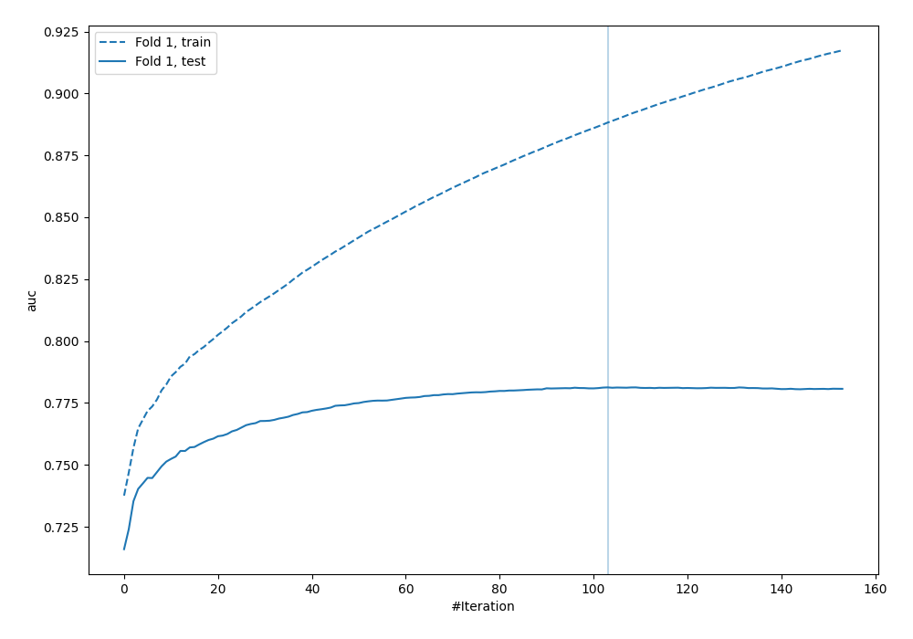
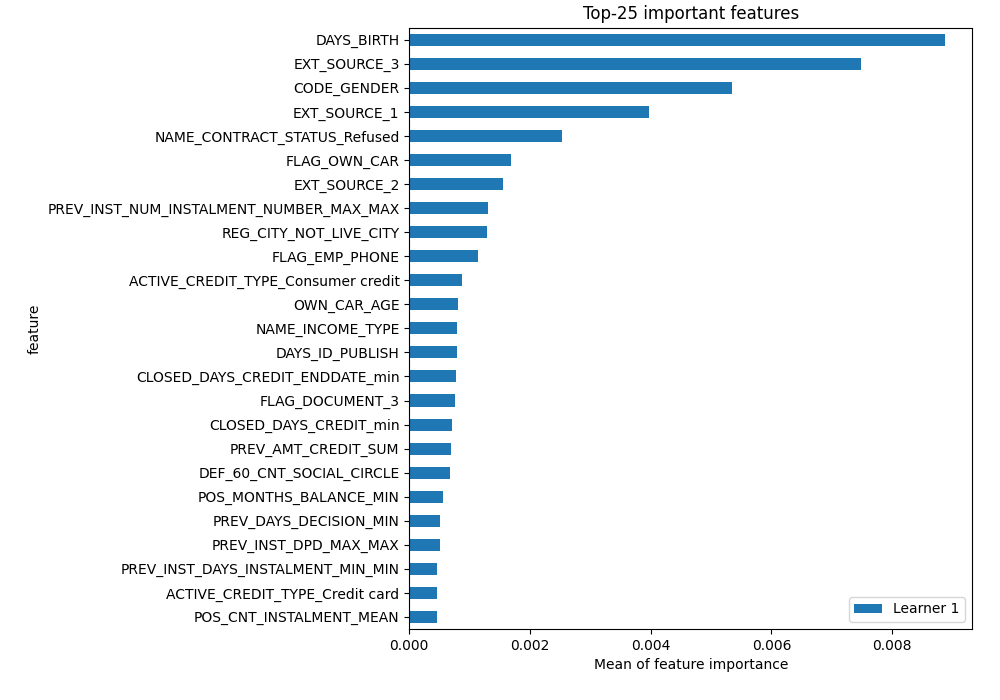
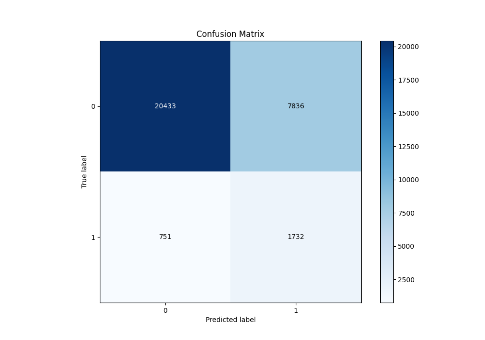
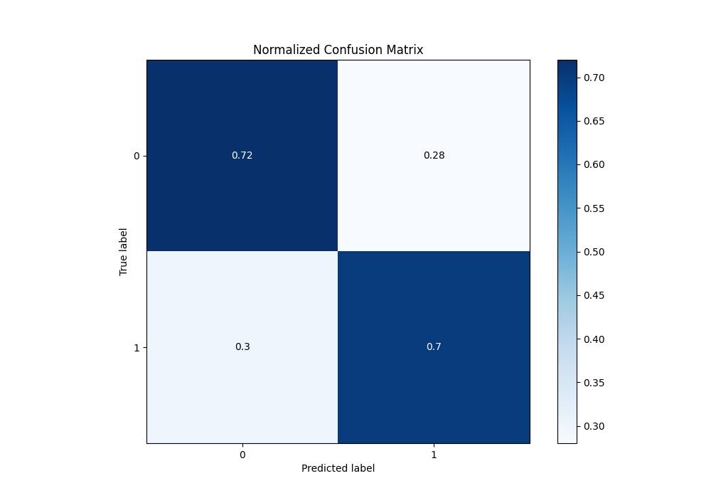
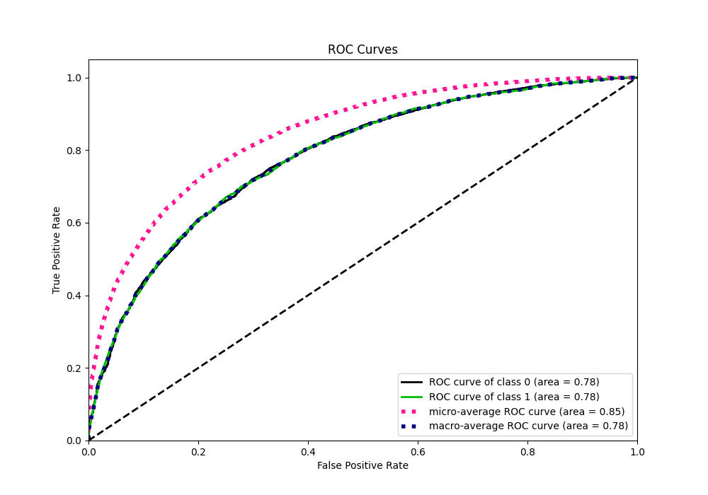
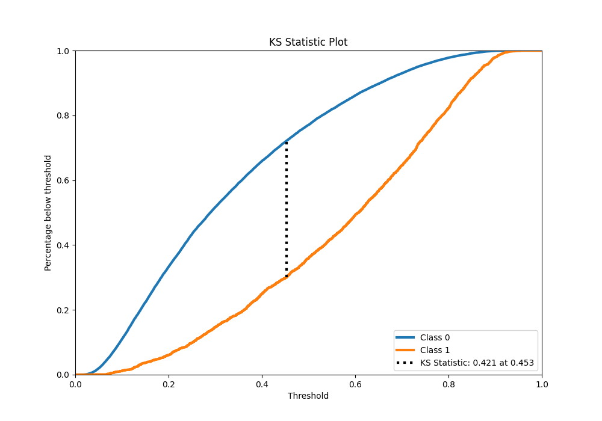
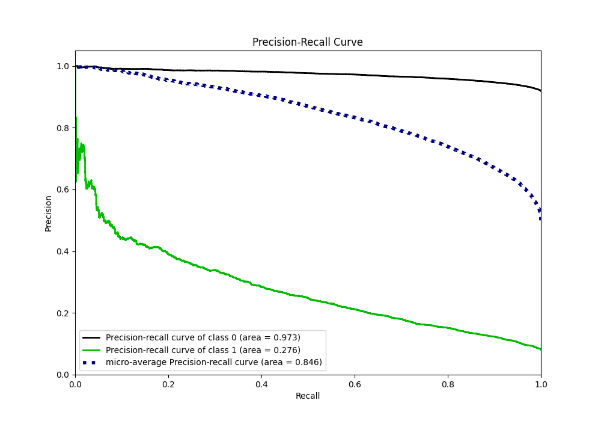
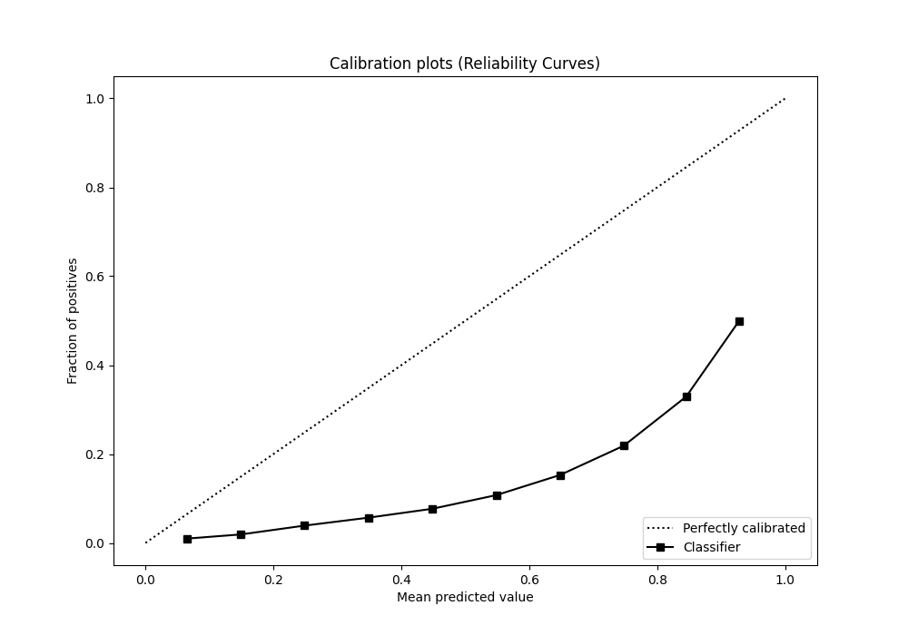
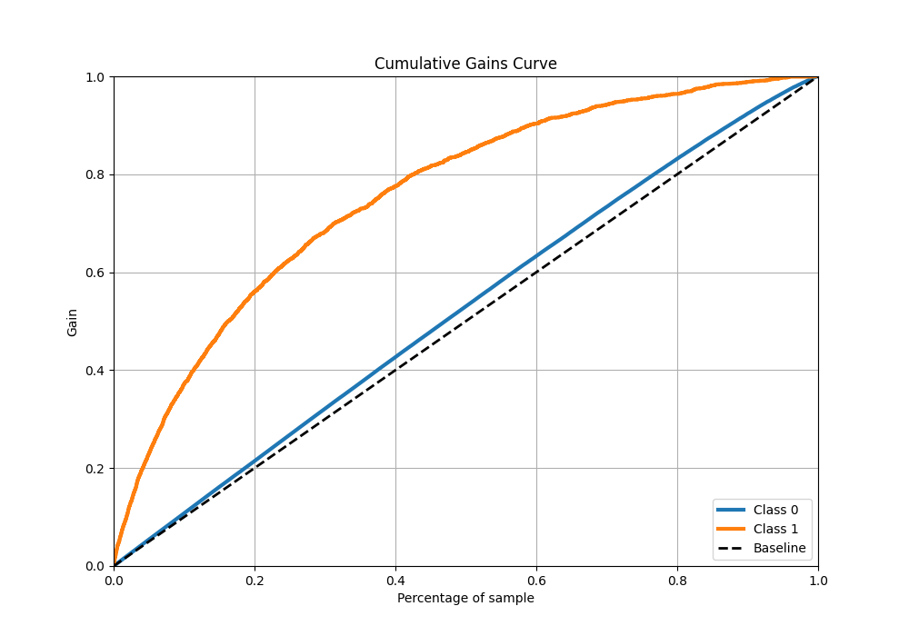
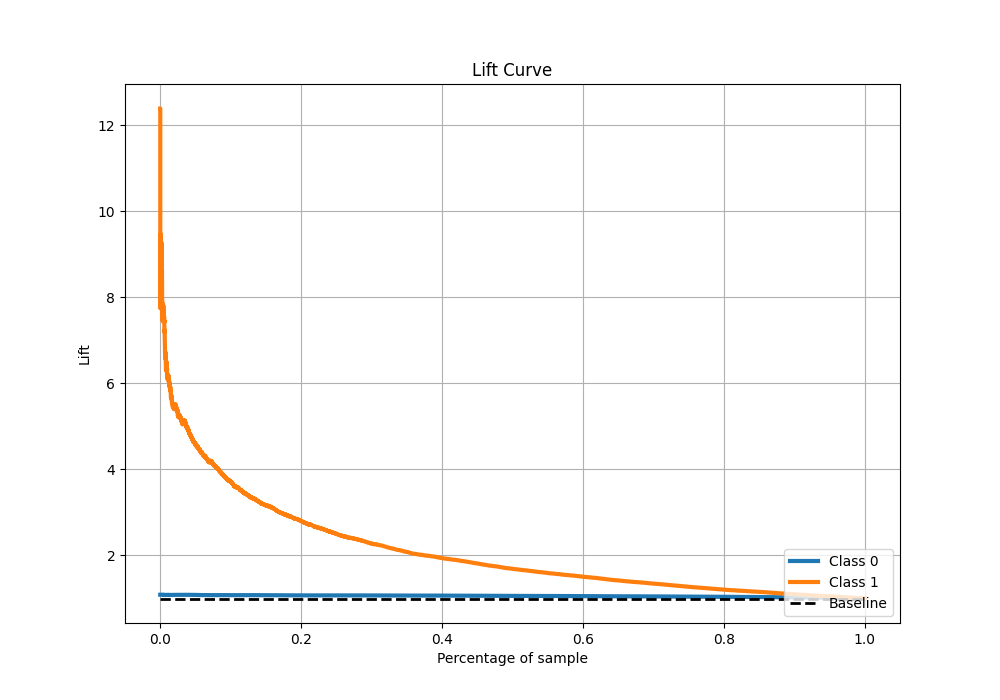

# Summary of 15_LightGBM

[<< Go back](../README.md)

## LightGBM
- **n_jobs**: -1
- **objective**: binary
- **num_leaves**: 95
- **learning_rate**: 0.1
- **feature_fraction**: 0.5
- **bagging_fraction**: 0.8
- **min_data_in_leaf**: 50
- **metric**: auc
- **custom_eval_metric_name**: None
- **explain_level**: 2

## Validation
 - **validation_type**: split
 - **train_ratio**: 0.9
 - **shuffle**: True
 - **stratify**: True

## Optimized metric
auc

## Training time

188.0 seconds

## Metric details
|           |    score |   threshold |
|:----------|---------:|------------:|
| logloss   | 0.56819  | nan         |
| auc       | 0.781294 | nan         |
| f1        | 0.731416 |   0.282163  |
| accuracy  | 0.710173 |   0.454029  |
| precision | 0.918438 |   0.860476  |
| recall    | 1        |   0.0116748 |
| mcc       | 0.420483 |   0.454029  |

## Metric details with threshold from accuracy metric
|           |    score |   threshold |
|:----------|---------:|------------:|
| logloss   | 0.56819  |  nan        |
| auc       | 0.781294 |  nan        |
| f1        | 0.706485 |    0.454029 |
| accuracy  | 0.710173 |    0.454029 |
| precision | 0.71566  |    0.454029 |
| recall    | 0.697543 |    0.454029 |
| mcc       | 0.420483 |    0.454029 |

## Confusion matrix (at threshold=0.454029)
|              |   Predicted as 0 |   Predicted as 1 |
|:-------------|-----------------:|-----------------:|
| Labeled as 0 |         11113.7  |          4262.07 |
| Labeled as 1 |          4651.37 |         10727.3  |

## Learning curves

## Permutation-based Importance

## Confusion Matrix

## Normalized Confusion Matrix

## ROC Curve

## Kolmogorov-Smirnov Statistic

## Precision-Recall Curve

## Calibration Curve

## Cumulative Gains Curve

## Lift Curve

[<< Go back](../README.md)
