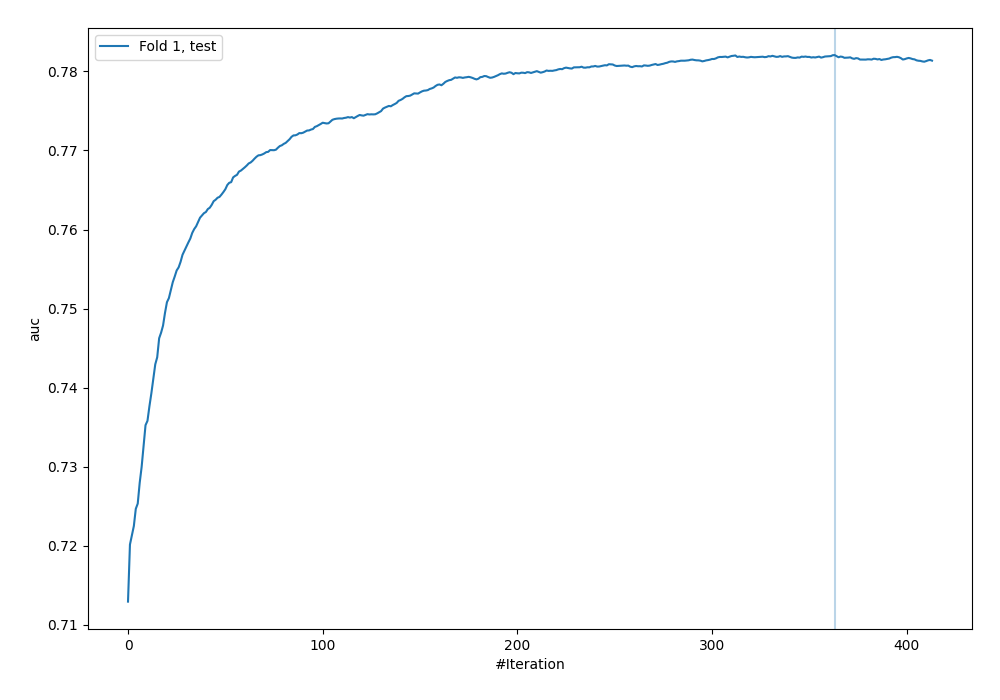
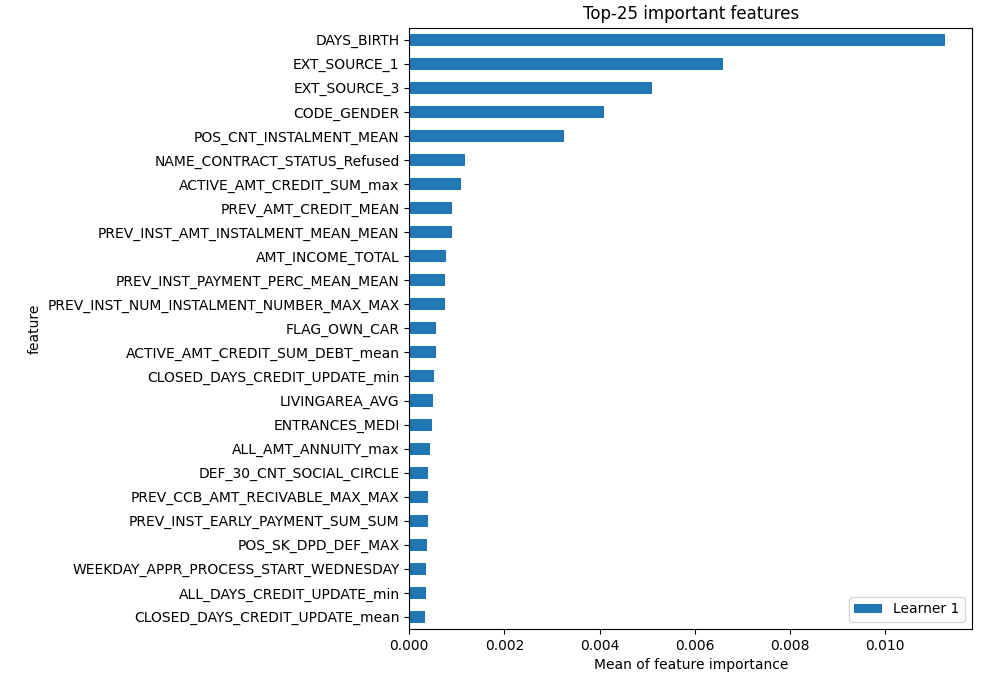
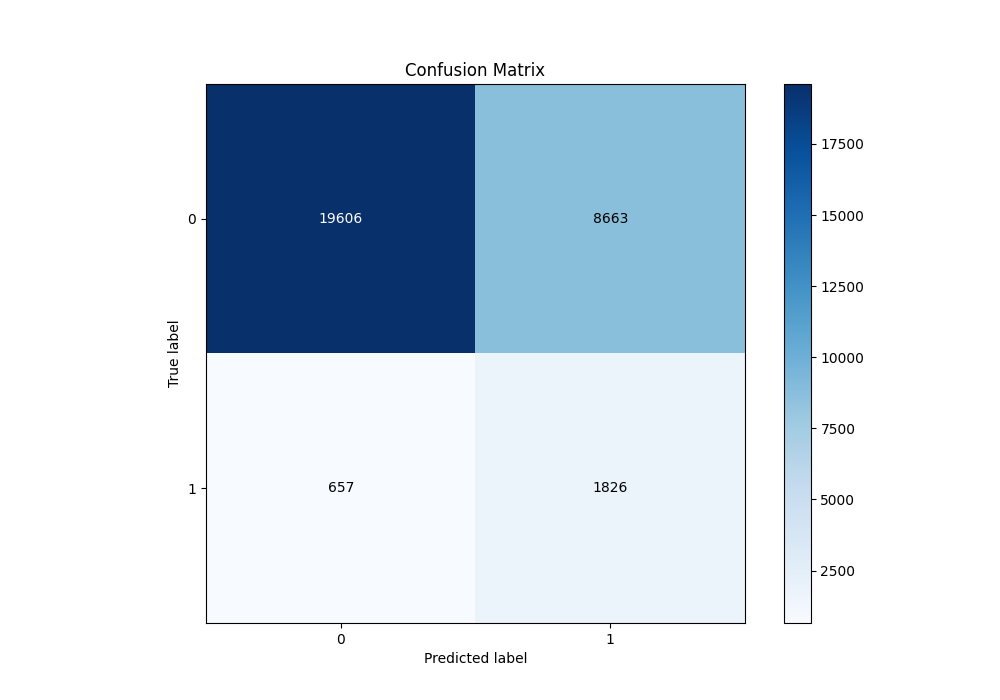
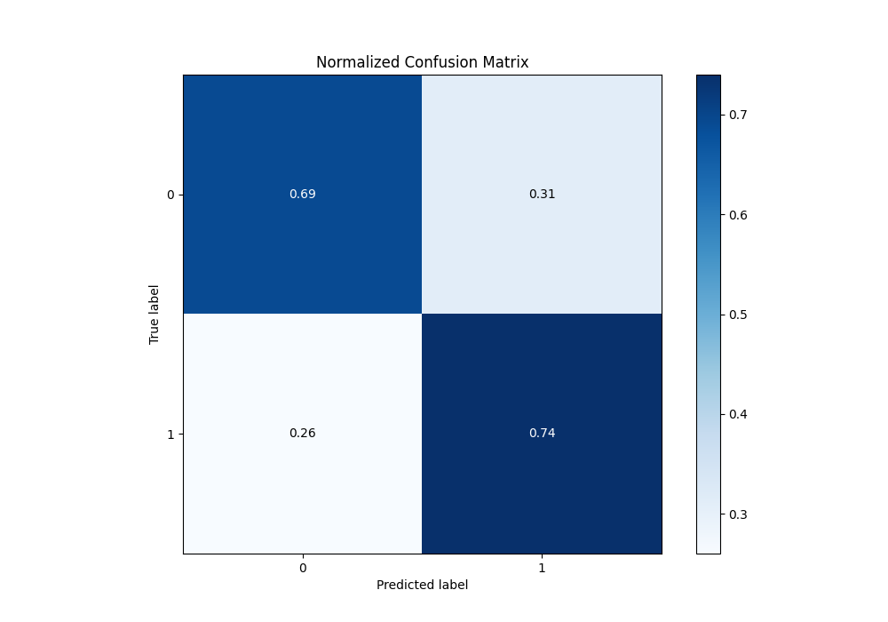
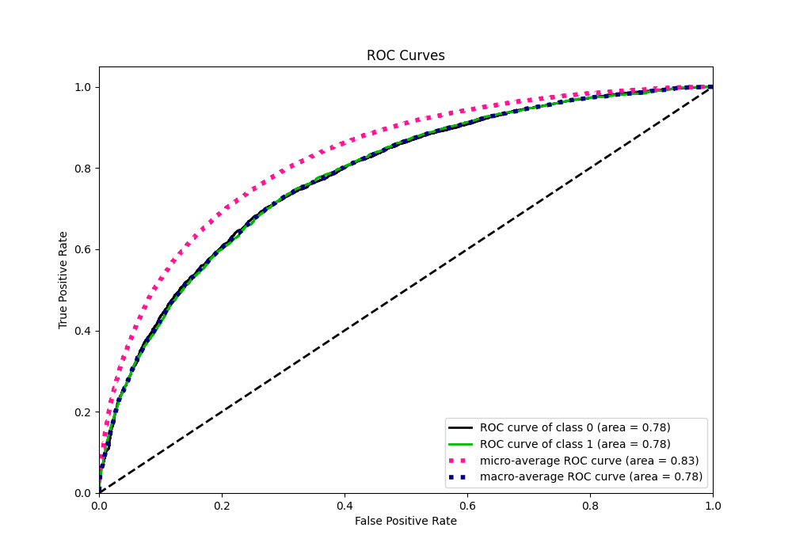
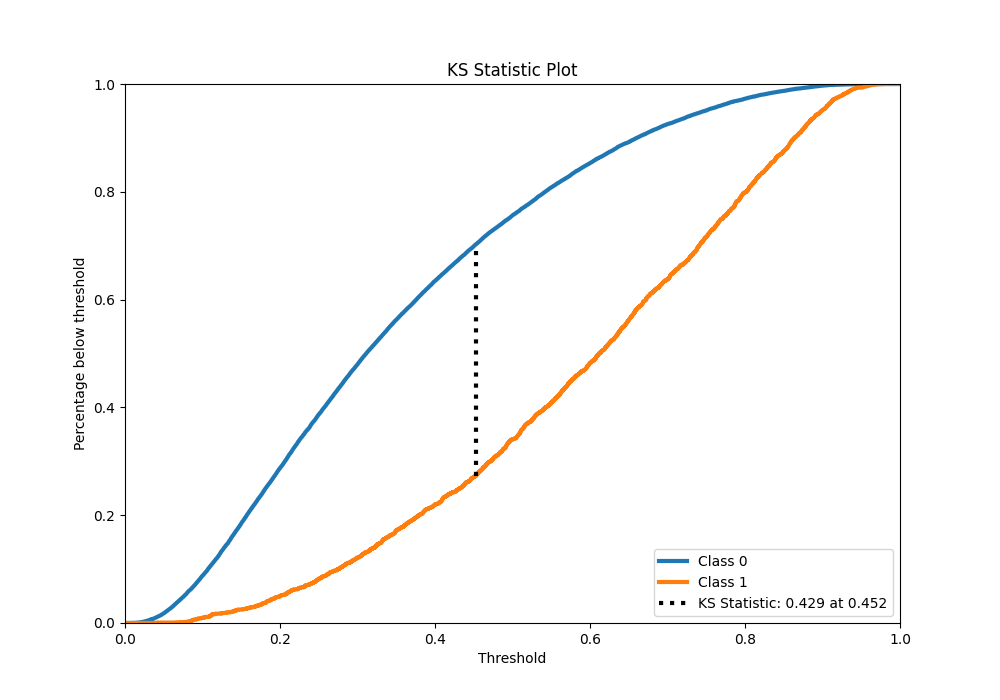
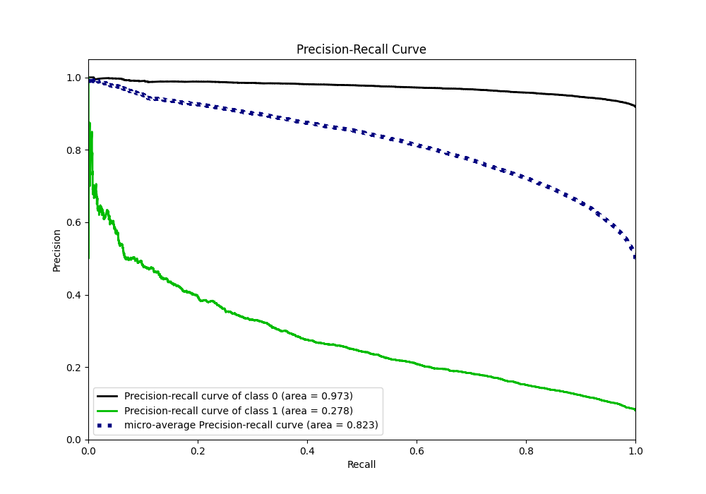
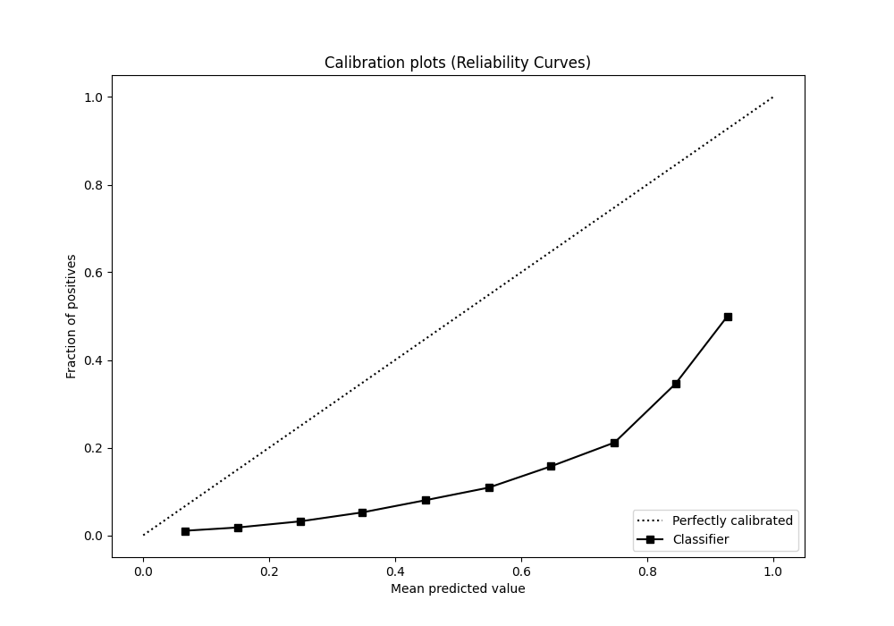
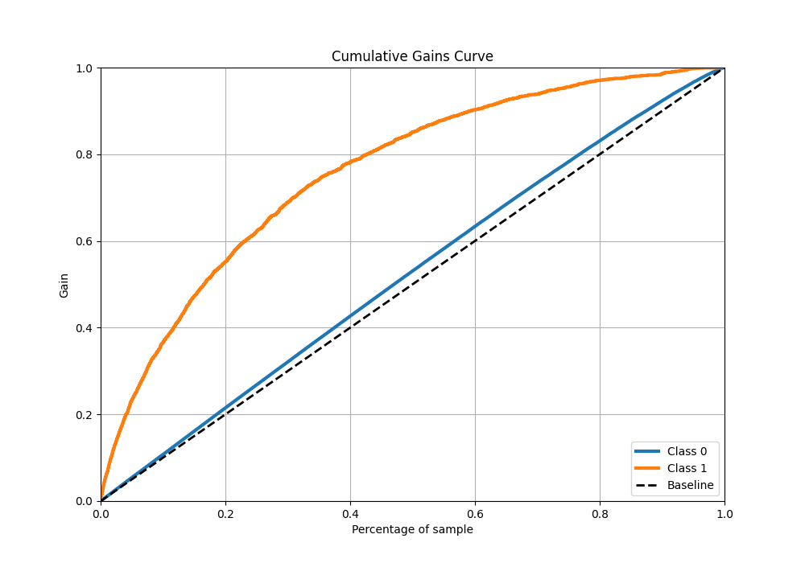
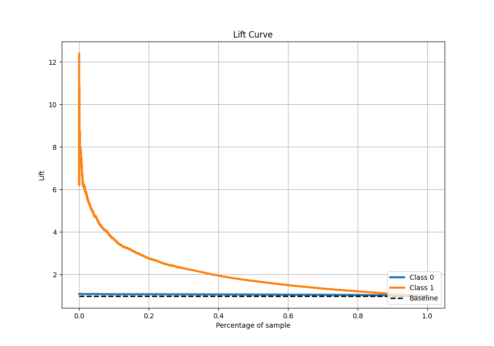

# Summary of 24_CatBoost

[<< Go back](../README.md)

## CatBoost
- **n_jobs**: -1
- **learning_rate**: 0.1
- **depth**: 7
- **rsm**: 0.8
- **loss_function**: Logloss
- **eval_metric**: AUC
- **explain_level**: 2

## Validation
 - **validation_type**: split
 - **train_ratio**: 0.9
 - **shuffle**: True
 - **stratify**: True

## Optimized metric
auc

## Training time

497.1 seconds

## Metric details
|           |    score |    threshold |
|:----------|---------:|-------------:|
| logloss   | 0.564101 | nan          |
| auc       | 0.78206  | nan          |
| f1        | 0.733571 |   0.323339   |
| accuracy  | 0.714478 |   0.445611   |
| precision | 0.919271 |   0.881883   |
| recall    | 1        |   0.00729463 |
| mcc       | 0.429329 |   0.445611   |

## Metric details with threshold from accuracy metric
|           |    score |   threshold |
|:----------|---------:|------------:|
| logloss   | 0.564101 |  nan        |
| auc       | 0.78206  |  nan        |
| f1        | 0.720348 |    0.445611 |
| accuracy  | 0.714478 |    0.445611 |
| precision | 0.7059   |    0.445611 |
| recall    | 0.735401 |    0.445611 |
| mcc       | 0.429329 |    0.445611 |

## Confusion matrix (at threshold=0.445611)
|              |   Predicted as 0 |   Predicted as 1 |
|:-------------|-----------------:|-----------------:|
| Labeled as 0 |         10663.9  |          4711.88 |
| Labeled as 1 |          4069.18 |         11309.5  |

## Learning curves

## Permutation-based Importance

## Confusion Matrix

## Normalized Confusion Matrix

## ROC Curve

## Kolmogorov-Smirnov Statistic

## Precision-Recall Curve

## Calibration Curve

## Cumulative Gains Curve

## Lift Curve

[<< Go back](../README.md)
