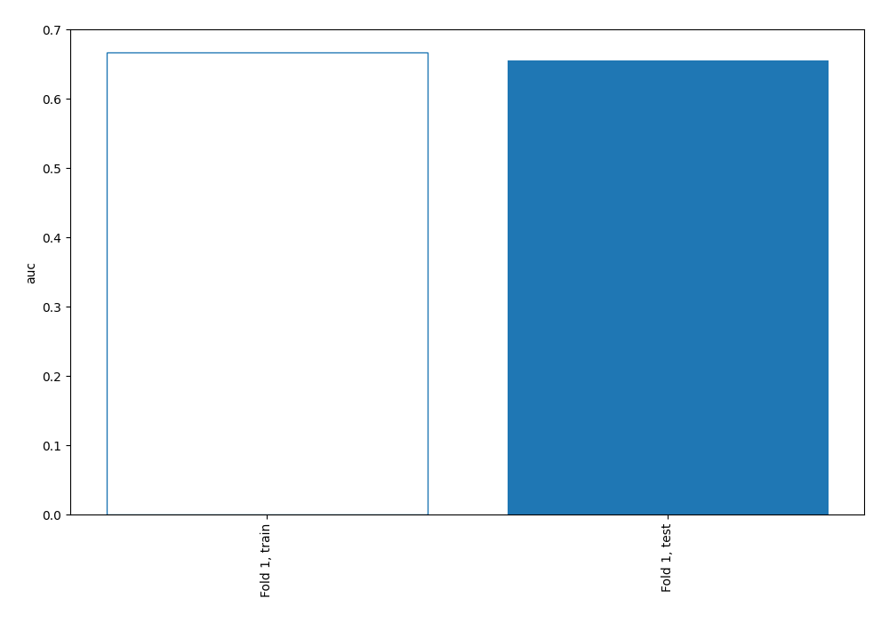
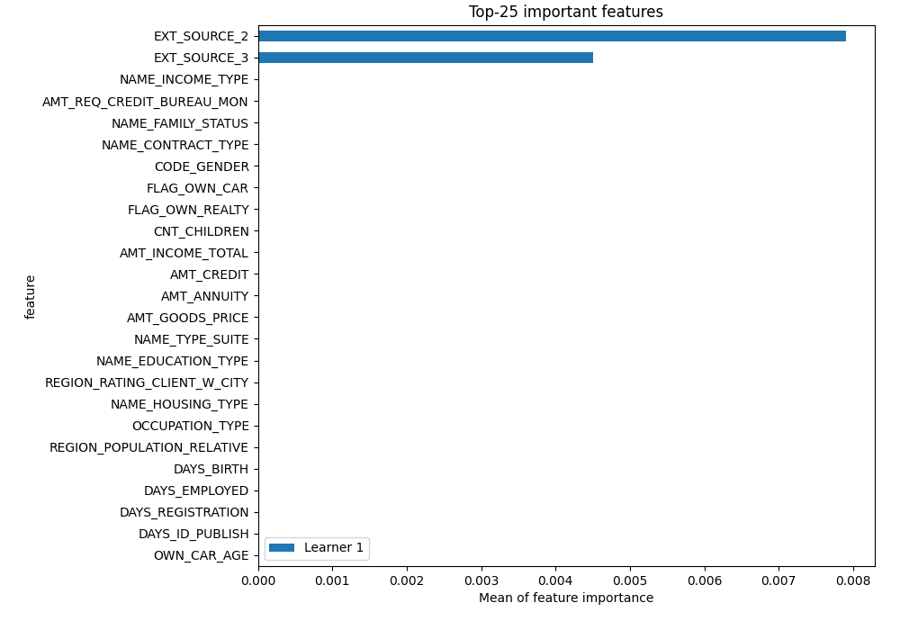
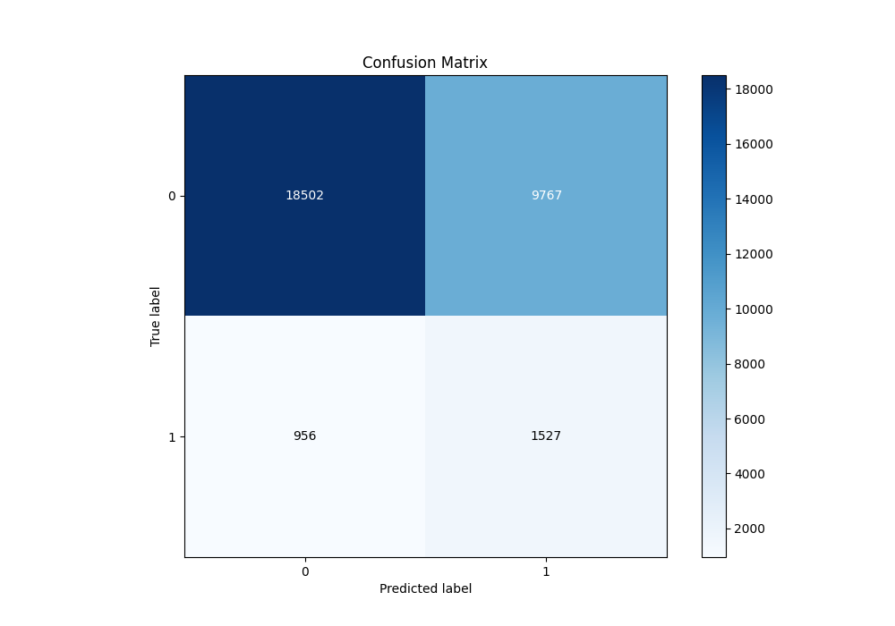
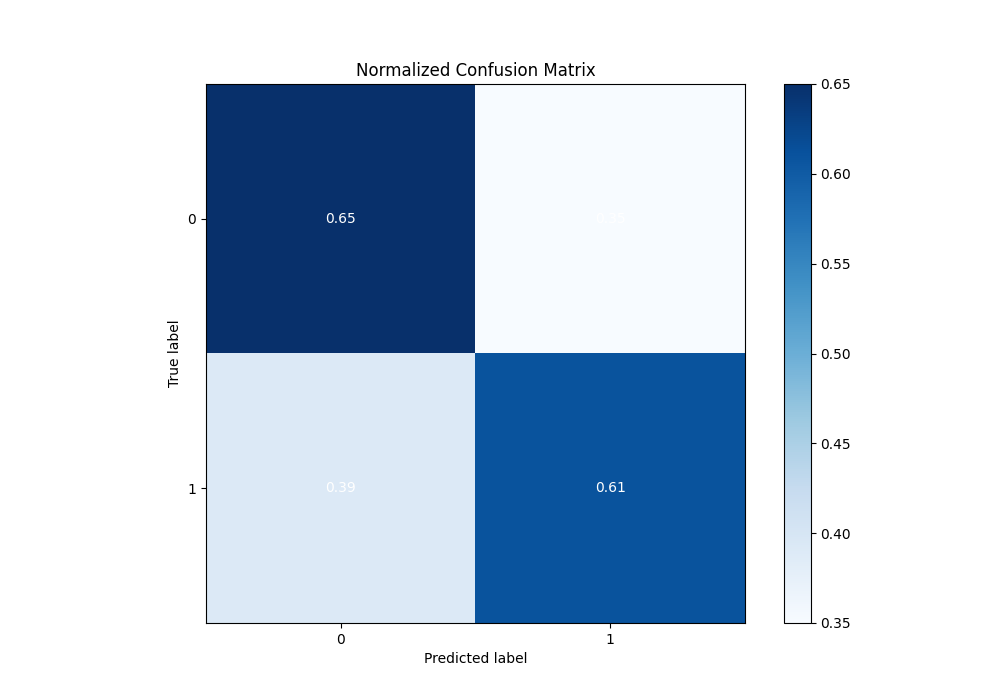
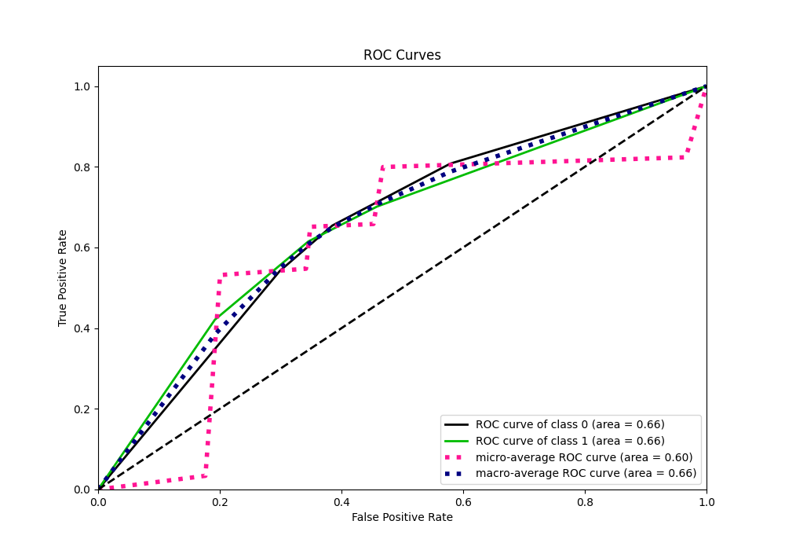
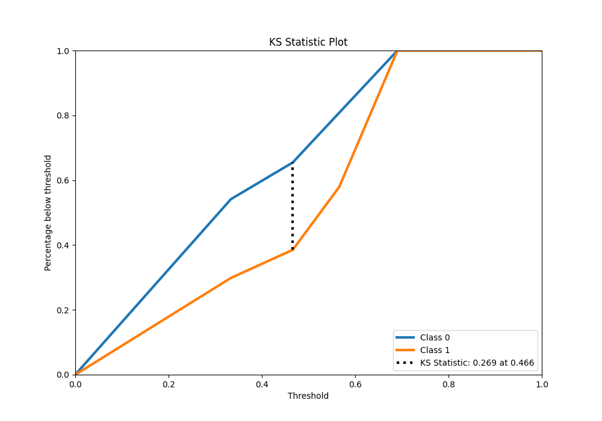
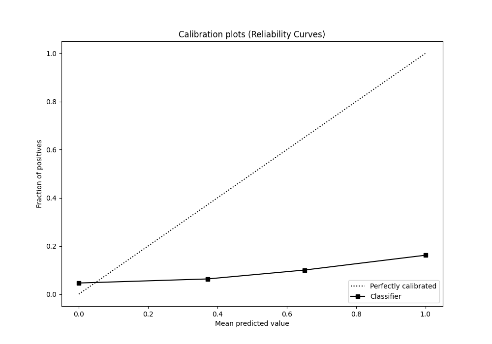

# Summary of 3_DecisionTree

[<< Go back](../README.md)

## Decision Tree
- **n_jobs**: -1
- **criterion**: gini
- **max_depth**: 2
- **explain_level**: 2

## Validation
 - **validation_type**: split
 - **train_ratio**: 0.9
 - **shuffle**: True
 - **stratify**: True

## Optimized metric
auc

## Training time

163.8 seconds

## Metric details
|           |    score |   threshold |
|:----------|---------:|------------:|
| logloss   | 0.652014 |  nan        |
| auc       | 0.655017 |  nan        |
| f1        | 0.666708 |    0.300229 |
| accuracy  | 0.634738 |    0.466048 |
| precision | 0.686901 |    0.565791 |
| recall    | 1        |    0.300229 |
| mcc       | 0.26969  |    0.466048 |

## Metric details with threshold from accuracy metric
|           |    score |   threshold |
|:----------|---------:|------------:|
| logloss   | 0.652014 |  nan        |
| auc       | 0.655017 |  nan        |
| f1        | 0.627398 |    0.466048 |
| accuracy  | 0.634738 |    0.466048 |
| precision | 0.640326 |    0.466048 |
| recall    | 0.614982 |    0.466048 |
| mcc       | 0.26969  |    0.466048 |

## Confusion matrix (at threshold=0.466048)
|              |   Predicted as 0 |   Predicted as 1 |
|:-------------|-----------------:|-----------------:|
| Labeled as 0 |         10063.4  |          5312.36 |
| Labeled as 1 |          5921.06 |          9457.59 |

## Learning curves

## Permutation-based Importance

## Confusion Matrix

## Normalized Confusion Matrix

## ROC Curve

## Kolmogorov-Smirnov Statistic

## Precision-Recall Curve

## Calibration Curve

## Cumulative Gains Curve

## Lift Curve

[<< Go back](../README.md)
