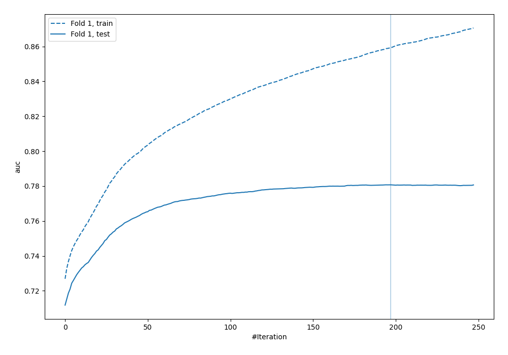
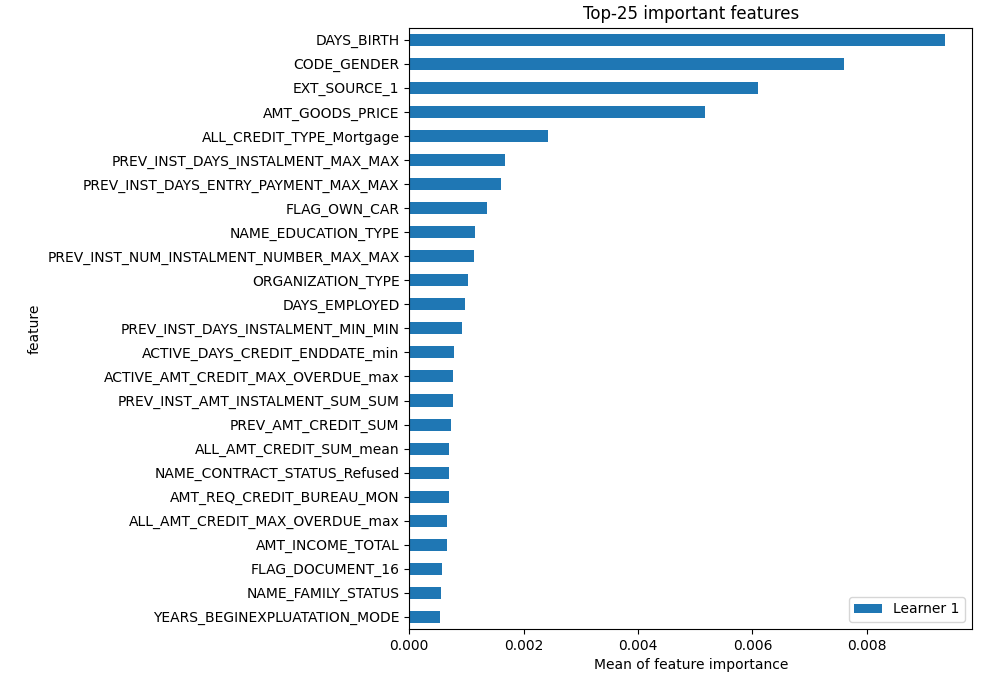
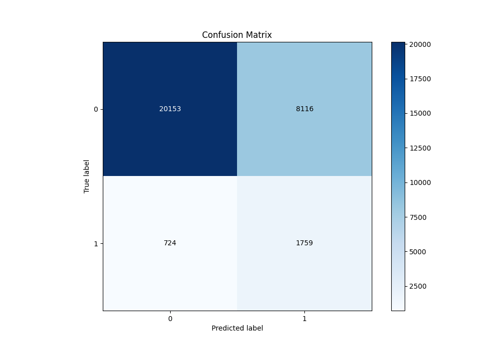
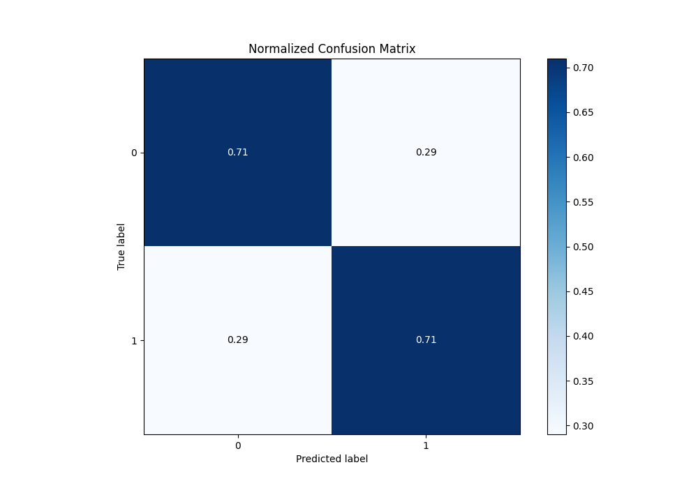
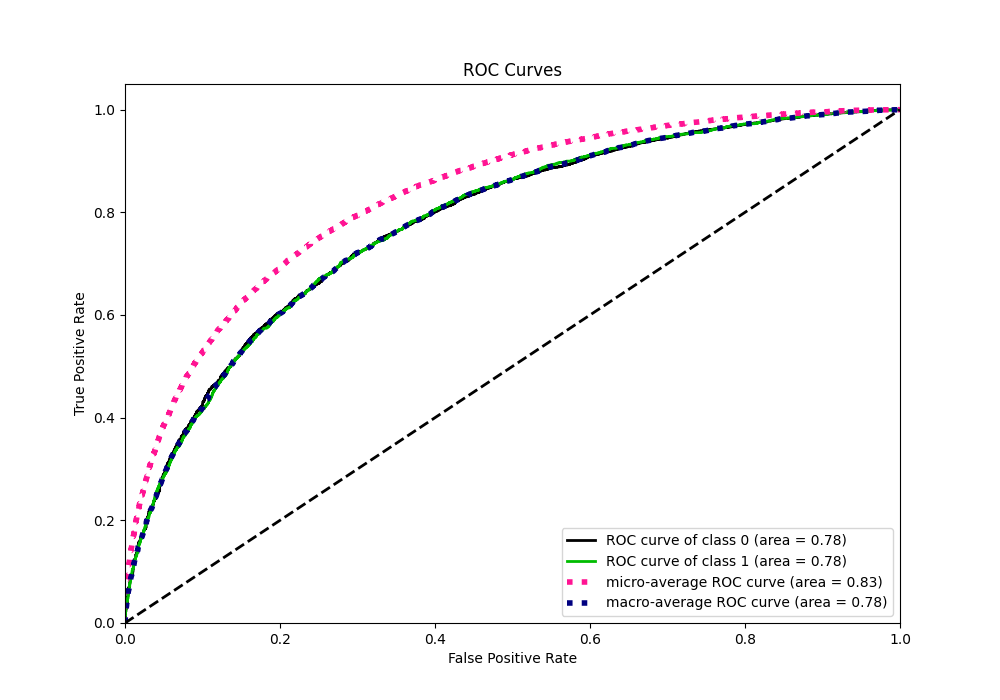
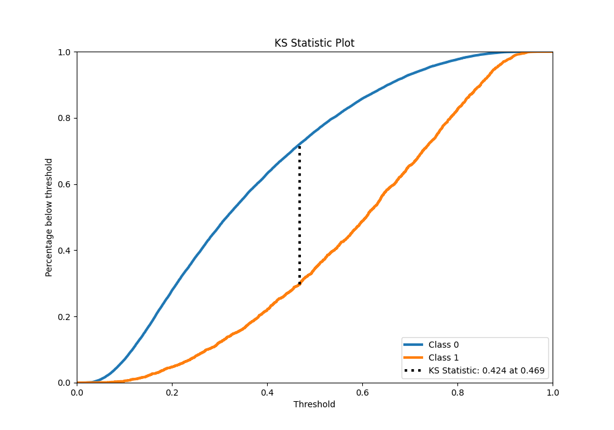
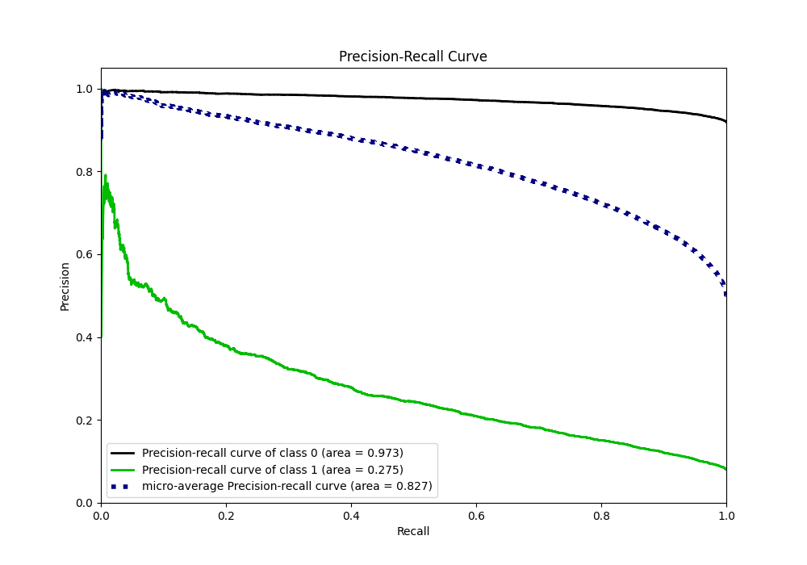
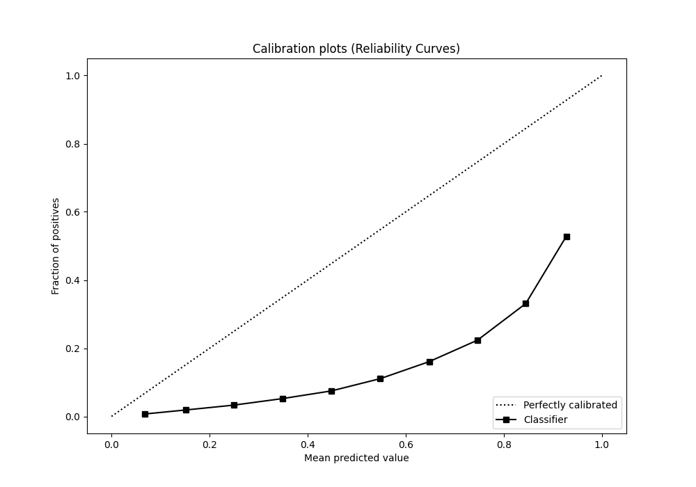
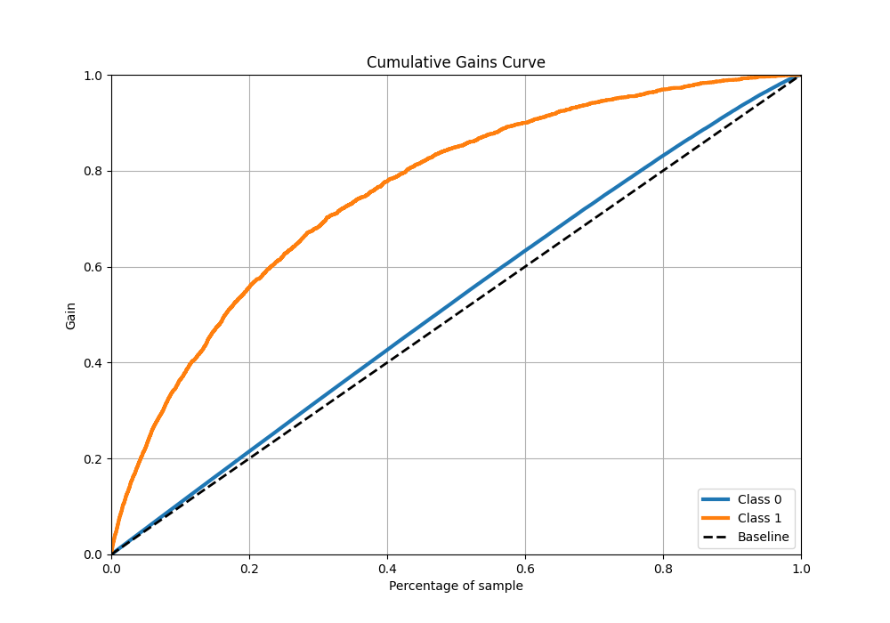
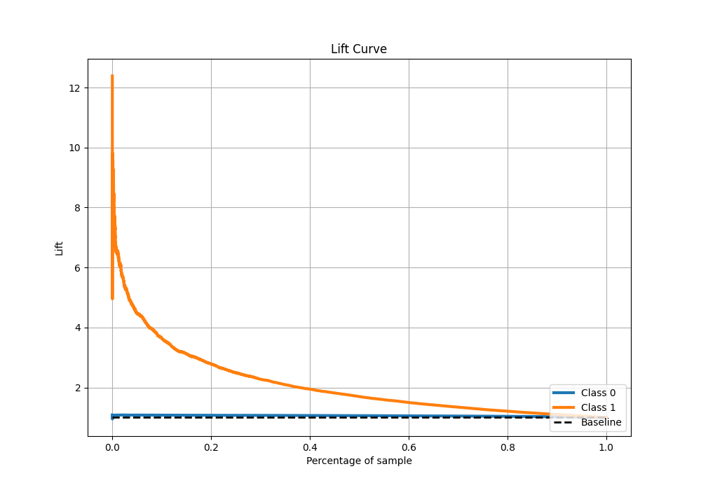

# Summary of 5_Default_Xgboost

[<< Go back](../README.md)

## Extreme Gradient Boosting (Xgboost)
- **n_jobs**: -1
- **objective**: binary:logistic
- **eta**: 0.075
- **max_depth**: 6
- **min_child_weight**: 1
- **subsample**: 1.0
- **colsample_bytree**: 1.0
- **eval_metric**: auc
- **explain_level**: 2

## Validation
 - **validation_type**: split
 - **train_ratio**: 0.9
 - **shuffle**: True
 - **stratify**: True

## Optimized metric
auc

## Training time

256.3 seconds

## Metric details
|           |    score |   threshold |
|:----------|---------:|------------:|
| logloss   | 0.56601  | nan         |
| auc       | 0.780709 | nan         |
| f1        | 0.733941 |   0.346459  |
| accuracy  | 0.710659 |   0.462178  |
| precision | 0.924891 |   0.864403  |
| recall    | 1        |   0.0147261 |
| mcc       | 0.421322 |   0.462178  |

## Metric details with threshold from accuracy metric
|           |    score |   threshold |
|:----------|---------:|------------:|
| logloss   | 0.56601  |  nan        |
| auc       | 0.780709 |  nan        |
| f1        | 0.710028 |    0.462178 |
| accuracy  | 0.710659 |    0.462178 |
| precision | 0.711646 |    0.462178 |
| recall    | 0.708417 |    0.462178 |
| mcc       | 0.421322 |    0.462178 |

## Confusion matrix (at threshold=0.462178)
|              |   Predicted as 0 |   Predicted as 1 |
|:-------------|-----------------:|-----------------:|
| Labeled as 0 |         10961.4  |          4414.37 |
| Labeled as 1 |          4484.15 |         10894.5  |

## Learning curves

## Permutation-based Importance

## Confusion Matrix

## Normalized Confusion Matrix

## ROC Curve

## Kolmogorov-Smirnov Statistic

## Precision-Recall Curve

## Calibration Curve

## Cumulative Gains Curve

## Lift Curve

[<< Go back](../README.md)
