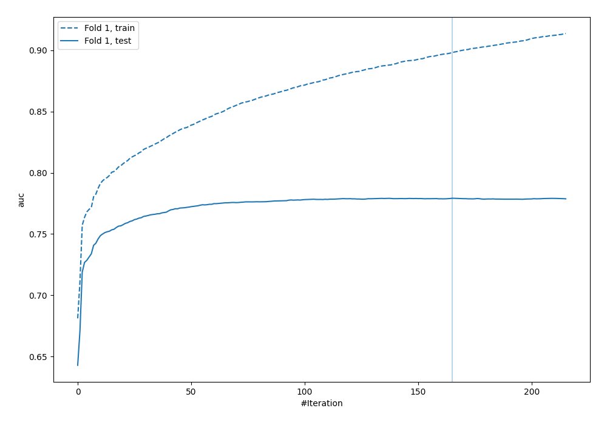
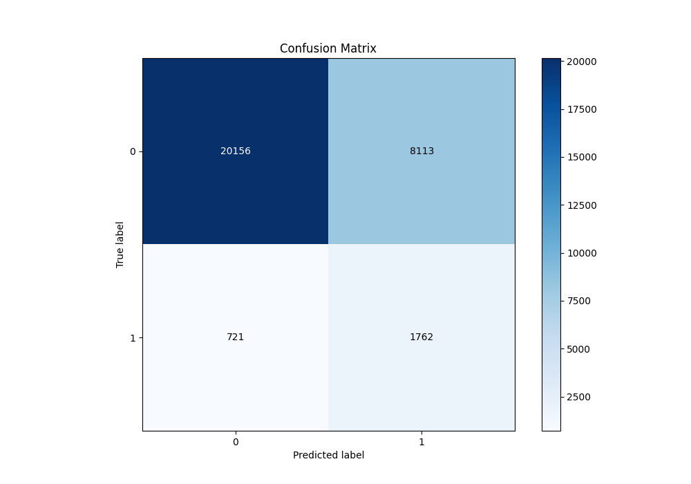
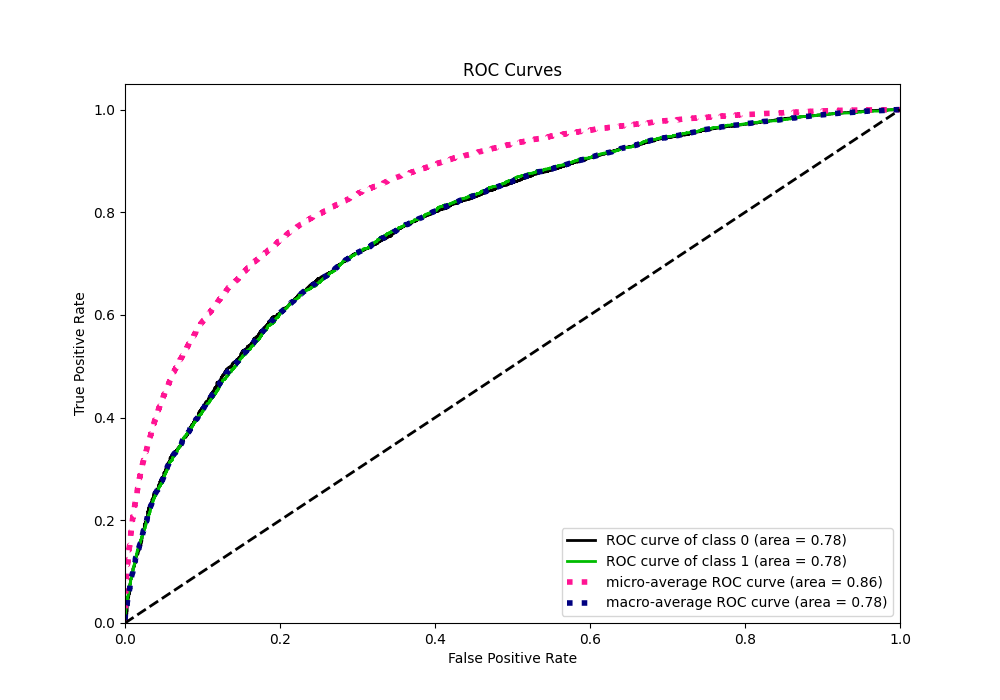
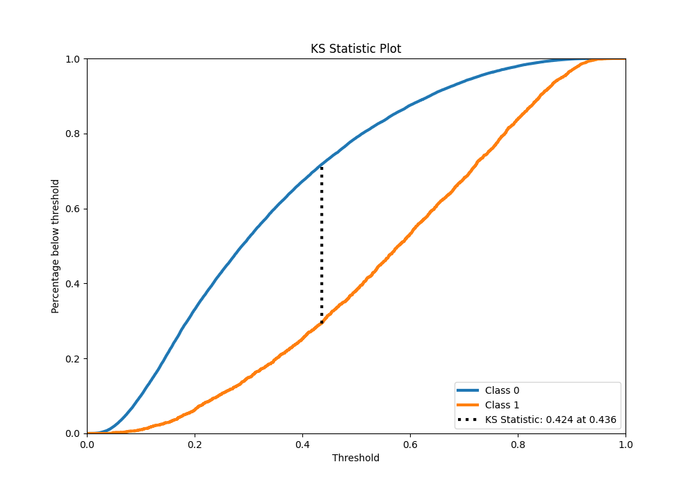
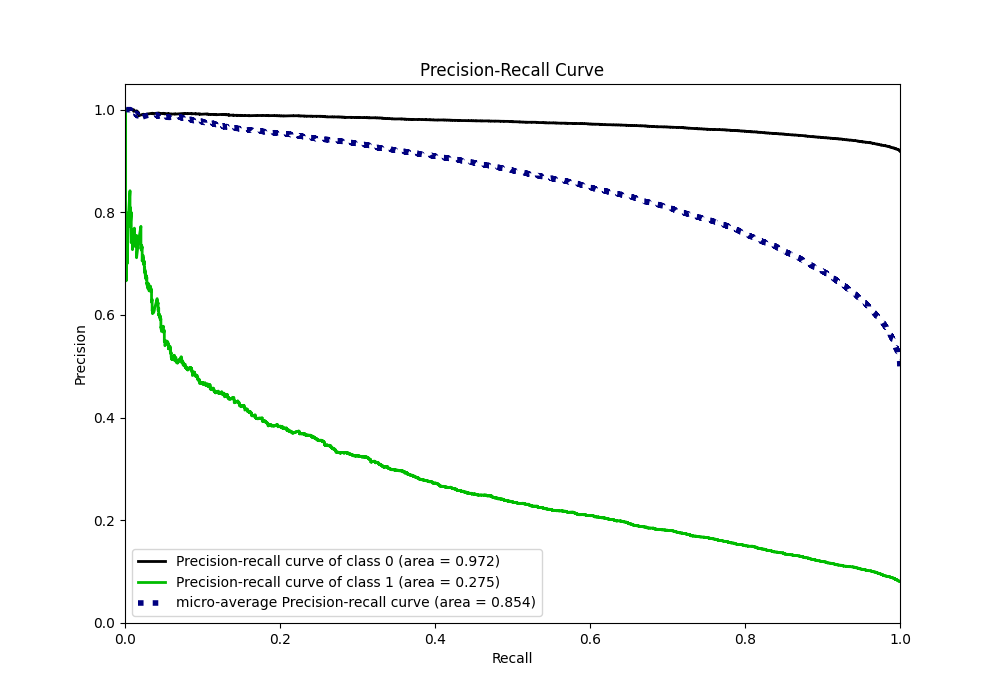
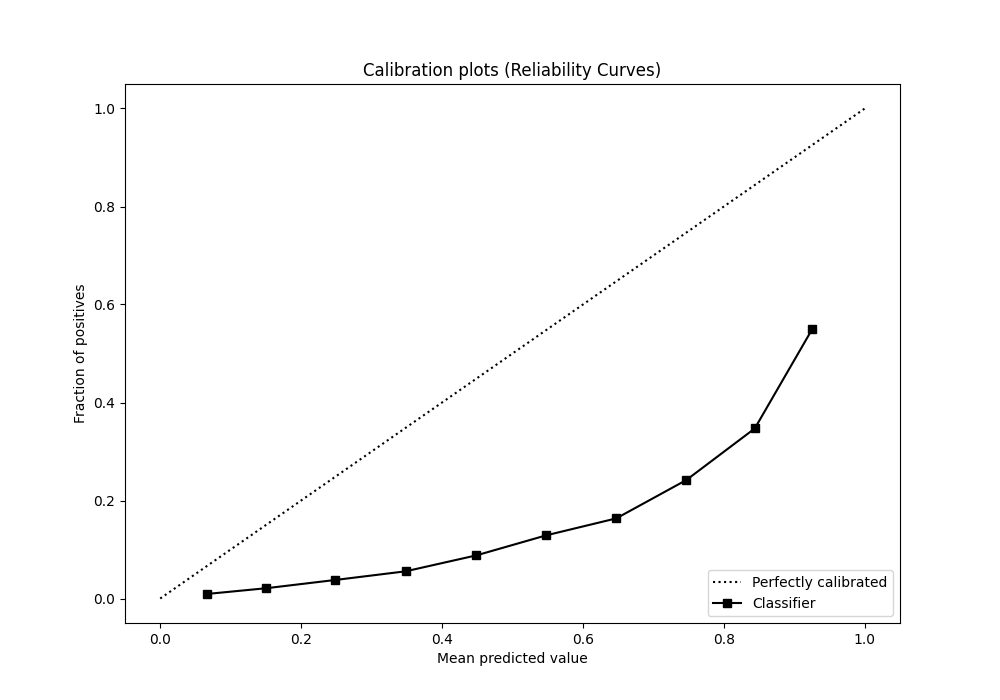
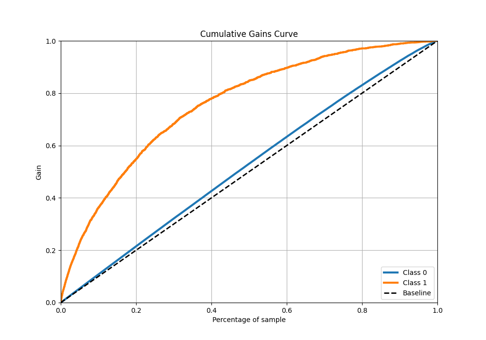
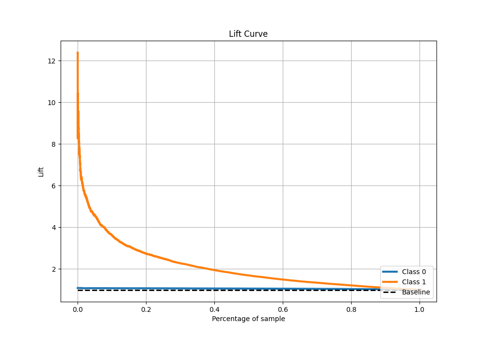

# Summary of 6_Xgboost

[<< Go back](../README.md)

## Extreme Gradient Boosting (Xgboost)
- **n_jobs**: -1
- **objective**: binary:logistic
- **eta**: 0.1
- **max_depth**: 7
- **min_child_weight**: 5
- **subsample**: 1.0
- **colsample_bytree**: 0.5
- **eval_metric**: auc
- **explain_level**: 2

## Validation
 - **validation_type**: split
 - **train_ratio**: 0.9
 - **shuffle**: True
 - **stratify**: True

## Optimized metric
auc

## Training time

211.7 seconds

## Metric details
|           |    score |    threshold |
|:----------|---------:|-------------:|
| logloss   | 0.572307 | nan          |
| auc       | 0.779222 | nan          |
| f1        | 0.73192  |   0.305196   |
| accuracy  | 0.711316 |   0.432098   |
| precision | 0.921724 |   0.861601   |
| recall    | 1        |   0.00813626 |
| mcc       | 0.422635 |   0.432098   |

## Metric details with threshold from accuracy metric
|           |    score |   threshold |
|:----------|---------:|------------:|
| logloss   | 0.572307 |  nan        |
| auc       | 0.779222 |  nan        |
| f1        | 0.710846 |    0.432098 |
| accuracy  | 0.711316 |    0.432098 |
| precision | 0.712072 |    0.432098 |
| recall    | 0.709625 |    0.432098 |
| mcc       | 0.422635 |    0.432098 |

## Confusion matrix (at threshold=0.432098)
|              |   Predicted as 0 |   Predicted as 1 |
|:-------------|-----------------:|-----------------:|
| Labeled as 0 |         10963    |          4412.73 |
| Labeled as 1 |          4465.57 |         10913.1  |

## Learning curves

## Permutation-based Importance

## Confusion Matrix

## Normalized Confusion Matrix

## ROC Curve

## Kolmogorov-Smirnov Statistic

## Precision-Recall Curve

## Calibration Curve

## Cumulative Gains Curve

## Lift Curve

[<< Go back](../README.md)
