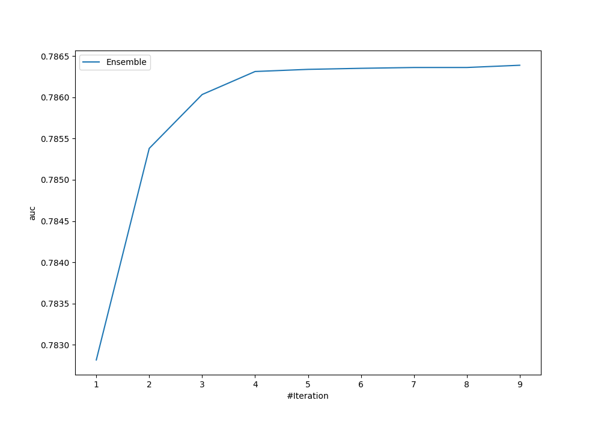
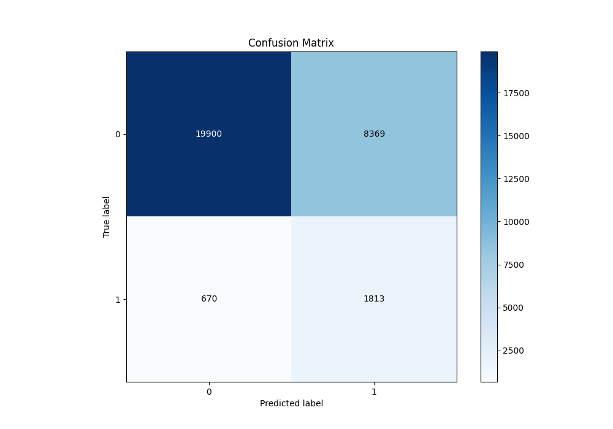
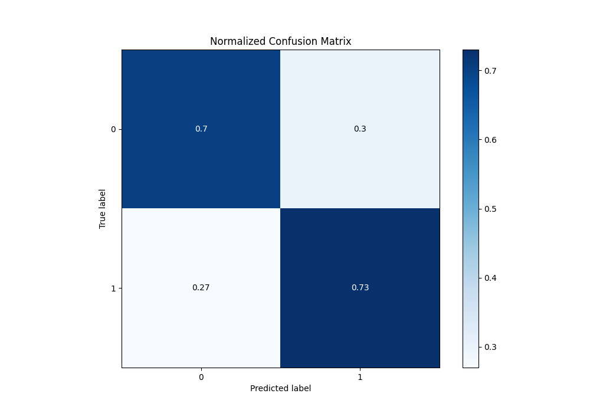
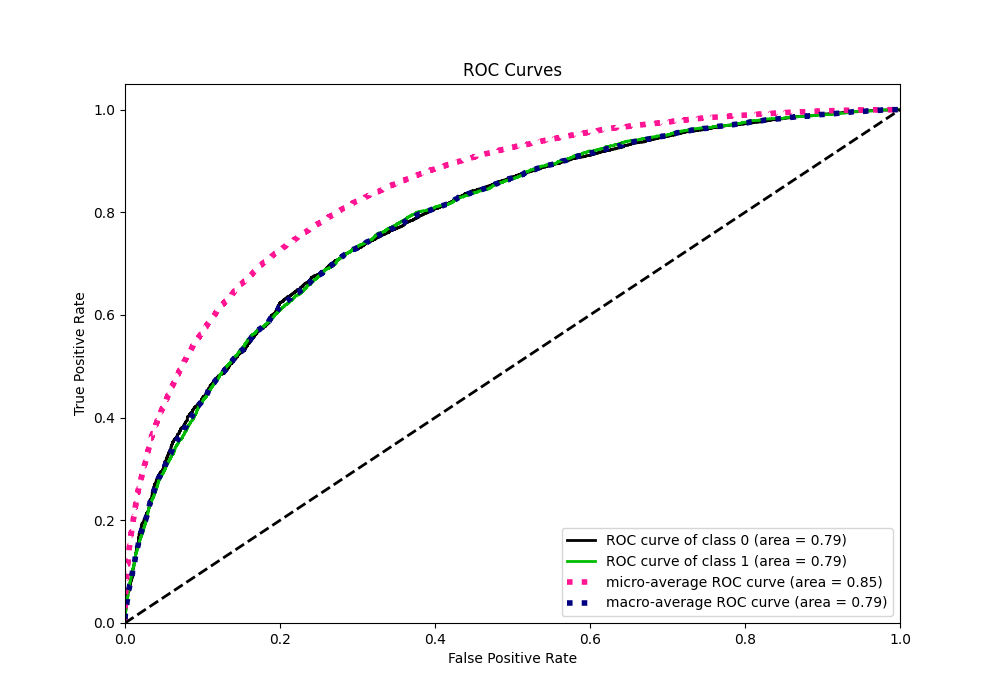
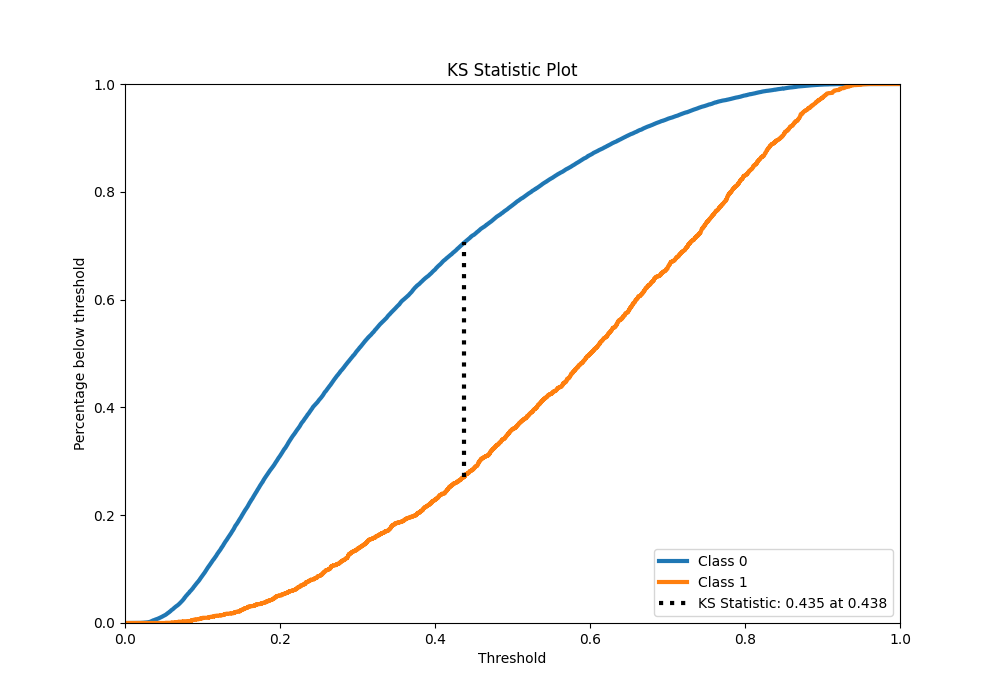
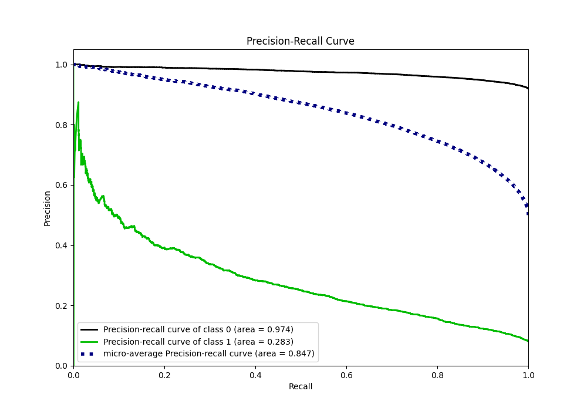
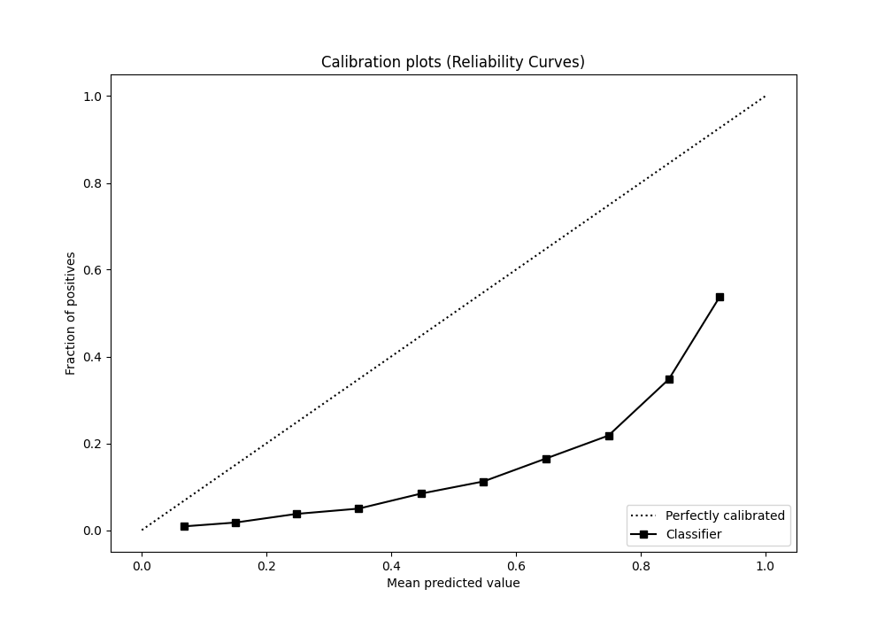
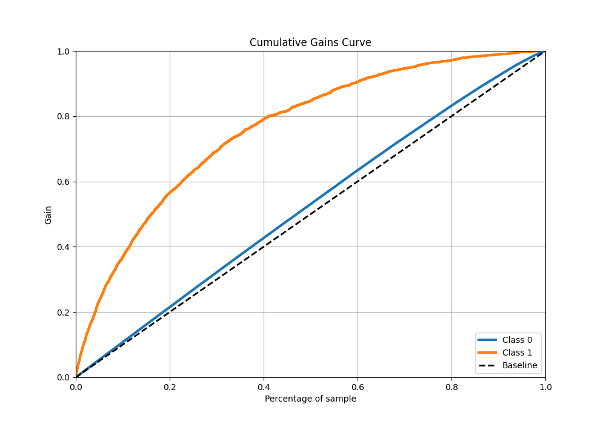
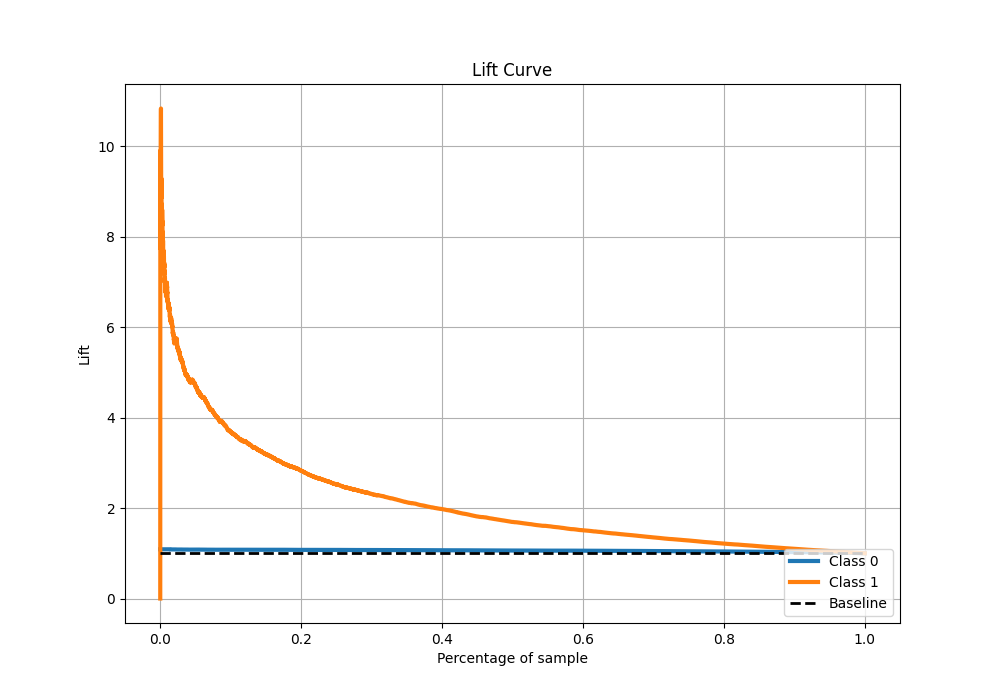

# Summary of Ensemble

[<< Go back](../README.md)

## Ensemble structure
| Model              |   Weight |
|:-------------------|---------:|
| 15_LightGBM        |        2 |
| 24_CatBoost        |        3 |
| 4_Default_LightGBM |        2 |
| 6_Xgboost          |        2 |

## Metric details
|           |    score |   threshold |
|:----------|---------:|------------:|
| logloss   | 0.56219  | nan         |
| auc       | 0.786388 | nan         |
| f1        | 0.735197 |   0.37511   |
| accuracy  | 0.717059 |   0.436446  |
| precision | 0.926432 |   0.861967  |
| recall    | 1        |   0.0124947 |
| mcc       | 0.434266 |   0.436446  |

## Metric details with threshold from accuracy metric
|           |    score |   threshold |
|:----------|---------:|------------:|
| logloss   | 0.56219  |  nan        |
| auc       | 0.786388 |  nan        |
| f1        | 0.720738 |    0.436446 |
| accuracy  | 0.717059 |    0.436446 |
| precision | 0.711552 |    0.436446 |
| recall    | 0.730165 |    0.436446 |
| mcc       | 0.434266 |    0.436446 |

## Confusion matrix (at threshold=0.436446)
|              |   Predicted as 0 |   Predicted as 1 |
|:-------------|-----------------:|-----------------:|
| Labeled as 0 |          10823.8 |          4551.98 |
| Labeled as 1 |           4149.7 |         11229    |

## Learning curves

## Confusion Matrix

## Normalized Confusion Matrix

## ROC Curve

## Kolmogorov-Smirnov Statistic

## Precision-Recall Curve

## Calibration Curve

## Cumulative Gains Curve

## Lift Curve

[<< Go back](../README.md)
