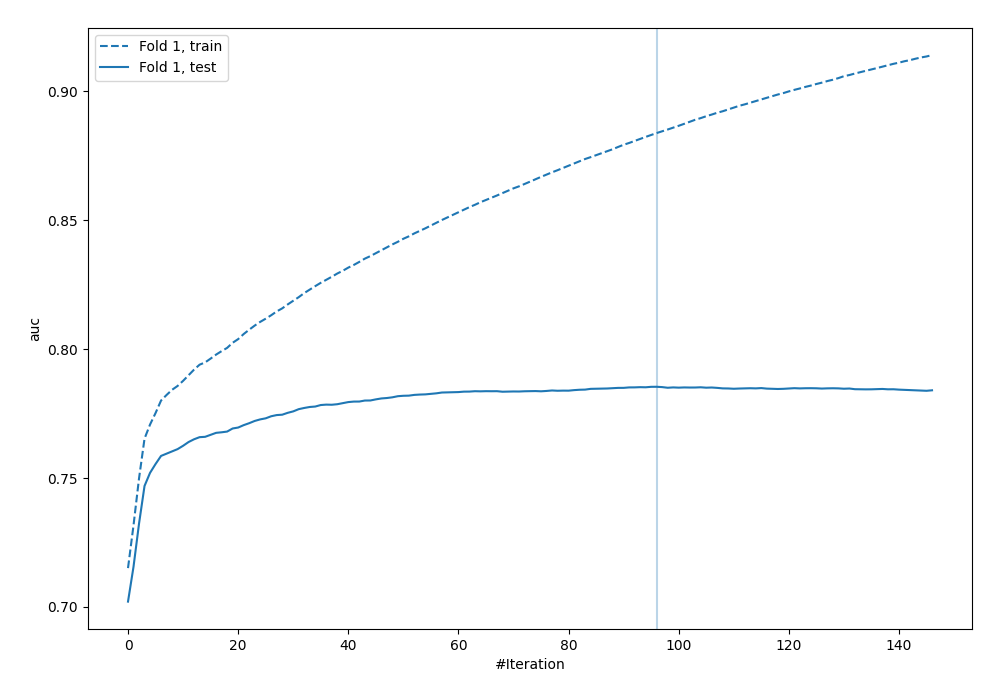
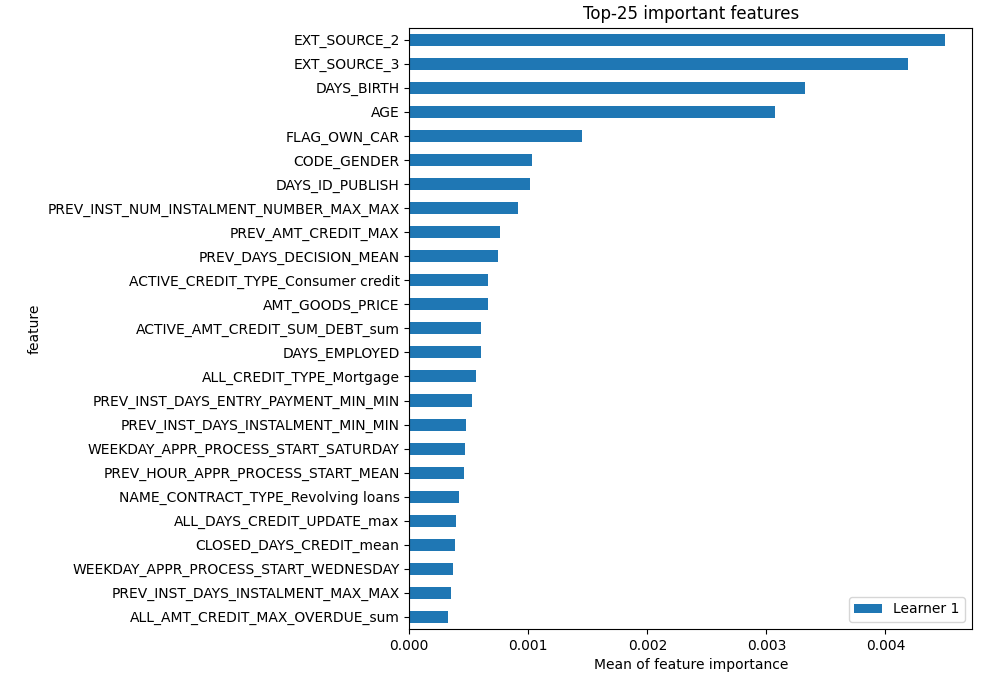
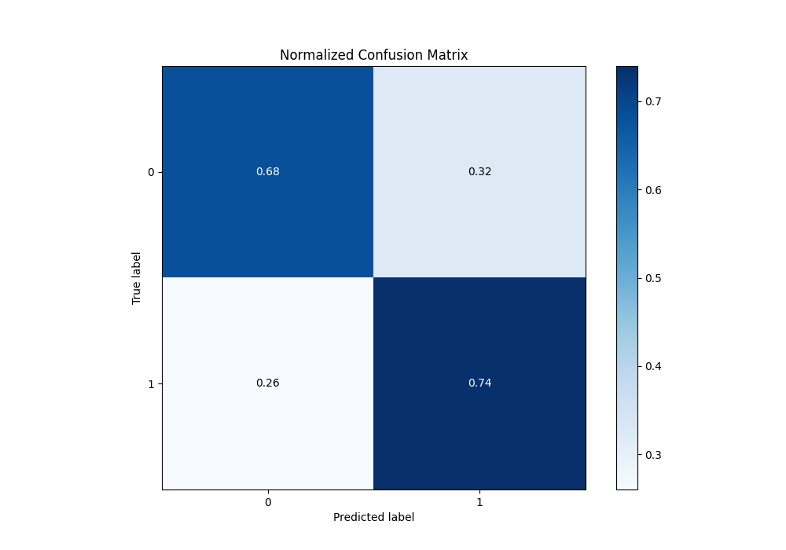
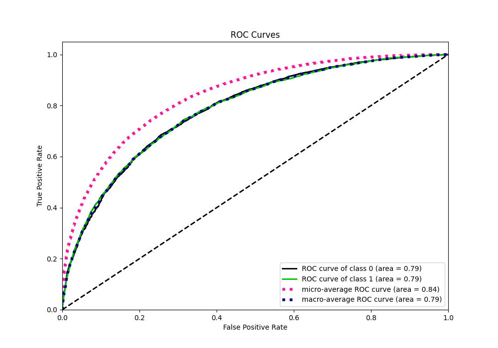
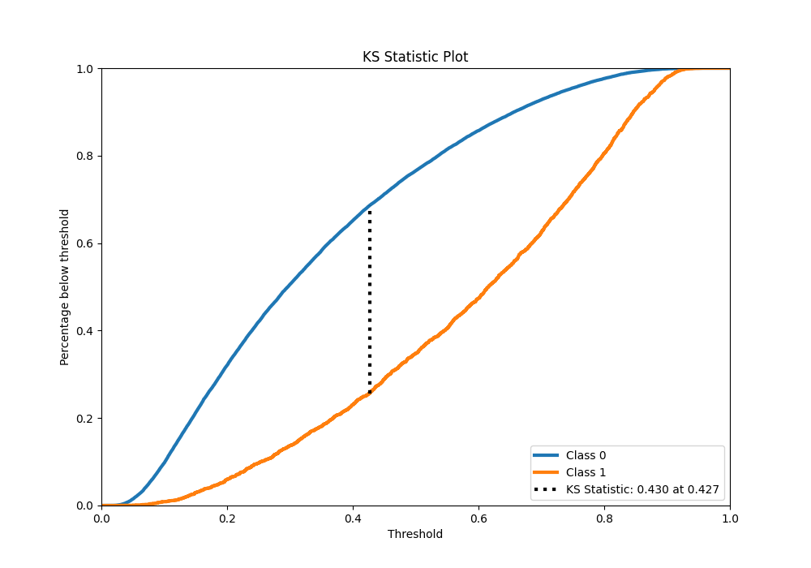
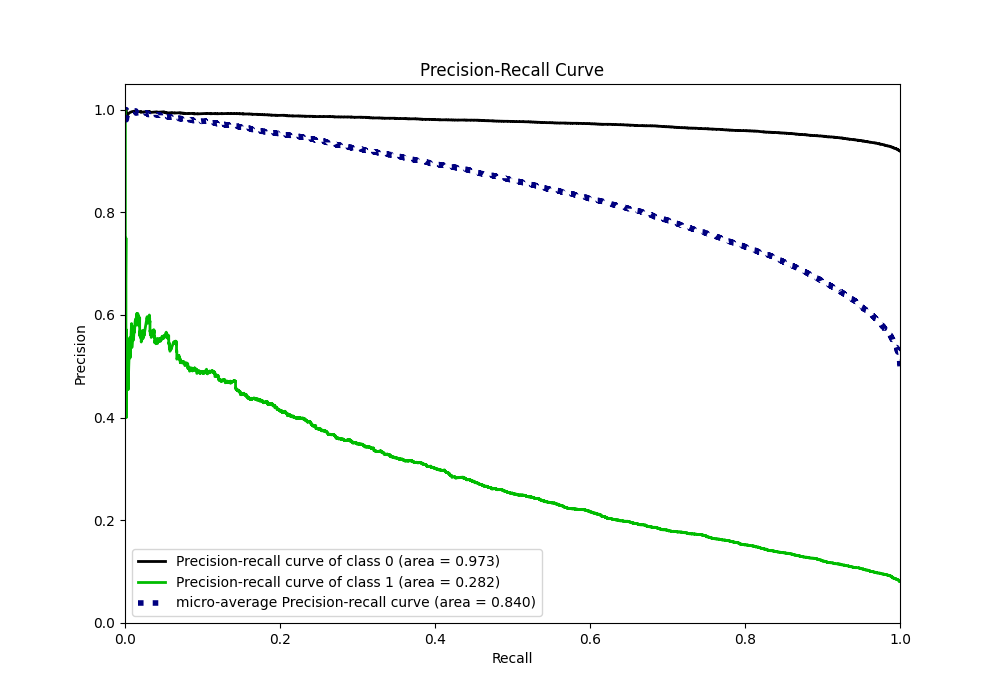
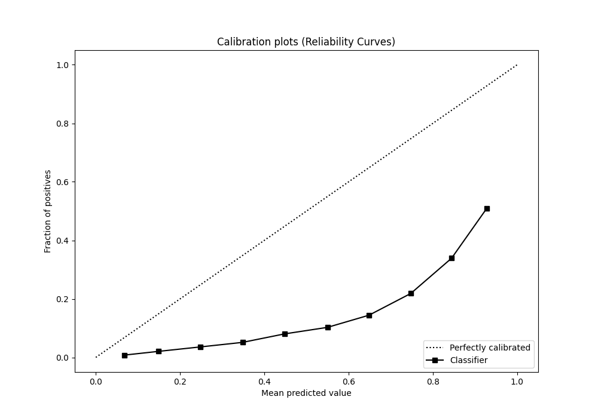
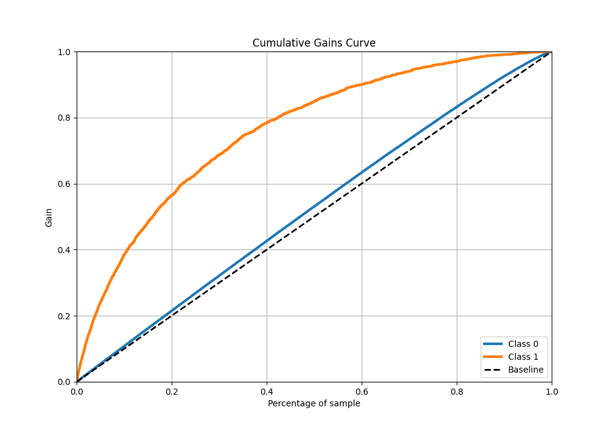
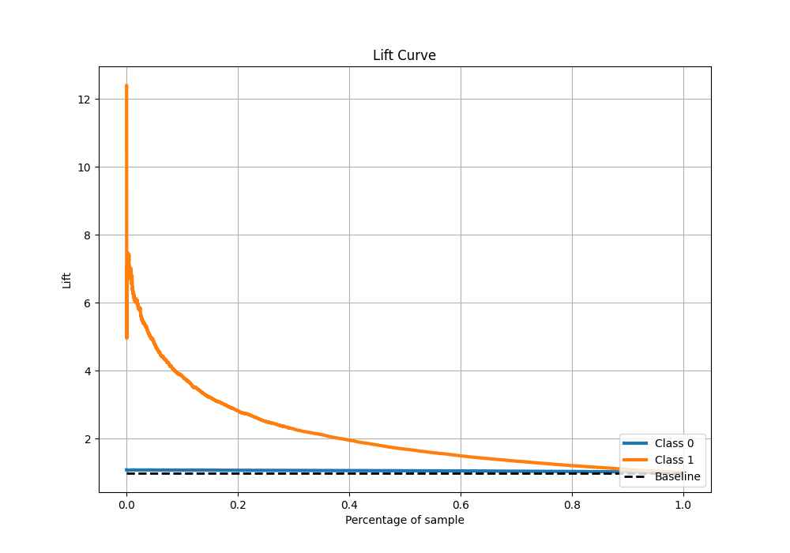

# Summary of 15_LightGBM

[<< Go back](../README.md)

## LightGBM
- **n_jobs**: -1
- **objective**: binary
- **num_leaves**: 95
- **learning_rate**: 0.1
- **feature_fraction**: 0.5
- **bagging_fraction**: 0.8
- **min_data_in_leaf**: 50
- **metric**: auc
- **custom_eval_metric_name**: None
- **explain_level**: 2

## Validation
 - **validation_type**: split
 - **train_ratio**: 0.9
 - **shuffle**: True
 - **stratify**: True

## Optimized metric
auc

## Training time

164.6 seconds

## Metric details
|           |    score |   threshold |
|:----------|---------:|------------:|
| logloss   | 0.562205 | nan         |
| auc       | 0.785383 | nan         |
| f1        | 0.733253 |   0.309039  |
| accuracy  | 0.714249 |   0.424664  |
| precision | 0.921328 |   0.863488  |
| recall    | 1        |   0.0127325 |
| mcc       | 0.429314 |   0.424664  |

## Metric details with threshold from accuracy metric
|           |    score |   threshold |
|:----------|---------:|------------:|
| logloss   | 0.562205 |  nan        |
| auc       | 0.785383 |  nan        |
| f1        | 0.722745 |    0.424664 |
| accuracy  | 0.714249 |    0.424664 |
| precision | 0.701814 |    0.424664 |
| recall    | 0.744964 |    0.424664 |
| mcc       | 0.429314 |    0.424664 |

## Confusion matrix (at threshold=0.424664)
|              |   Predicted as 0 |   Predicted as 1 |
|:-------------|-----------------:|-----------------:|
| Labeled as 0 |         10509.9  |           4865.8 |
| Labeled as 1 |          3920.63 |          11452.2 |

## Learning curves

## Permutation-based Importance

## Confusion Matrix

## Normalized Confusion Matrix

## ROC Curve

## Kolmogorov-Smirnov Statistic

## Precision-Recall Curve

## Calibration Curve

## Cumulative Gains Curve

## Lift Curve

[<< Go back](../README.md)
