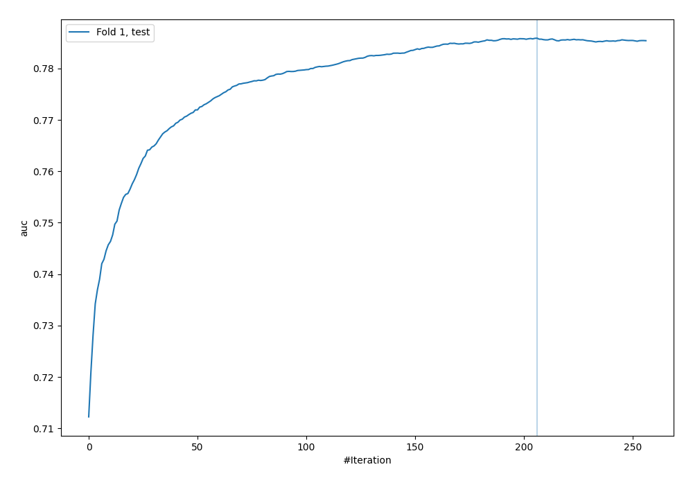
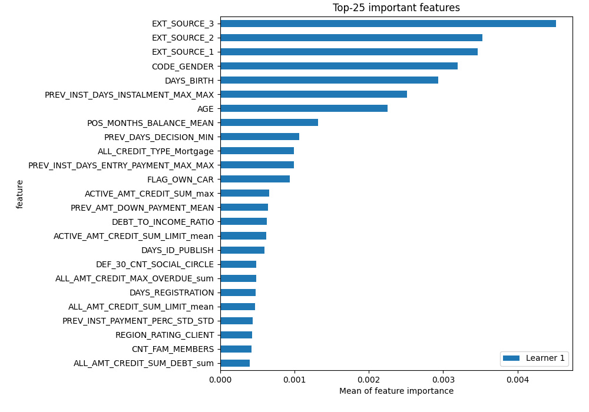
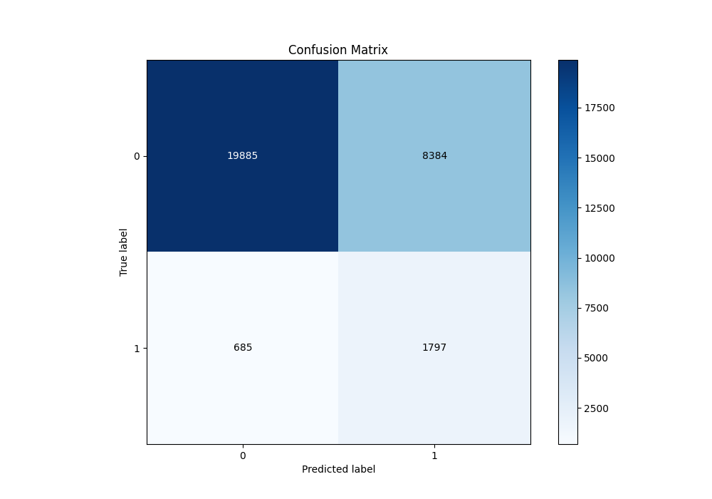
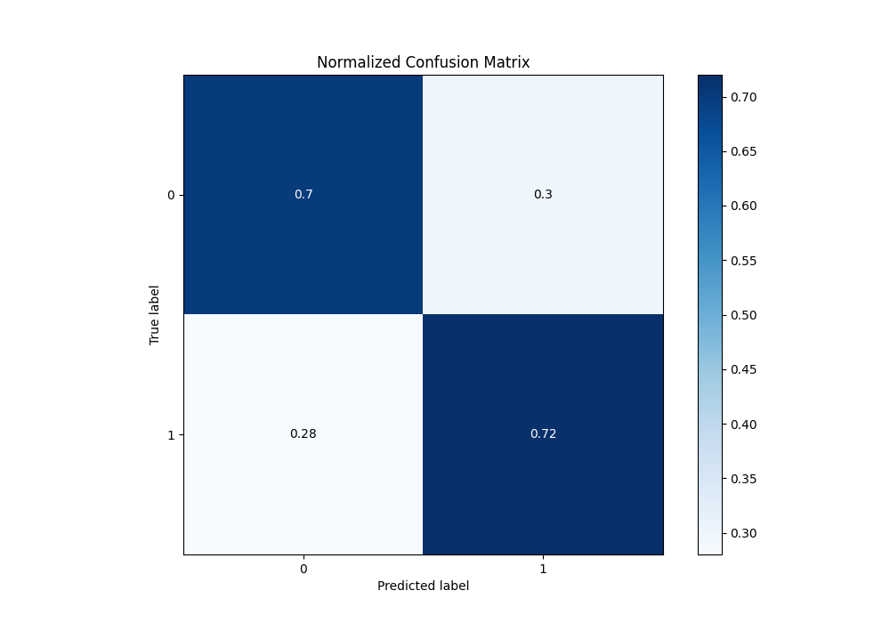
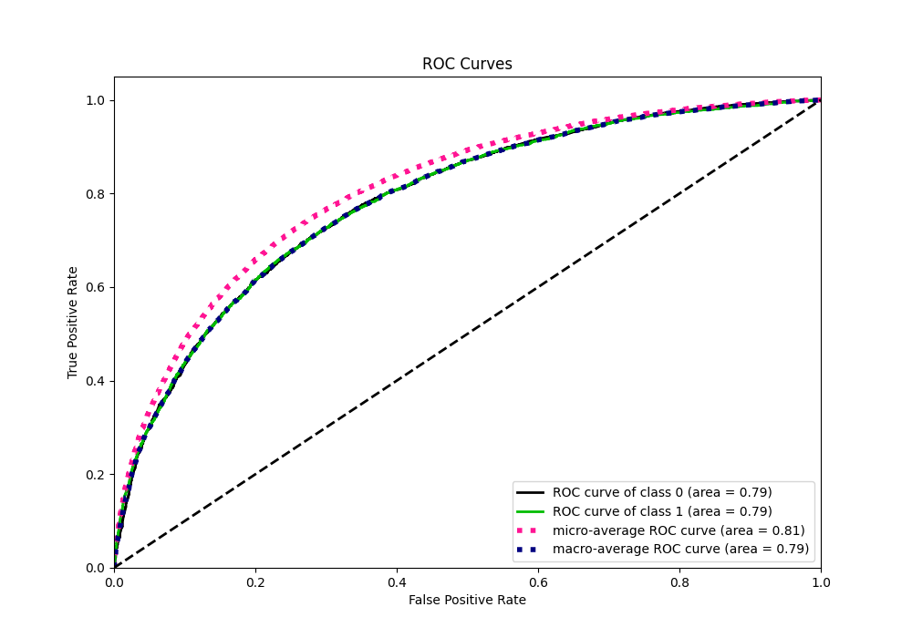
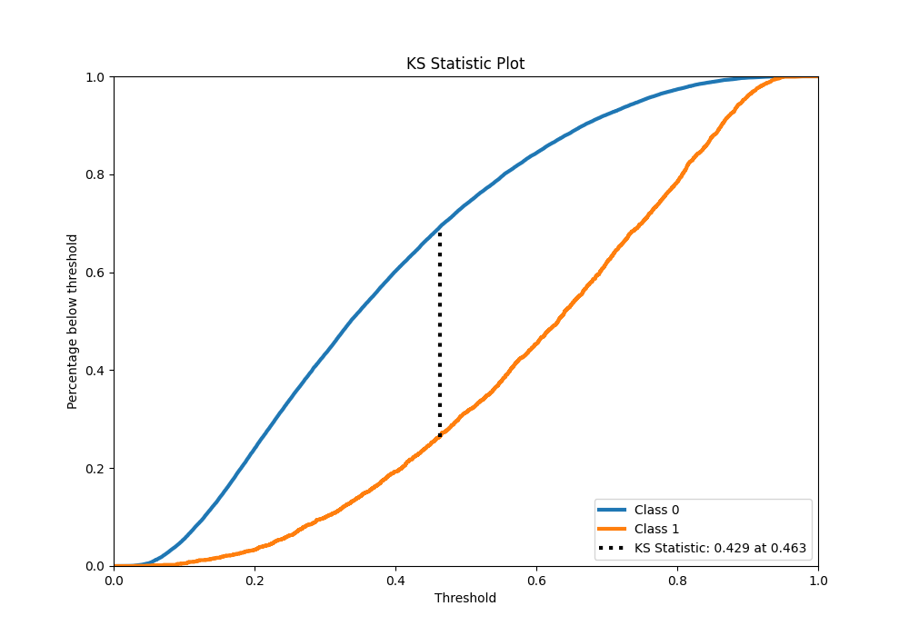
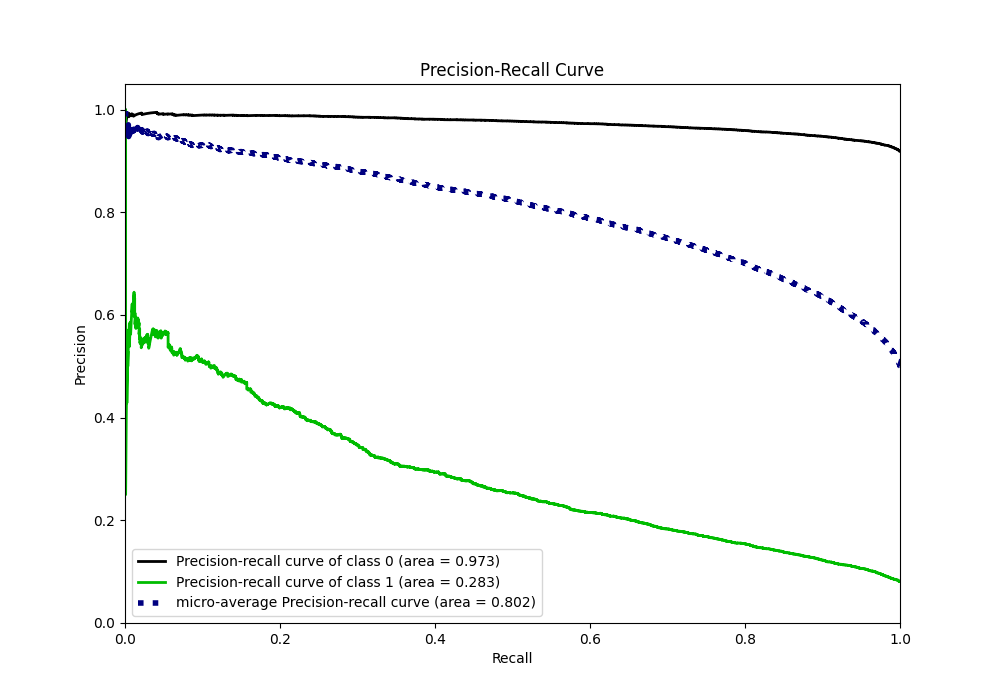
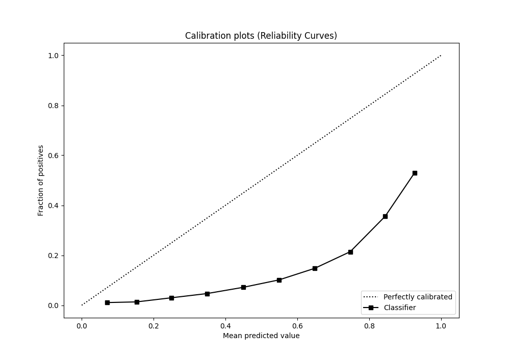
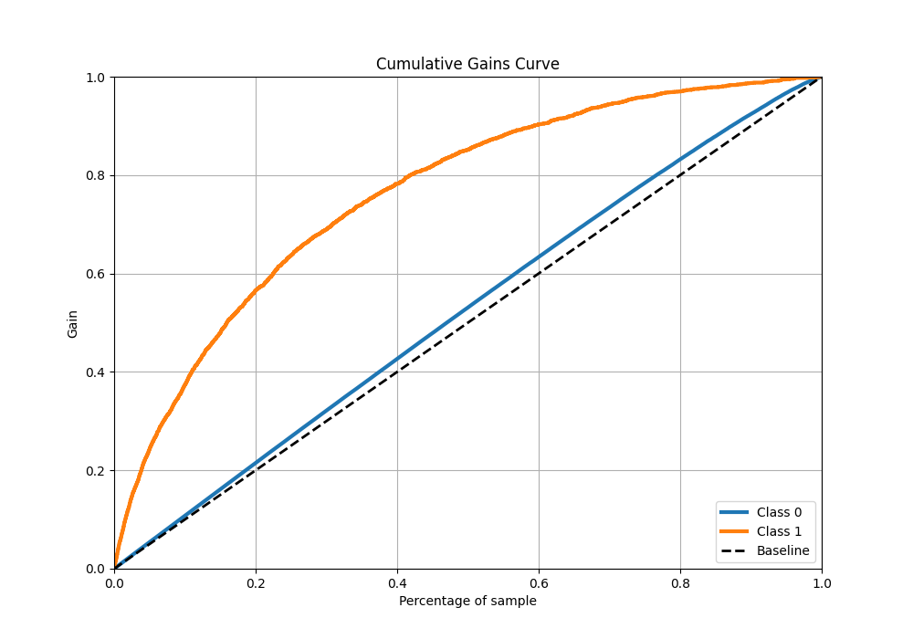
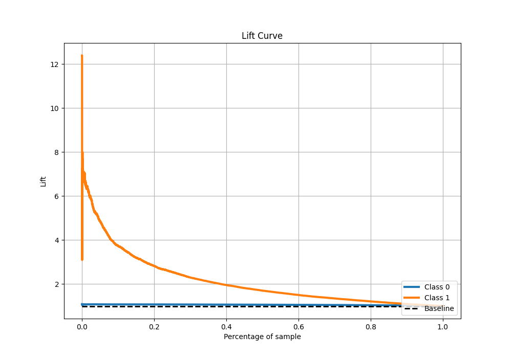

# Summary of 24_CatBoost

[<< Go back](../README.md)

## CatBoost
- **n_jobs**: -1
- **learning_rate**: 0.1
- **depth**: 7
- **rsm**: 0.8
- **loss_function**: Logloss
- **eval_metric**: AUC
- **explain_level**: 2

## Validation
 - **validation_type**: split
 - **train_ratio**: 0.9
 - **shuffle**: True
 - **stratify**: True

## Optimized metric
auc

## Training time

364.6 seconds

## Metric details
|           |    score |   threshold |
|:----------|---------:|------------:|
| logloss   | 0.559377 | nan         |
| auc       | 0.785909 | nan         |
| f1        | 0.734811 |   0.361538  |
| accuracy  | 0.713716 |   0.471588  |
| precision | 0.924518 |   0.877939  |
| recall    | 1        |   0.0114154 |
| mcc       | 0.427884 |   0.513122  |

## Metric details with threshold from accuracy metric
|           |    score |   threshold |
|:----------|---------:|------------:|
| logloss   | 0.559377 |  nan        |
| auc       | 0.785909 |  nan        |
| f1        | 0.716614 |    0.471588 |
| accuracy  | 0.713716 |    0.471588 |
| precision | 0.709366 |    0.471588 |
| recall    | 0.724013 |    0.471588 |
| mcc       | 0.427524 |    0.471588 |

## Confusion matrix (at threshold=0.471588)
|              |   Predicted as 0 |   Predicted as 1 |
|:-------------|-----------------:|-----------------:|
| Labeled as 0 |          10815.6 |          4560.12 |
| Labeled as 1 |           4242.7 |         11130.1  |

## Learning curves

## Permutation-based Importance

## Confusion Matrix

## Normalized Confusion Matrix

## ROC Curve

## Kolmogorov-Smirnov Statistic

## Precision-Recall Curve

## Calibration Curve

## Cumulative Gains Curve

## Lift Curve

[<< Go back](../README.md)
