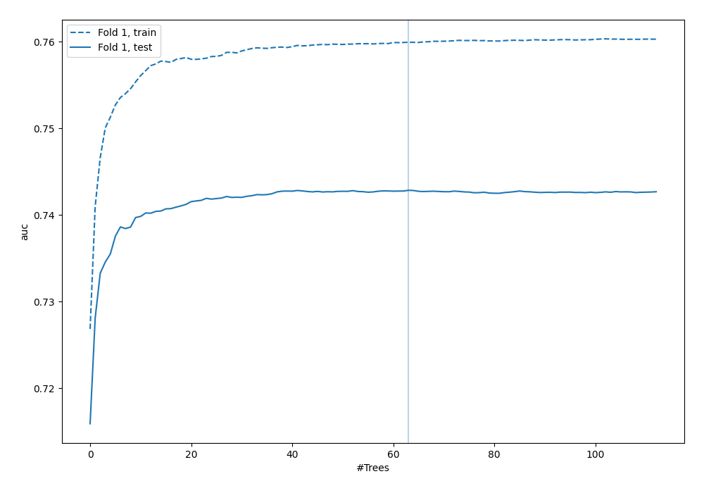
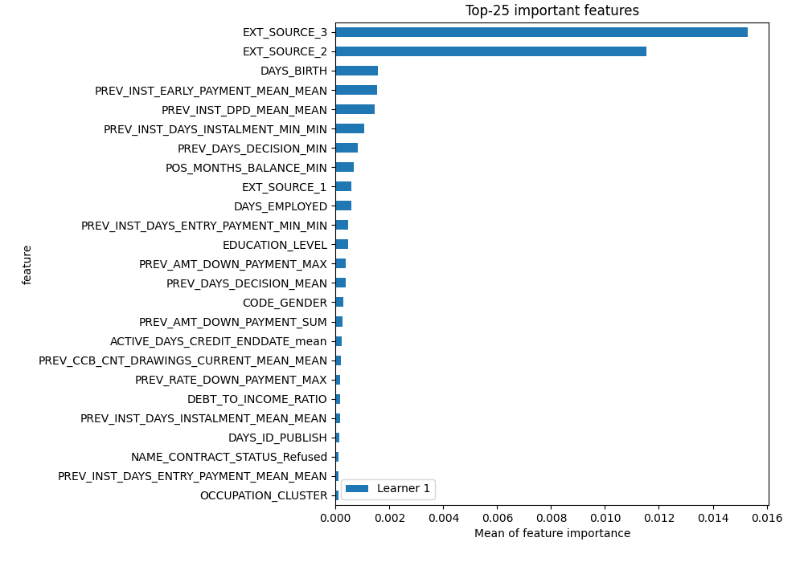
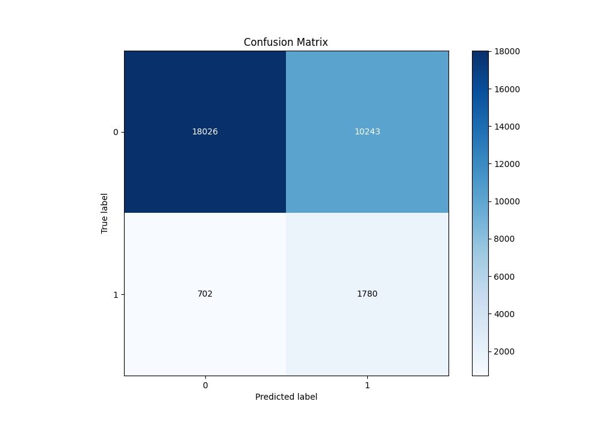
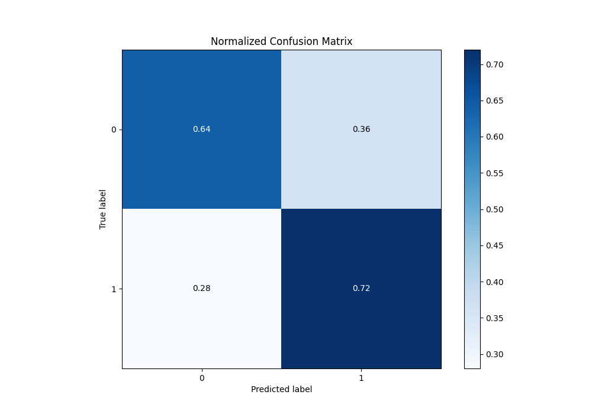
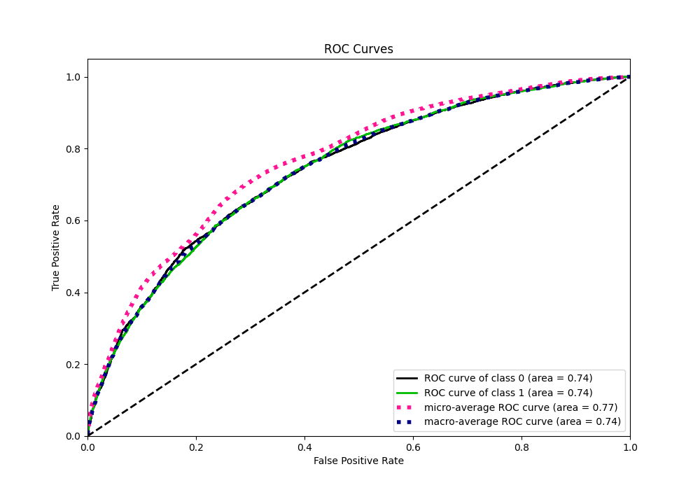
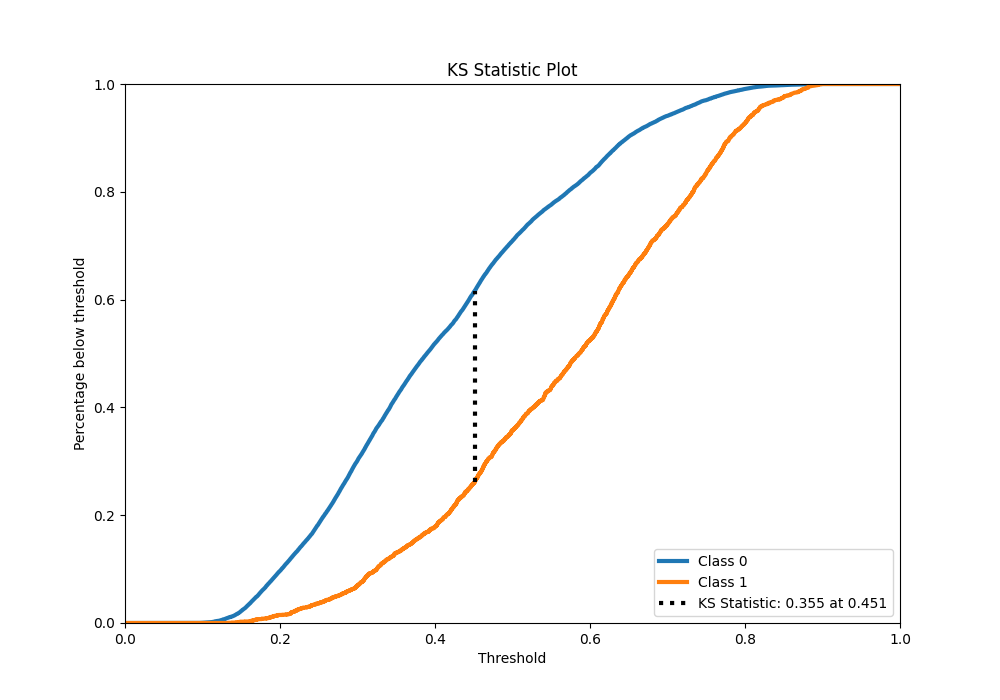
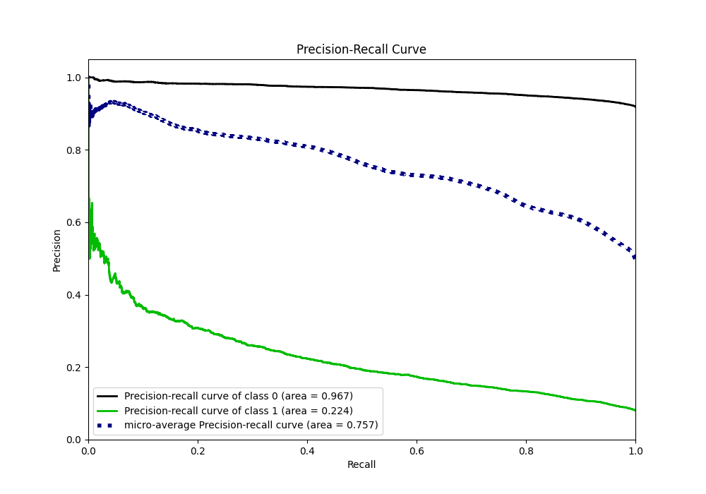
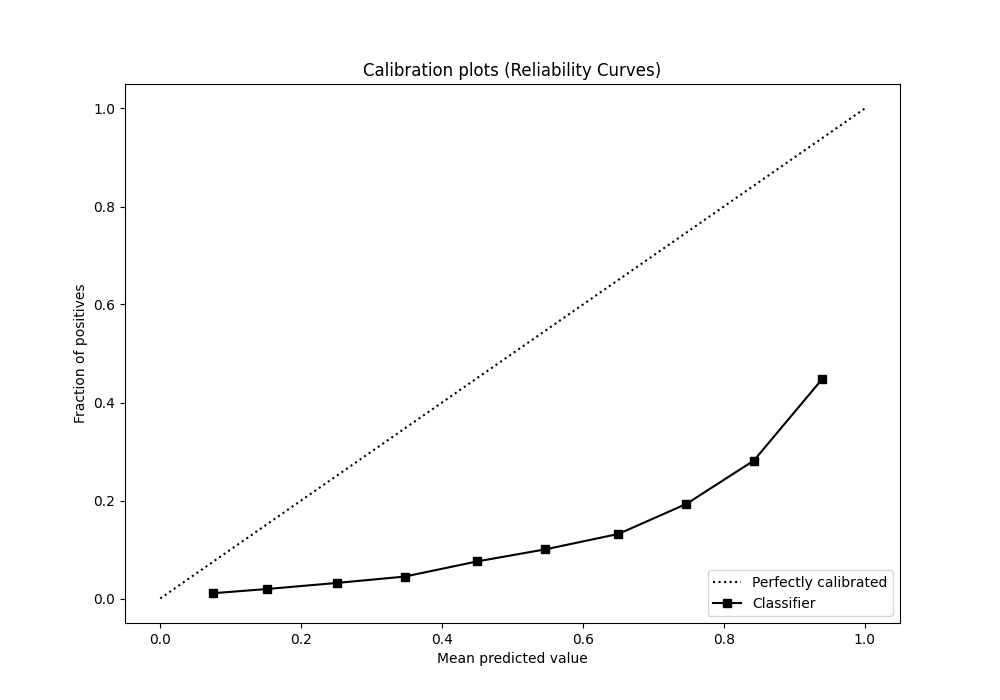
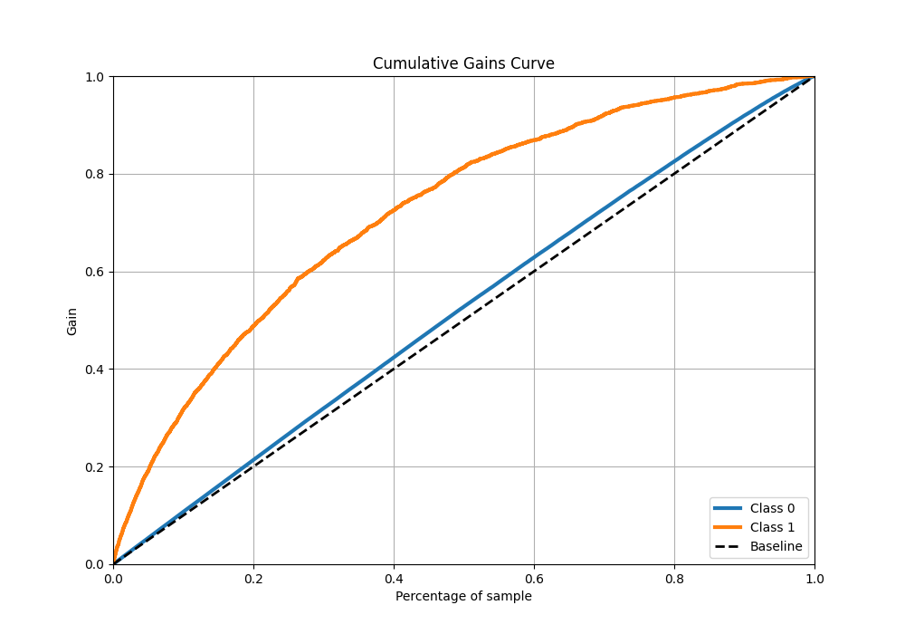
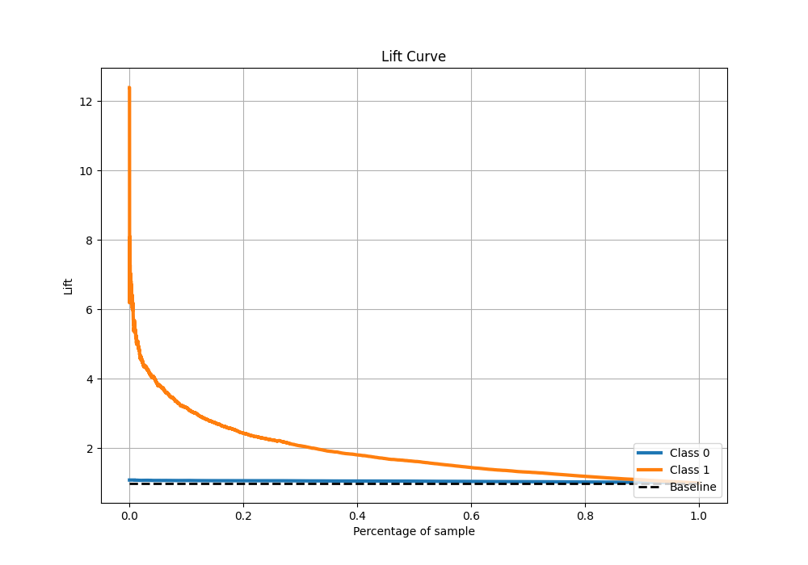

# Summary of 33_RandomForest

[<< Go back](../README.md)

## Random Forest
- **n_jobs**: -1
- **criterion**: entropy
- **max_features**: 0.8
- **min_samples_split**: 50
- **max_depth**: 7
- **eval_metric_name**: auc
- **explain_level**: 2

## Validation
 - **validation_type**: split
 - **train_ratio**: 0.9
 - **shuffle**: True
 - **stratify**: True

## Optimized metric
auc

## Training time

2732.4 seconds

## Metric details
|           |    score |   threshold |
|:----------|---------:|------------:|
| logloss   | 0.599592 | nan         |
| auc       | 0.742849 | nan         |
| f1        | 0.713958 |   0.398616  |
| accuracy  | 0.677408 |   0.46035   |
| precision | 0.891913 |   0.807287  |
| recall    | 1        |   0.0774816 |
| mcc       | 0.357449 |   0.398616  |

## Metric details with threshold from accuracy metric
|           |    score |   threshold |
|:----------|---------:|------------:|
| logloss   | 0.599592 |   nan       |
| auc       | 0.742849 |   nan       |
| f1        | 0.689722 |     0.46035 |
| accuracy  | 0.677408 |     0.46035 |
| precision | 0.664303 |     0.46035 |
| recall    | 0.717164 |     0.46035 |
| mcc       | 0.355949 |     0.46035 |

## Confusion matrix (at threshold=0.46035)
|              |   Predicted as 0 |   Predicted as 1 |
|:-------------|-----------------:|-----------------:|
| Labeled as 0 |          9804.49 |          5571.25 |
| Labeled as 1 |          4347.99 |         11024.8  |

## Learning curves

## Permutation-based Importance

## Confusion Matrix

## Normalized Confusion Matrix

## ROC Curve

## Kolmogorov-Smirnov Statistic

## Precision-Recall Curve

## Calibration Curve

## Cumulative Gains Curve

## Lift Curve

[<< Go back](../README.md)
