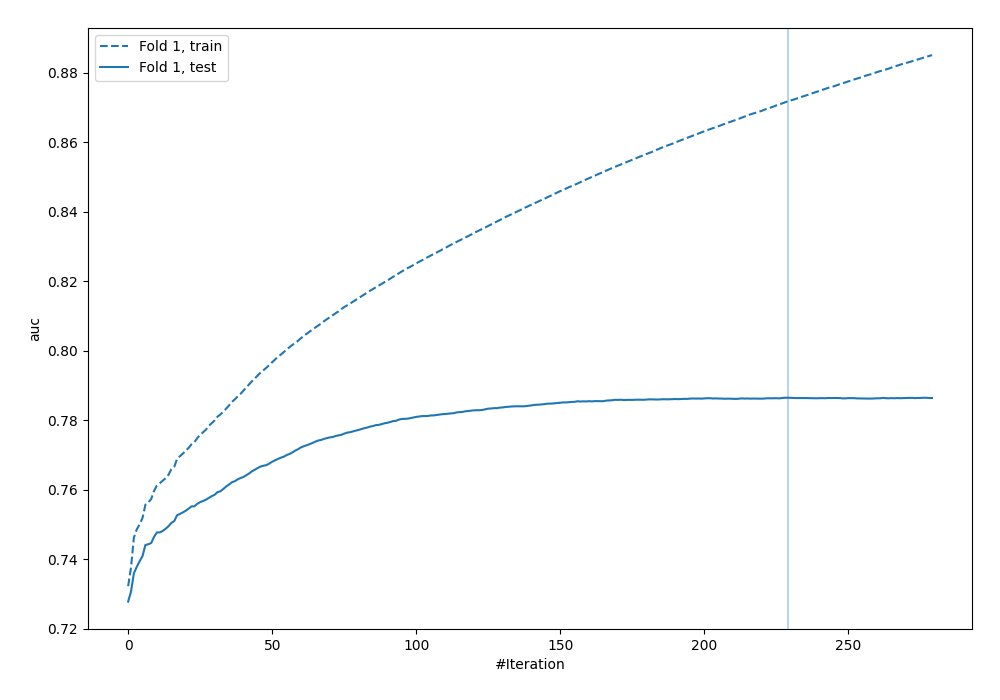
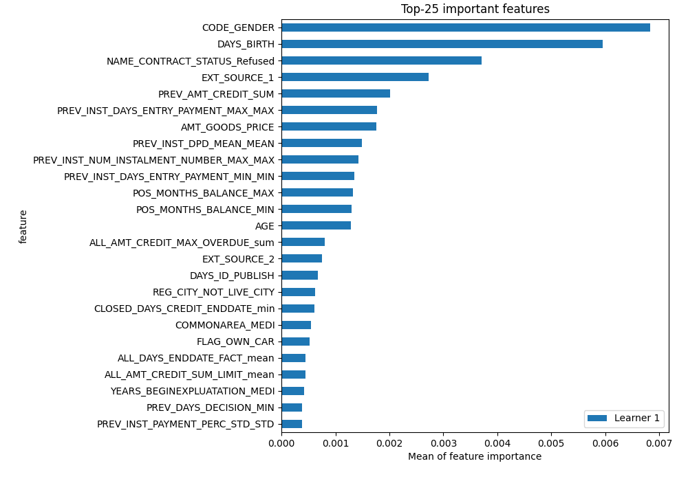
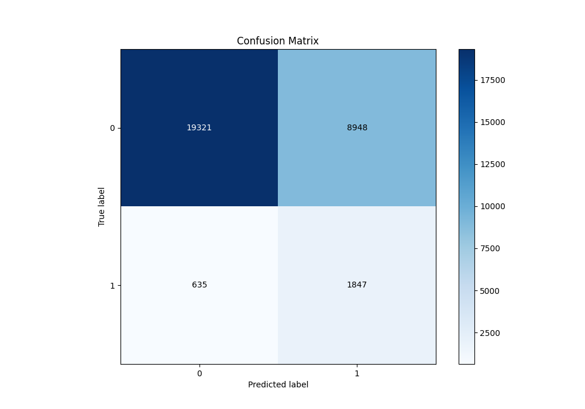
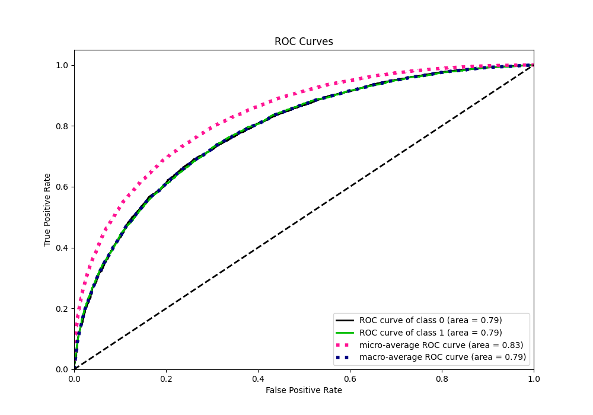
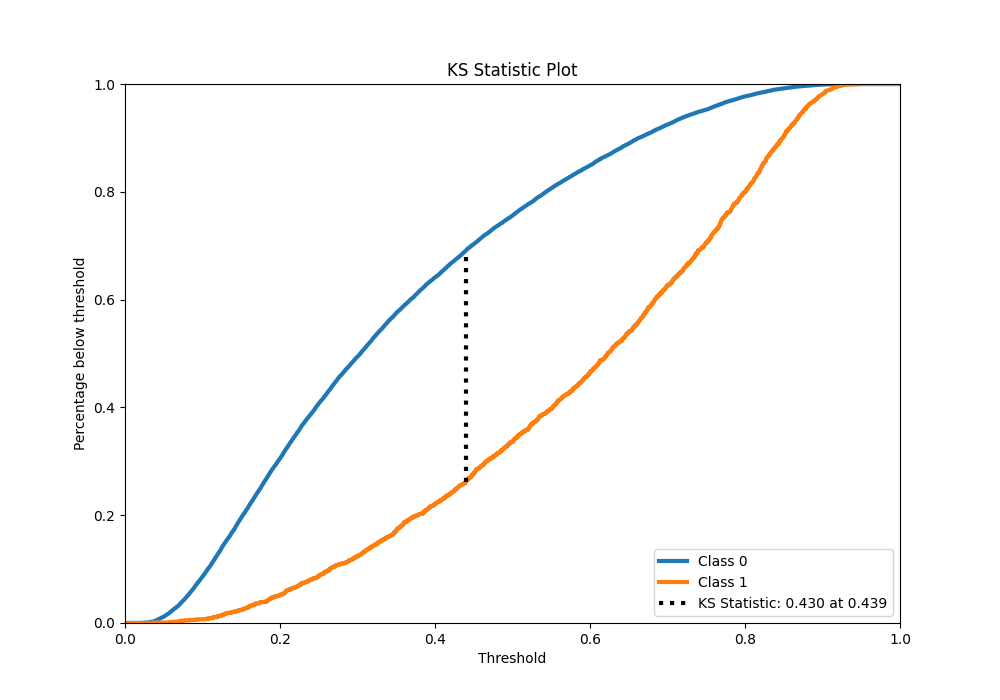
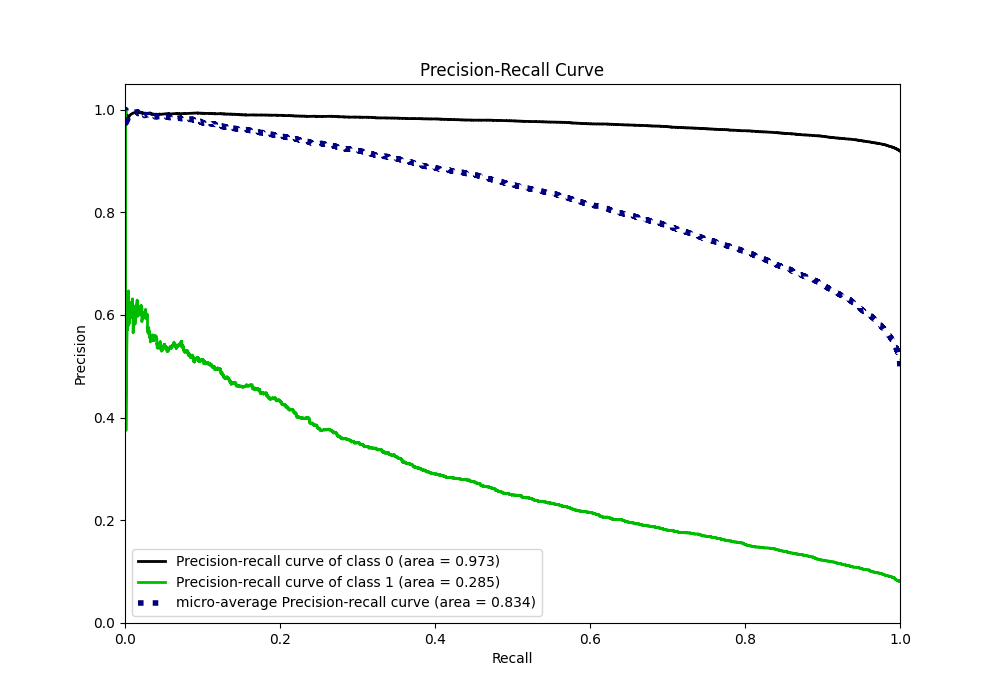
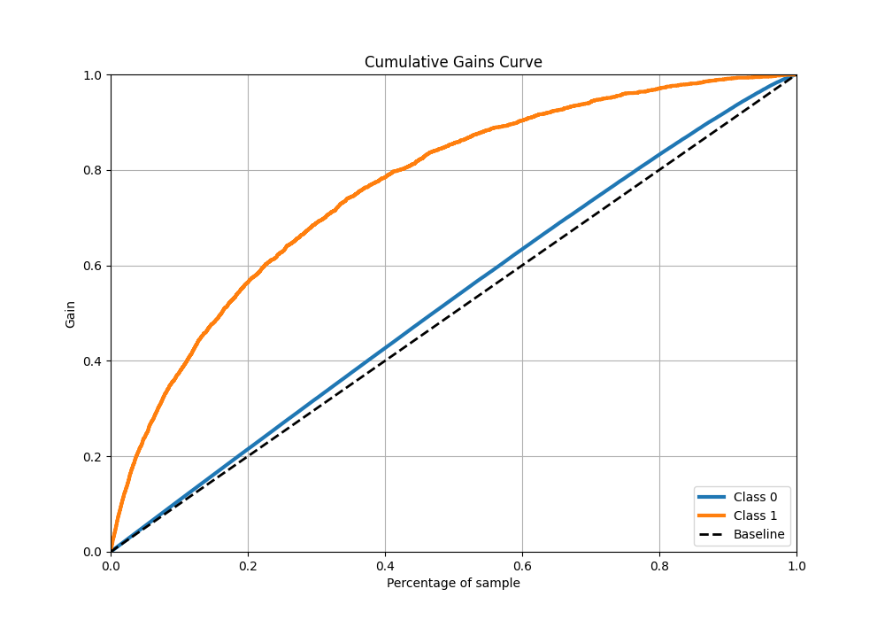
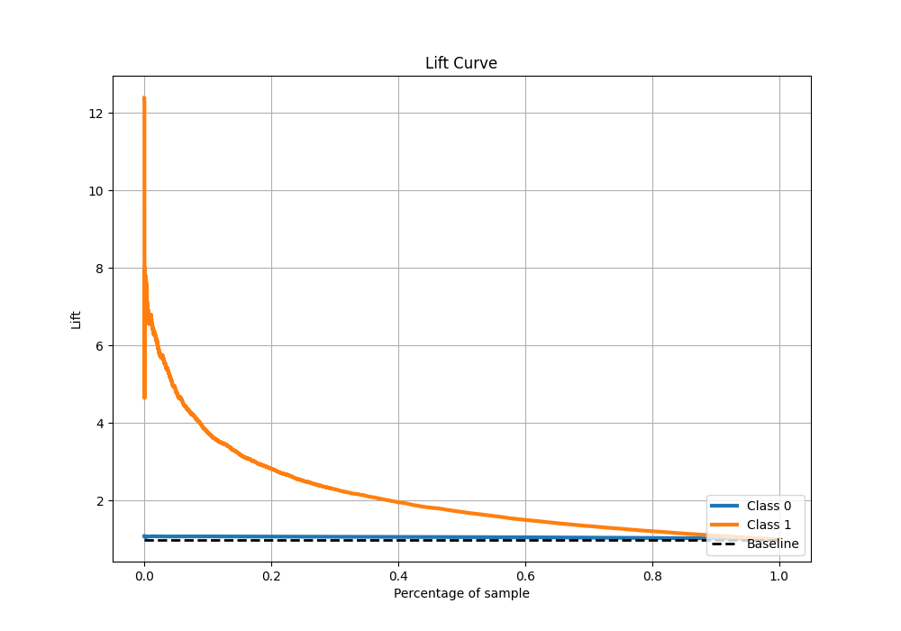

# Summary of 4_Default_LightGBM

[<< Go back](../README.md)

## LightGBM
- **n_jobs**: -1
- **objective**: binary
- **num_leaves**: 63
- **learning_rate**: 0.05
- **feature_fraction**: 0.9
- **bagging_fraction**: 0.9
- **min_data_in_leaf**: 10
- **metric**: auc
- **custom_eval_metric_name**: None
- **explain_level**: 2

## Validation
 - **validation_type**: split
 - **train_ratio**: 0.9
 - **shuffle**: True
 - **stratify**: True

## Optimized metric
auc

## Training time

240.4 seconds

## Metric details
|           |    score |   threshold |
|:----------|---------:|------------:|
| logloss   | 0.560417 | nan         |
| auc       | 0.78643  | nan         |
| f1        | 0.73688  |   0.34086   |
| accuracy  | 0.713811 |   0.434324  |
| precision | 0.928345 |   0.860576  |
| recall    | 1        |   0.0142982 |
| mcc       | 0.42864  |   0.417745  |

## Metric details with threshold from accuracy metric
|           |    score |   threshold |
|:----------|---------:|------------:|
| logloss   | 0.560417 |  nan        |
| auc       | 0.78643  |  nan        |
| f1        | 0.722221 |    0.434324 |
| accuracy  | 0.713811 |    0.434324 |
| precision | 0.70154  |    0.434324 |
| recall    | 0.744158 |    0.434324 |
| mcc       | 0.428416 |    0.434324 |

## Confusion matrix (at threshold=0.434324)
|              |   Predicted as 0 |   Predicted as 1 |
|:-------------|-----------------:|-----------------:|
| Labeled as 0 |         10508.8  |          4866.89 |
| Labeled as 1 |          3933.01 |         11439.8  |

## Learning curves

## Permutation-based Importance

## Confusion Matrix

## Normalized Confusion Matrix

## ROC Curve

## Kolmogorov-Smirnov Statistic

## Precision-Recall Curve

## Calibration Curve

## Cumulative Gains Curve

## Lift Curve

[<< Go back](../README.md)
