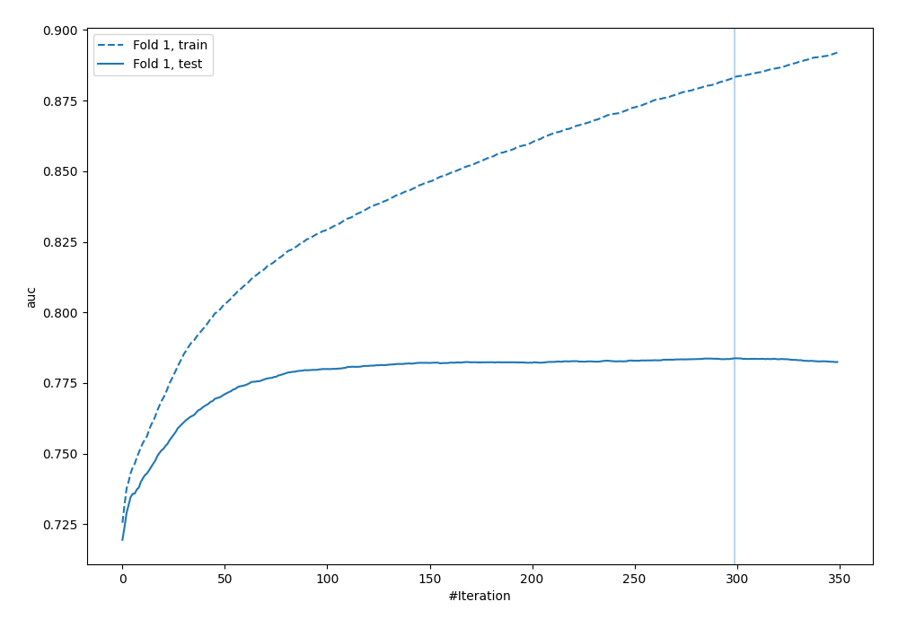
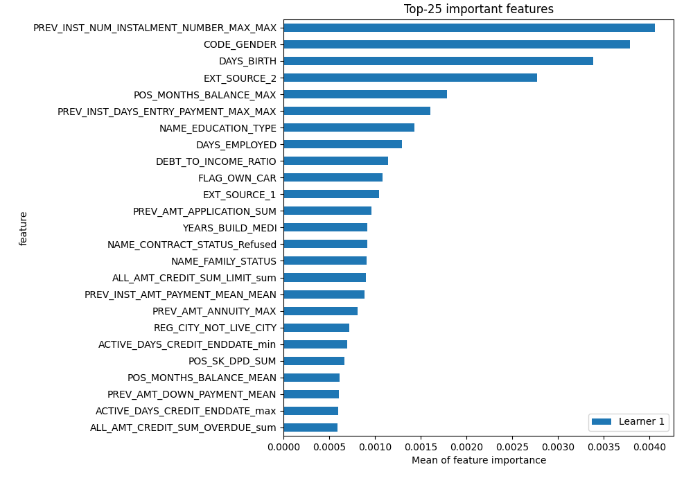
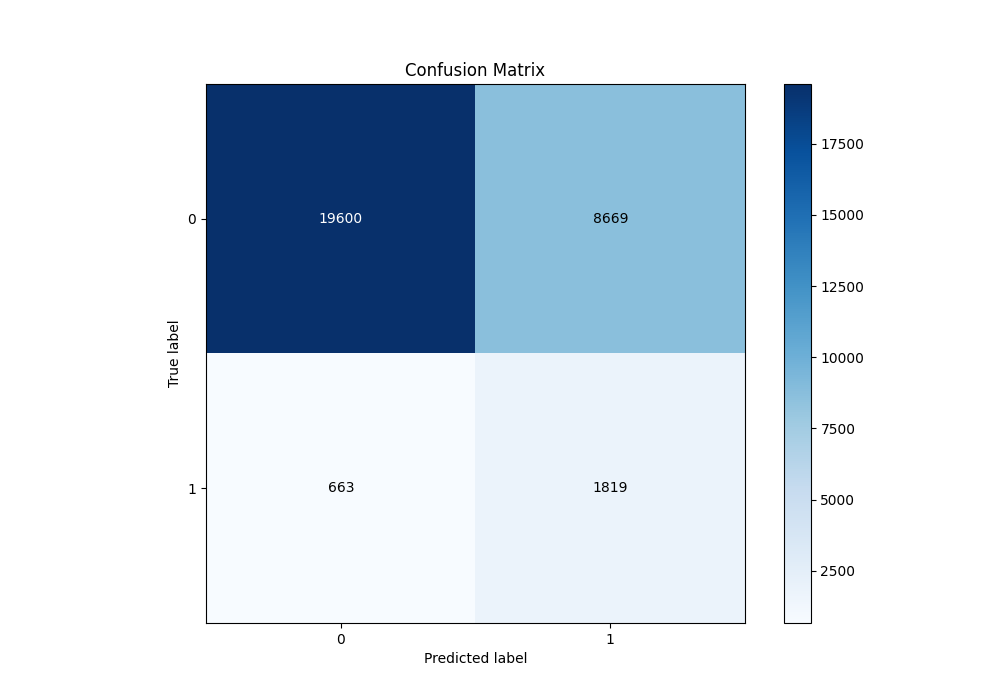
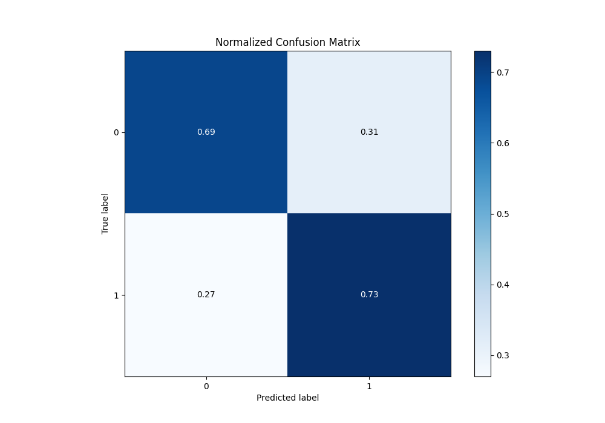
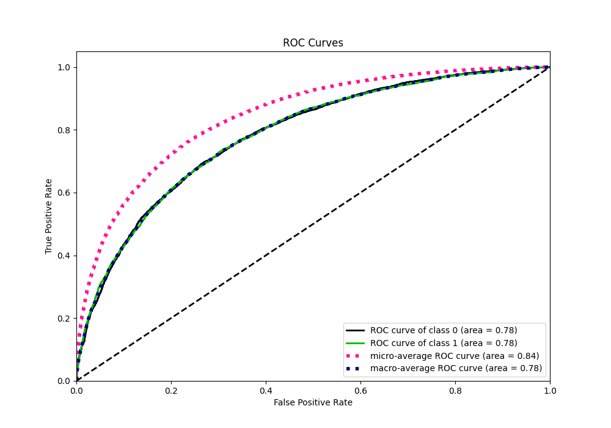
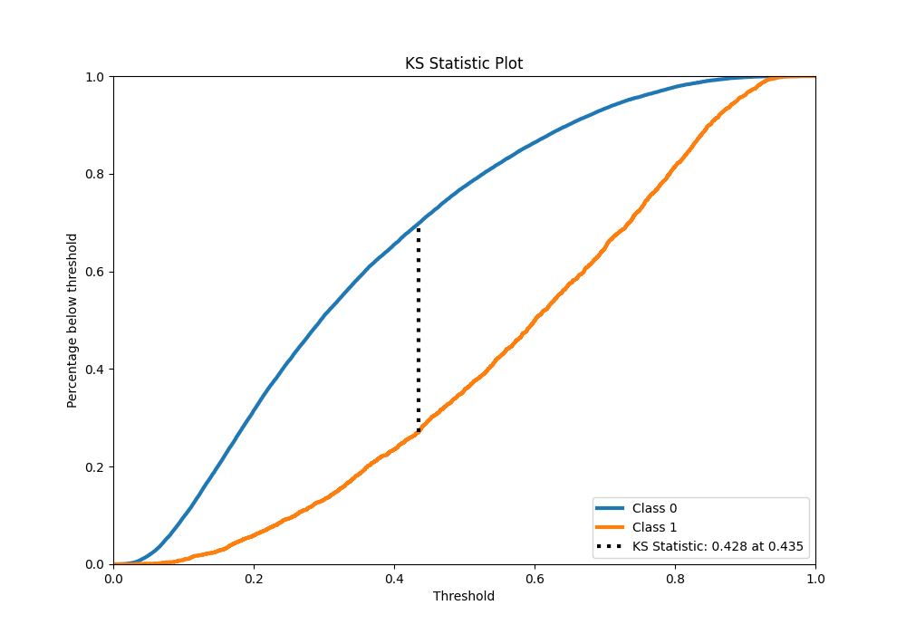
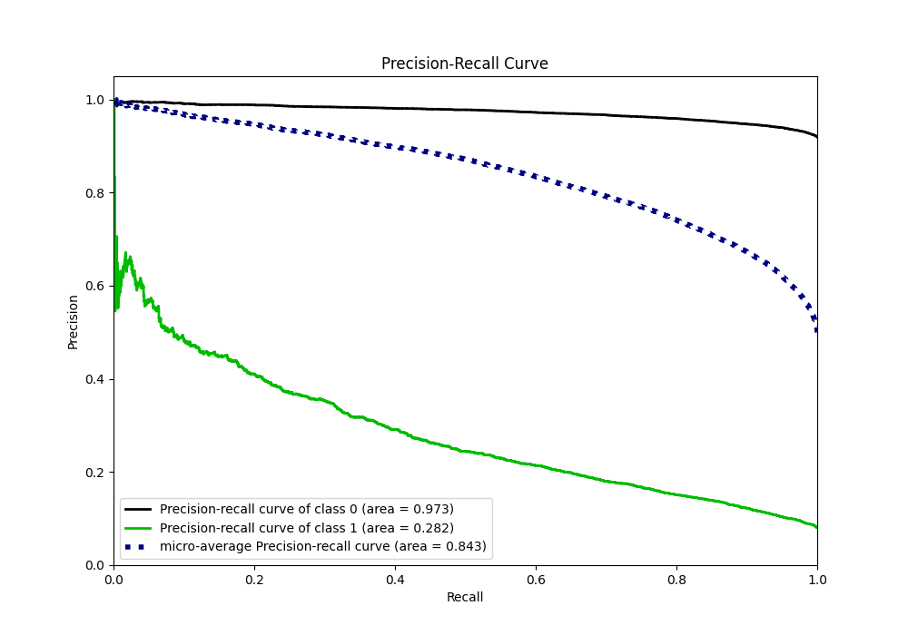
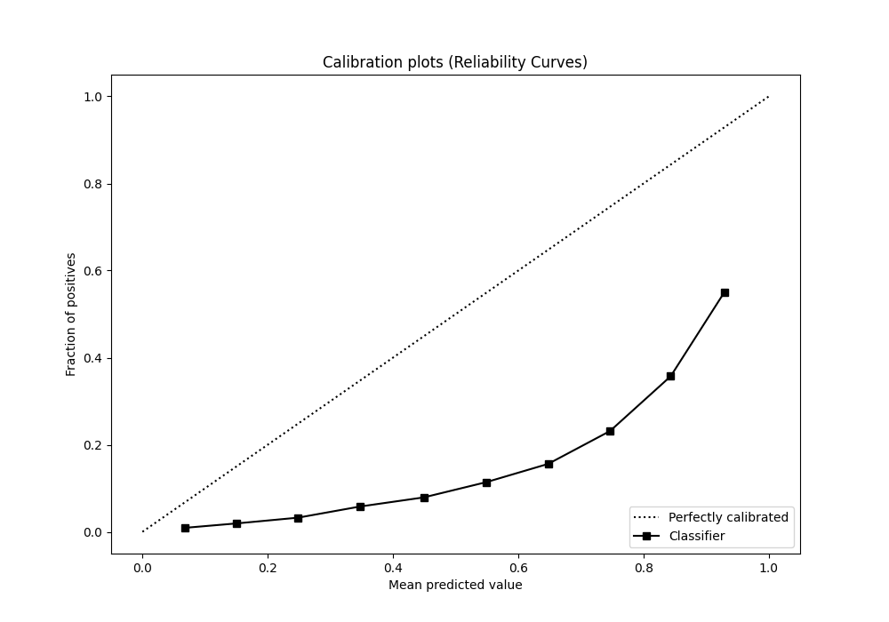
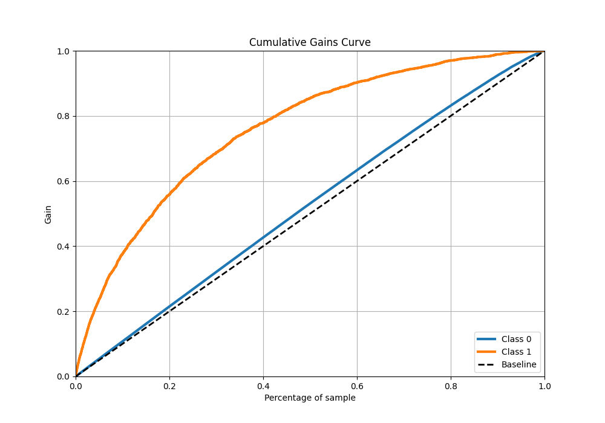

# Summary of 5_Default_Xgboost

[<< Go back](../README.md)

## Extreme Gradient Boosting (Xgboost)
- **n_jobs**: -1
- **objective**: binary:logistic
- **eta**: 0.075
- **max_depth**: 6
- **min_child_weight**: 1
- **subsample**: 1.0
- **colsample_bytree**: 1.0
- **eval_metric**: auc
- **explain_level**: 2

## Validation
 - **validation_type**: split
 - **train_ratio**: 0.9
 - **shuffle**: True
 - **stratify**: True

## Optimized metric
auc

## Training time

253.6 seconds

## Metric details
|           |    score |    threshold |
|:----------|---------:|-------------:|
| logloss   | 0.564713 | nan          |
| auc       | 0.783768 | nan          |
| f1        | 0.73623  |   0.307289   |
| accuracy  | 0.713106 |   0.431067   |
| precision | 0.922136 |   0.868215   |
| recall    | 1        |   0.00598899 |
| mcc       | 0.426549 |   0.431067   |

## Metric details with threshold from accuracy metric
|           |    score |   threshold |
|:----------|---------:|------------:|
| logloss   | 0.564713 |  nan        |
| auc       | 0.783768 |  nan        |
| f1        | 0.718649 |    0.431067 |
| accuracy  | 0.713106 |    0.431067 |
| precision | 0.704963 |    0.431067 |
| recall    | 0.732877 |    0.431067 |
| mcc       | 0.426549 |    0.431067 |

## Confusion matrix (at threshold=0.431067)
|              |   Predicted as 0 |   Predicted as 1 |
|:-------------|-----------------:|-----------------:|
| Labeled as 0 |         10660.6  |          4715.14 |
| Labeled as 1 |          4106.44 |         11266.4  |

## Learning curves

## Permutation-based Importance

## Confusion Matrix

## Normalized Confusion Matrix

## ROC Curve

## Kolmogorov-Smirnov Statistic

## Precision-Recall Curve

## Calibration Curve

## Cumulative Gains Curve

## Lift Curve

[<< Go back](../README.md)
