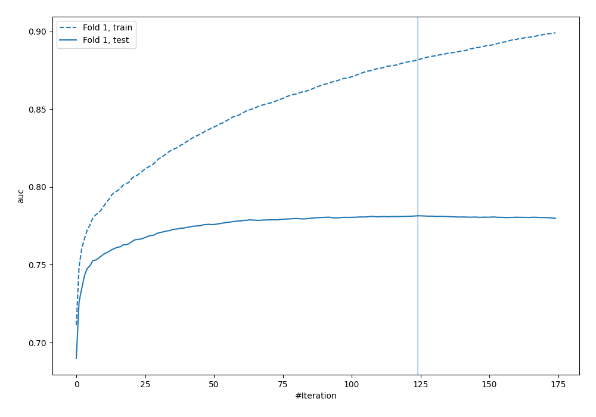
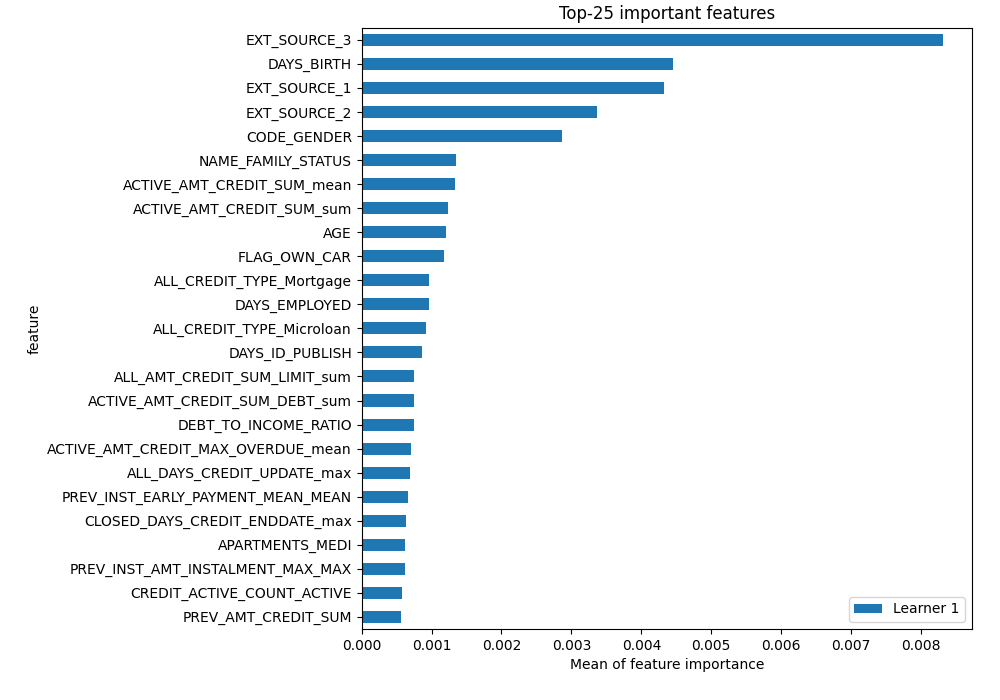
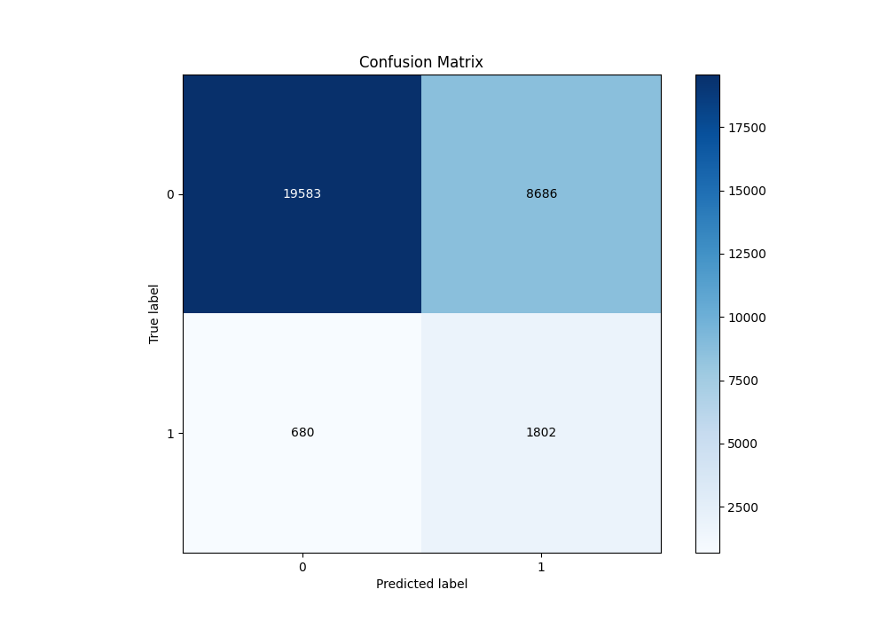
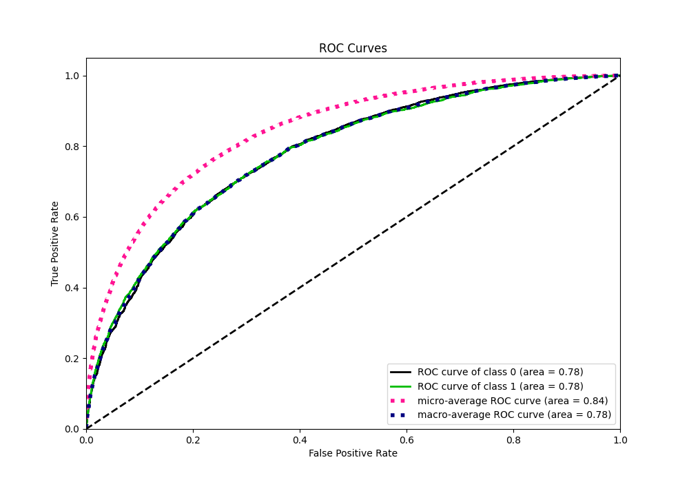
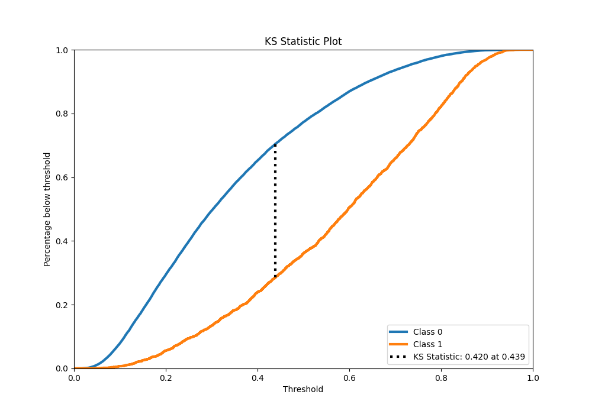
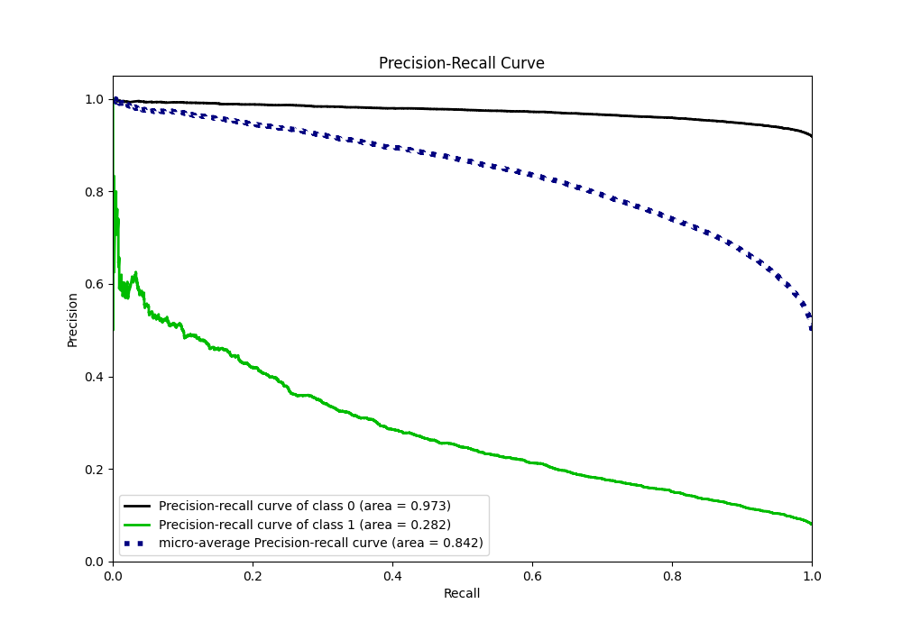
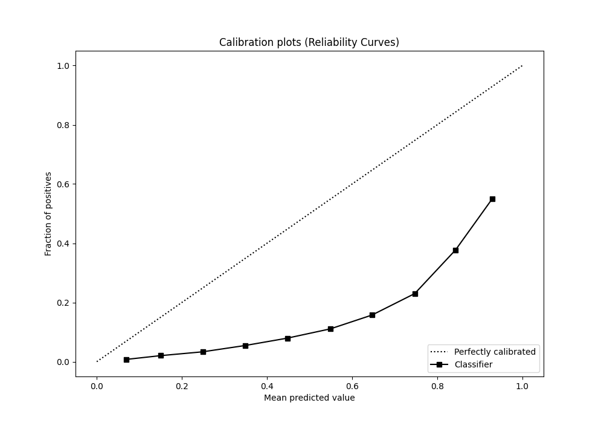
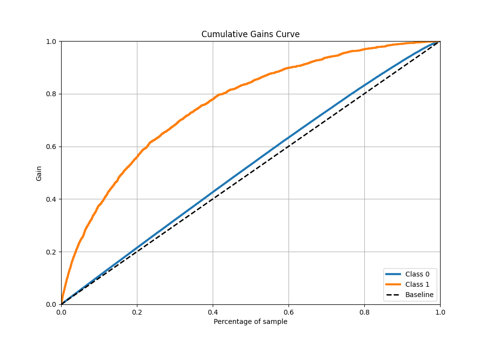
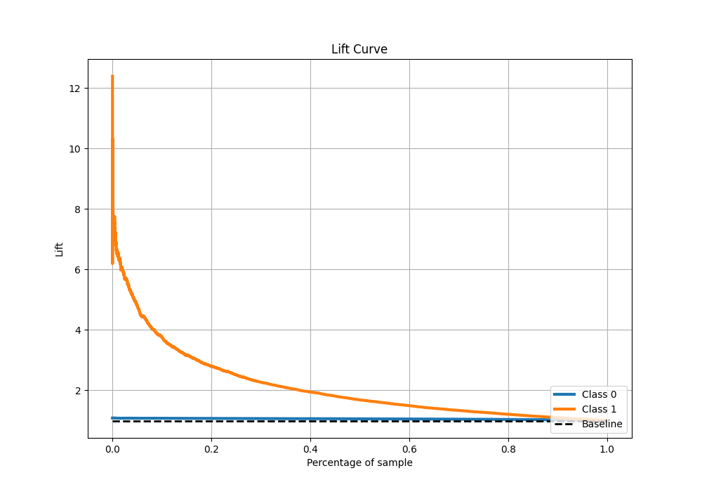

# Summary of 6_Xgboost

[<< Go back](../README.md)

## Extreme Gradient Boosting (Xgboost)
- **n_jobs**: -1
- **objective**: binary:logistic
- **eta**: 0.1
- **max_depth**: 7
- **min_child_weight**: 5
- **subsample**: 1.0
- **colsample_bytree**: 0.5
- **eval_metric**: auc
- **explain_level**: 2

## Validation
 - **validation_type**: split
 - **train_ratio**: 0.9
 - **shuffle**: True
 - **stratify**: True

## Optimized metric
auc

## Training time

222.5 seconds

## Metric details
|           |    score |   threshold |
|:----------|---------:|------------:|
| logloss   | 0.566599 | nan         |
| auc       | 0.781455 | nan         |
| f1        | 0.730826 |   0.358653  |
| accuracy  | 0.709381 |   0.429735  |
| precision | 0.926069 |   0.858879  |
| recall    | 1        |   0.0090097 |
| mcc       | 0.41977  |   0.37919   |

## Metric details with threshold from accuracy metric
|           |    score |   threshold |
|:----------|---------:|------------:|
| logloss   | 0.566599 |  nan        |
| auc       | 0.781455 |  nan        |
| f1        | 0.71412  |    0.429735 |
| accuracy  | 0.709381 |    0.429735 |
| precision | 0.702597 |    0.429735 |
| recall    | 0.726027 |    0.429735 |
| mcc       | 0.418997 |    0.429735 |

## Confusion matrix (at threshold=0.429735)
|              |   Predicted as 0 |   Predicted as 1 |
|:-------------|-----------------:|-----------------:|
| Labeled as 0 |         10651.4  |          4724.38 |
| Labeled as 1 |          4211.73 |         11161.1  |

## Learning curves

## Permutation-based Importance

## Confusion Matrix

## Normalized Confusion Matrix

## ROC Curve

## Kolmogorov-Smirnov Statistic

## Precision-Recall Curve

## Calibration Curve

## Cumulative Gains Curve

## Lift Curve

[<< Go back](../README.md)
