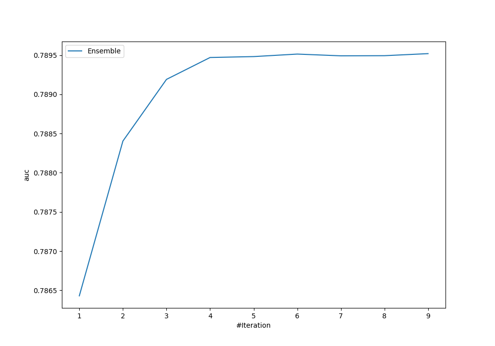
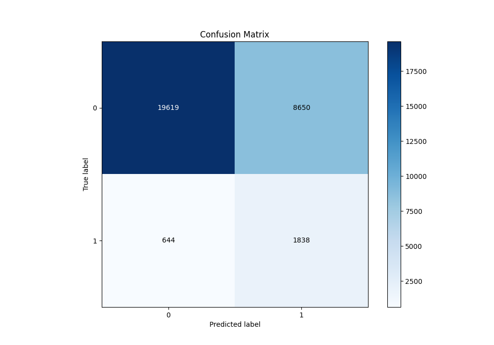
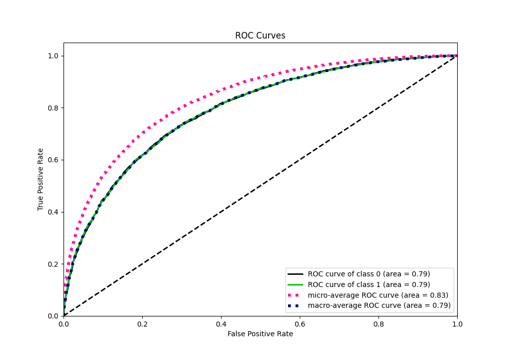
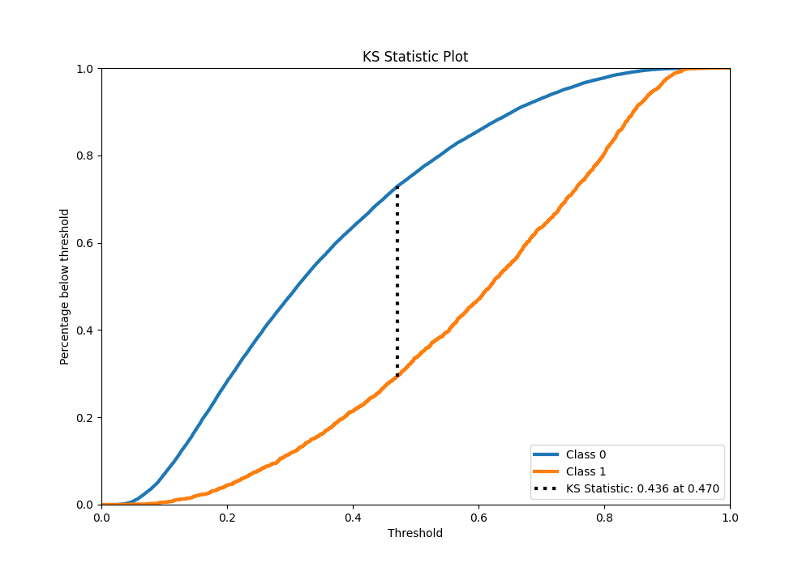
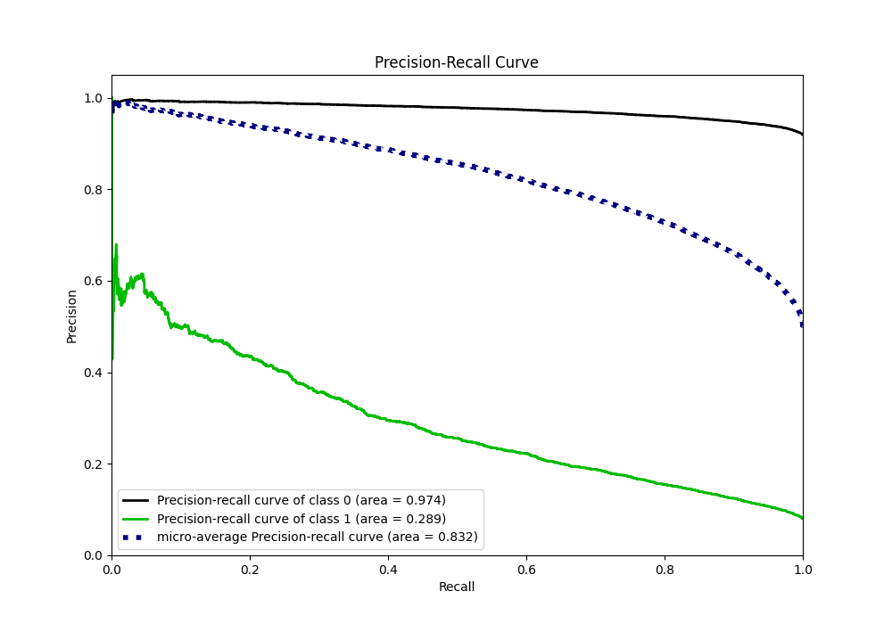
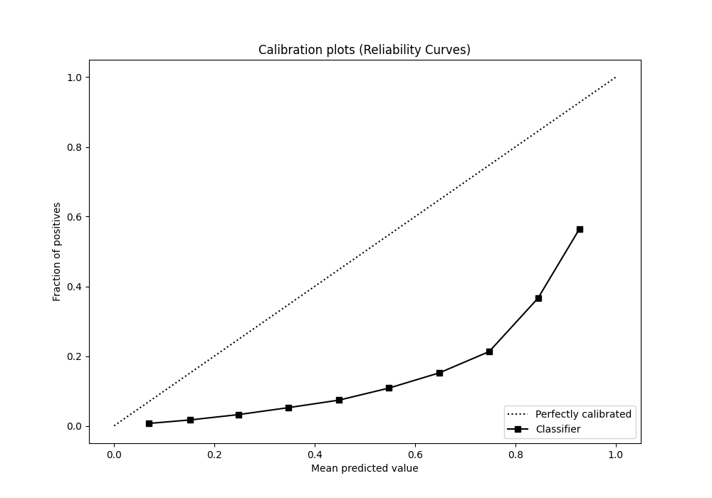
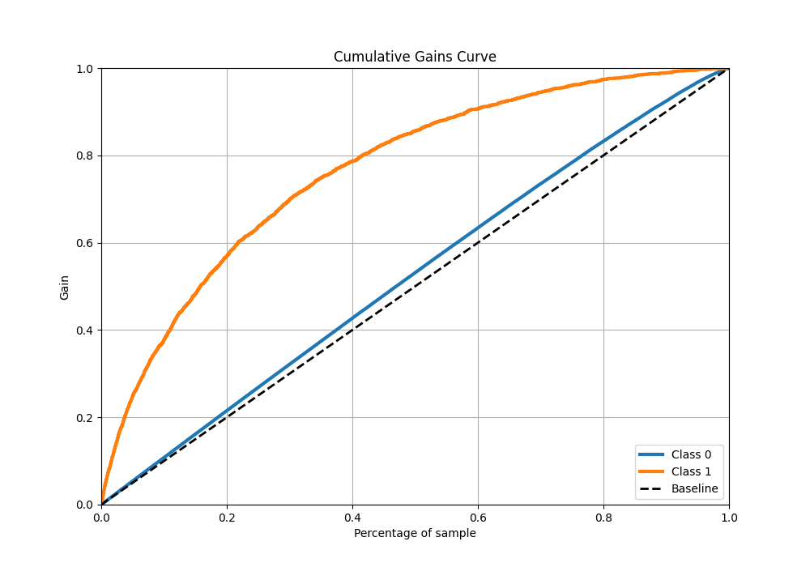
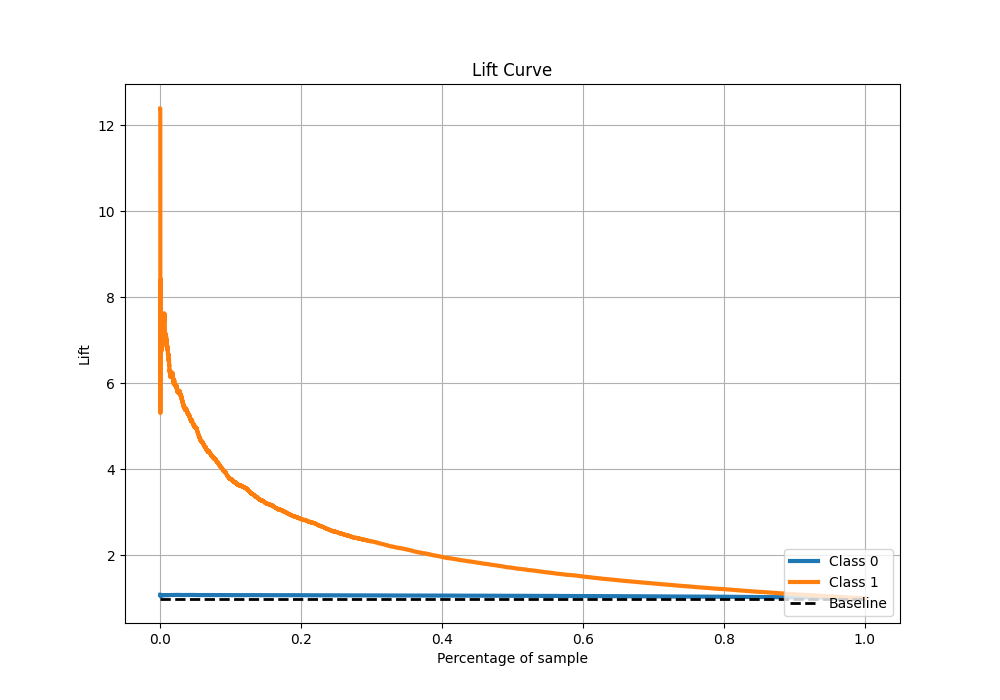

# Summary of Ensemble

[<< Go back](../README.md)

## Ensemble structure
| Model              |   Weight |
|:-------------------|---------:|
| 15_LightGBM        |        2 |
| 24_CatBoost        |        3 |
| 4_Default_LightGBM |        2 |
| 5_Default_Xgboost  |        2 |

## Metric details
|           |    score |   threshold |
|:----------|---------:|------------:|
| logloss   | 0.556957 | nan         |
| auc       | 0.789519 | nan         |
| f1        | 0.737355 |   0.341845  |
| accuracy  | 0.717269 |   0.443491  |
| precision | 0.929829 |   0.861126  |
| recall    | 1        |   0.0130704 |
| mcc       | 0.435013 |   0.443491  |

## Metric details with threshold from accuracy metric
|           |    score |   threshold |
|:----------|---------:|------------:|
| logloss   | 0.556957 |  nan        |
| auc       | 0.789519 |  nan        |
| f1        | 0.723678 |    0.443491 |
| accuracy  | 0.717269 |    0.443491 |
| precision | 0.707574 |    0.443491 |
| recall    | 0.740532 |    0.443491 |
| mcc       | 0.435013 |    0.443491 |

## Confusion matrix (at threshold=0.443491)
|              |   Predicted as 0 |   Predicted as 1 |
|:-------------|-----------------:|-----------------:|
| Labeled as 0 |         10670.9  |           4704.8 |
| Labeled as 1 |          3988.76 |          11384.1 |

## Learning curves

## Confusion Matrix

## Normalized Confusion Matrix

## ROC Curve

## Kolmogorov-Smirnov Statistic

## Precision-Recall Curve

## Calibration Curve

## Cumulative Gains Curve

## Lift Curve

[<< Go back](../README.md)
